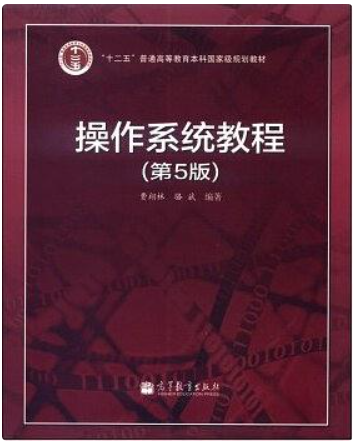
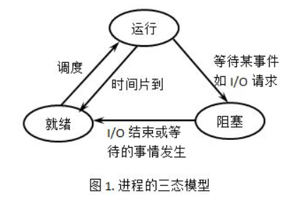
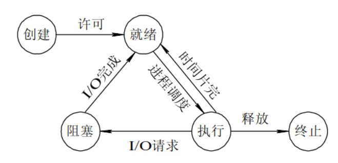
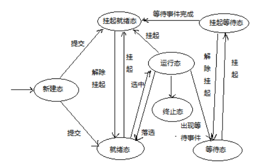

 

## 一、操作系统概观

### 1.计算机系统的组成及其层次结构

答：组成分硬件和软件：层次结构 应用程序-〉系统程序-〉操作系统-〉硬件。

### 2．操作系统的定义和目标

操作系统是计算机系统最基本的系统软件，它管理软硬件资源、控制程序执行，改善人机界面，合理组织计算机工作流程，为用户使用计算机提供良好运行环境。
目标：方便用户使用、扩充机器功能、管理各类资源、提供系统效率、构筑开放环境。

### 3 操作系统与支撑软件及应用软件的主要区别

虽然它们都是软件，但操作系统有权分配资源，而支撑软件及应用软件只能通过操作系统使用资源，两者是控制与被控制的关系；操作系统直接作用于硬件之上，隔离其他上层软件，并为其提供接口与服务。因此操作系统是软件系统的核心，是各种软件的基础运行平台。

### 4、操作系统的资源管理技术

**①操作系统的资源管理技术（资源复用、资源虚化、资源抽象）**

- 资源复用有两种基本方法：空分复用共享和时分复用共享。 

- 空分复用共享：资源可以进一步分割成更多和更小的单位供进程使用。举例：主存和辅助存储器（磁盘）资源。

- 时分复用资源：进程占用该类资源使用后，很可能随时被剥夺，被另一个进程抢占使用。举例：处理器资源和磁盘机。根据资源物理特性的差别，可进一步把时分复用划分成时分独占式和时分共享式。进程获得时分独占式资源后对资源执行多个操作，通常使用一个完整周期后才会释放，比如磁带机。时分复用共享式资源是指进程占用该资源后很可能随后被剥夺，被另一个进程抢占使用，如处理器。

- 资源虚拟：对资源进行转化、模拟或整合，把一个物理资源转变为逻辑上的多个对应物，创建无需共享的多个独占资源的假象，以达到多用户共享一套计算机物理资源的目的。操作系统虚拟性的意义：屏蔽、隔离具体环境，提高使用接口友好，以便以抽象统一方式使用资源。虚拟的具体应用：虚拟技术用于外部设备，实现虚拟设备如虚拟网卡、虚拟光驱。虚拟技术用于存储资源，实现虚拟内存，虚拟技术用于文件系统，实现虚拟文件系统（VFS）

- 资源抽象：通过创建软件来屏蔽硬件资源的物理特性和接口细节，简化对硬件资源的操作、控制和使用，即不考虑物理细节而对资源执行操作。
  资源复用和资源虚化的主要目的是解决物理资源数量不足的问题，资源抽象则用于处理系统的复杂性，重点解决资源的易用性。

**② 操作系统的基本抽象（进程抽象、虚存抽象和文件抽象）**

进程是处理器的一种抽象、虚存是内存的一种抽象、文件时设备的一种抽象，于是可面向进程而不是处理器，面向虚存而不是内存，面向文件而不是设备，方便系统对资源的管理、控制和调度。

**③ 操作系统虚拟机**
操作系统虚拟机是在裸机上配置操作系统，由操作系统对物理计算机实施仿真而获得的，为用户提供了一种简单、清晰、易用、高效的计算机模型。虚拟机的每种虚拟资源都是物理资源通过复用、虚拟或抽象得到的产物。虚拟机提供了进程运行的逻辑计算环境。

### 5、操作系统的作用与功能

- 主要作用： 

- 服务用户—操作系统作为用户接口和公共服务程序

- 进程交互—操作系统作为进程执行的控制者和协调者

- 系统实现—操作系统作为扩展机或虚拟机

- 资源管理—操作系统作为资源的管理者和控制者

- 功能：处理器管理，存储管理，设备管理，文件管理，网络与通信管理。

### 6、操作系统的主要特性（并发性、共享性、异步性）

- 并发性：指两个或两个以上的活动或事件在同一个时间间隔内发生。
  补充：并行性是指两个或两个以上的活动或时间在同一时刻发生。关系：并行是并发的特例，并发是并行的拓展。

- 共享性：指计算机系统的资源可以被多个并发执行的程序共同使用，而不是被某个程序独占。

- 异步性：在多道程序环境中，允许多个程序并发执行，并发活动会导致随机事件的发生，由于资源有限而程序众多，每个程序并非连贯的，而是走走停停。

## 二、操作系统的发展与分类

### 1、操作系统的分类

- 批处理操作系统：根据预先设定的调度策略选择若干作业并发地执行，系统的资源利用率高，作业吞吐量大。
  补充：作业是把程序、数据连同作业说明书组织起来的任务单位。

- 分时操作系统：允许多个联机用户同时使用一个计算机系统进行交互式计算的操作系统。特点：同时性、独立性、及时性、交互性。

- 实时操作系统：当外部事件或数据产生时，能够对其予以接收并以足够快的速度进行处理，并控制所有实时任务协调运行的操作系统。
  注：如果某个操作系统兼具批处理、分时和实时处理的全部或两种功能、则此操作系统称为通用操作系统。

### 2、什么是多道程序设计？

答：多道程序设计是允许多个作业(程序)同时进入计算机系统的主存并启动交替计算的方法。

### 3、操作系统引入多道程序设计的优点

- 一是可以提高CPU、内存和设备的利用率

- 二是可以提高系统的吞吐率，使单位时间内完成的作业数量增加

- 三是可以发挥系统的并行性，使设备与设备之间、CPU与设备之间均可并行工作。

## 三、操作系统基本服务和用户接口

### 1、什么是系统调用？

程序接口（系统调用）由操作系统实现的完成某种特定功能的过程；它是程序与操作系统的接口。

### 2、系统调用的执行过程

当CPU执行程序中编写的由访管指令实现的系统调用时会产生异常信号，通过陷阱机制，处理器的状态由用户态转变为内核态，进入操作系统并执行相应的服务例程，以获得操作系统服务，当系统调用执行完毕时，处理器再次切换状态，控制返回至发出系统调用的程序，系统调用是应用程序获得操作系统服务的唯一途径。

## 四、操作系统结构和运行模型

### 1．什么是操作系统内核

答：内核是一组程序模块，作为可信软件来提供支持进程并发执行的基本功能和基本操作，通常驻留在内核空间，运行于核心态，具有访问硬件设备和所有主存空间的权限，是仅有的能够执行特权指令的程序。

### 2、操作系统体系结构

操作系统体结构分类有整体式结构、层次性结构、虚拟机结构、客户服务器以及微内核结构等。整体式结构高效但不容易维护，层次性结构便于维护但效率低，虚拟机结构方便资源管理使用，客户服务器及微内核结构便于扩充但通信开销大。

### 3、机制与策略分离原则的好处

相当于把一个项目分解成稳定和不稳定的两个部分。一旦用户需求发生改变，只需要改变策略即可，机制部分只需少许修改或者完全不需要修改。
总之，机制与策略分离原则可归纳为以下三点：

- 机制由操作系统实现、策略留给用户完成

- 机制放到底层、策略放到高层

- 机制集中在少数模块、策略可分散布在系统多处。

## 二、处理器管理

### 1、相关概念

#### （1）特权指令与非特权指令：

所谓特权指令是指仅供内核程序使用的指令，这些指令涉及改变机器状态、修改寄存器内容、启动设备I/O等敏感性操作。执行这些指令不仅影响程序自身，而且干扰其他程序及操作系统。非特权指令在目态和管态下都能工作，操作系统能够执行全部指令，应用程序只能使用非特权指令。

#### （2）内核态和用户态：

- 内核态（管态）：处理器可以执行全部指令，使用所有资源，并具有改变处理器状态的能力

- 用户态（目态）：处理器只能执行非特权指令。

#### （3）PSW程序状态字的作用和内容

PSW表示不同的处理器工作状态，控制指令执行顺序，保留和指示与程序有关的系统状态，主要作用是实现程序状态的保护和恢复。包括：程序指针、程序状态、中断状态等。

#### （4）中断概念

中断是指在程序执行过程中，遇到急需处理的事件时，暂时中止现行程序在CPU上的运行，转而执行相应的事件处理程序，待处理完成后再返回断点或调度其他程序执行的过程。操作系统是中断驱动的。

#### （5）硬中断和软中断

通过硬件设施来产生中断请求，称作硬中断。利用硬件中断的概念，用软件方式进行模拟，实现宏观上的异步执行效果的中断称作软中断。
关系：两者在中断请求、中断屏蔽、中断触发、中断服务等概念与设施方面十分相似。

#### （6）进程

进程是指可并发执行的程序在某个数据集合上的一次计算活动，也是操作系统进行资源分配和保护的基本单位。

#### （7）线程

是进程中能够并发执行的实体，是进程的组成部分，也是处理器调度和分派的基本单位。
进程与程序：进程是程序关于数据的执行，程序是静态的，进程是动态的。

### （8）原语

​	原语在核心态执行，是完成系统特定功能的不可分割的过程，它具有原子操作，其程序段不允许被中断，或者说原语不能并发执行。

### 2、处理器模式切换的途径

#### （1）用户态到核心态的转换

- 一是程序请求操作系统服务，执行系统调用

- 二是在程序执行时，产生中断事件（如I/O操作完成），运行程序被中断，转向中断处理程序

- 三是在程序运行时产生异常事件(如发生程序性中断、或目态执行特权指令)，运行程序被中断，转向异常处理工作。
  这三种情况都通过中断机制发生，可以说中断与异常是用户态到内核态转换的仅有路径。

#### （2）核心态到用户态的转换

计算机通常提供一条称作加载程序状态字的特权指令，用来实现从系统返回用户态，将控制权转交给应用程序。

#### （3）什么使模式切换，什么是进程切换，以及两者之间的关系？

模式切换时CPU从核心态到用户态，或从用户态到核心态，进程切换是指从一个进程上下文切换到另一个进程上下文，模式切换不一定导致进程切换，进程切换一定导致模式切换。

#### （4）引进进程的原因

- 刻画系统的动态性，发挥系统的并发性，提高资源利用率。

- 它能够解决系统的“共享性”，正确描述程序的执行状态。

#### （5）进程的状态转换模型；

挂起进程的特征:

**三态模型**

 

**五状态模型**

 

**七状态模型**

 

**挂起**：系统资源不能够满足进程运行的要求，就必须挂起某些进程，对换到磁盘镜像区中，释放它占有的某些资源，暂时不参与低级调度，起到平滑系统负荷的目的；也可能系统出现故障。需要暂时挂起一些进程，以便故障消除后再解除挂起并恢复进程运行；用户调试程序过程中，可以请求挂起其进程，以便进行某种检查和修改，总之，引进进程挂起的原因多种多样。

#### （6）进程映像

某时刻进程的内容及其状态集合称为进程映像，包括以下几个要素：进程控制块、进程程序块、进程核心栈、进程数据块。

#### （7）PCB的概念和组成

每个进程有且仅有一个进程控制块（PCB），或称进程描述符，它是进程存在的唯一标识，是操作系统用来记录和刻画进程状态及有关信息的数据结构，是进程动态特征的一种汇集，也是操作系统掌握进程的唯一资料结构和管理进程的主要依据。
包含三类：

- 标识信息：用于唯一的标识一个进程

- 现场信息：现场信息用于保留进程在运行时存放在处理器现场中的各种信息。

- 控制信息：控制信息用于管理和调度进程。

#### （8）引入多线程的目的和优点

进程切换开销大、进程通信代价大、进程间的并发粒度较粗，并发行较高。为此，通过把分配资源与调度执行分离开来，使进程作为资源分配和保护的单位，线程作为系统调度和分派的单位，能被频繁的调度和切换。
引入线程，以减少进程并发执行时所付出的时空开销，使得并发粒度更细、并发行更好。

#### （9）线程的实现

多线程的实现分三类：

- 内核级线程(KLV :Kernel Level Thread)，如Windows、OS/2和March C-Ttread

- 用户级线程(ULV :User Level Thread),如POSIX 1003的Pthread、Java线程库

- 某些系统（如Solaris UI-Thread）提供混合式线程,同时支持ULT和KLT两种线程。

#### （10）处理机调度的层次及调度模型

处理机调度的层次：高级调度，中级调度，低级调度

- 高级调度（作业调度）：从输入系统的一批作业中挑选若干作业进入内存，为其分配资源并创建对应作业的用户进程。

- 中级调度（内存调度）：根据内存资源情况决定内存中所能容纳的进程数目，并完成内存和外存的对换工作。

- 低级调度：决定就绪队列中的哪个进程/线程获得处理器，并将处理器出让给它使用。执行得很频繁。引起低级调度的事件包括： 时钟中断、I/O中断、操作系统调用、信号

#### （11）选择调度算法的周转时间

批处理用户从向系统提交作业开始，到作业完成为止的时间间隔称为作业周转时间。

- 作业i的周转时间T(i)=作业i的完成时间-作业i的提交时间

- 平均周转时间T=（T(1)+T(2)+....+T(n)）/n

- 带权周转时间W(i)=作业i的周转时间/作业i的运行时间

- 平均带权周转时间：类似于平均周转时间。

#### （12）作业和进程的关系

作业是任务实体，进程是完成任务的执行实体；没有作业实体，进程无事可做；没有进程，作业任务无法完成。作业的概念更多的用于批处理操作系统中，而进程则多用于各种多道程序设计系统。

#### （13）低级调度算法

- 先来先服务算法FCFS,First Come First Server(作业调度、进程调度)

- 最短作业优先算法SJF,Shortest Job First(作业调度、进程调度)

- 最短剩余时间优先算法SRTF，Shortest Remaining Time First（进程调度）

- 最高响应比优先算法HRRF，Highest Response Ratio First（作业调度）

- 优先级调度算法（作业调度、进程调度）

- 轮转调度算法RR（时间片调度算法），Round-Robin（进程调度）

- 多级反馈队列调度算法MLFQ，Multi-level Feedback Queue（进程调度）