### 1、操作系统概念 

操作系统的概念：操作系统是指控制和管理整个计算机系统的硬件和软件资源，合理的组织、调度计算机的工作与资源的分配，进而为用户和其他软件提供方便接口与环境的程序集合。操作系统是计算机最基本的系统软件。 

###  2、操作系统的4个特性

+ 并发：并发是指两个或多个事件在同一时间间隔内发生。操作系统的并发性是指计算机系统中同时存在多个运行的程序，因此它具有处理和调度多个程序同时执行的能力。 

+ 共享：资源共享即共享，是指系统中的资源可供内存中多个并发执行的进程共同使用，共享可分为互斥共享方式和同时访问方式。 
+ 虚拟：虚拟是指一个物理上的实体变成若干逻辑上的对应物。物理实体是实际存在的，而后者是用户感觉上的事物。用于实现虚拟的技术，称为虚拟技术。操作系统中利用了多种虚拟技术来实现虚拟处理器、虚拟内存和虚拟外部设备。 
+ 异步：多道程序环境允许多个程序并发执行，但由于资源有限，进程的执行并不是一贯到底的，而是走走停停的，它以不可预知的速度向前推进，这就是进程的异步性。 

### 3、操作系统的主要功能 

+ 处理器管理：在多道程序环境下，处理器的分配和运行都以进程（或线程）为基本单位，因而对处理器的管理可归结为进程的管理。并发是指在计算机内同时运行多个进程，因此进程何时创建、合适撤销、如何管理、如何避免冲突、合理共享就是进程管理最主要的任务。进程管理的主要功能包括进程控制、进程同步、进程通信、死锁处理、处理机调度等。 

+ 存储器管理：存储器管理是为了给多道程序的运行提供良好的环境，方便用户使用及提高内存的利用率。主要包括内存分配与回收、地址映射、内存保护与共享和内存扩充等功能。 
+ 文件管理：计算机中的信息都是以文件的形式存在的，操作系统中负责文件管理的部分称为文件系统。文件管理包括文件存储空间的管理、目录管理及文件读写管理和保护等。 
+ 设备管理：设备管理的主要任务是完成用户的I/O请求，方便用户使用各种设备，并提高设备的利用率，主要包括缓冲管理、设备分配、设备处理和虚拟设备等功能。 
+ 操作系统与用户之间的接口：操作系统向用户提供了操作系统与用户之间的接口，接口分为用户接口和程序接口两种类型。操作系统与用户之间的接口便于用户使用操作系统。 

###  4、分时操作系统 

+ 所谓分时技术，是指把处理器的运行时间分成很短的时间片，按时间片轮流把处理器分配给各联机作业使用。若某个作业在分配给它的时间片内不能完成其计算，则该作业暂时停止运行，把处理器让给其他作业使用，等待下一轮再继续运行。由于计算机速度很快，作业运行轮转也很快，因此给每个用户的感觉就像是自己独占一台计算机。 

+ 分时操作系统是指多个用户通过终端同时共享一台主机，这些终端连接在主机上，用户可以同时与主机进行交互操作而互不干

### 5、实时操作系统

 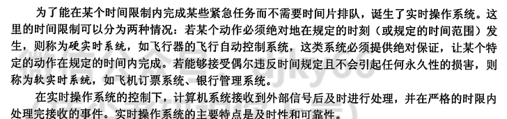 

### 6、核心态和用户态的区别

 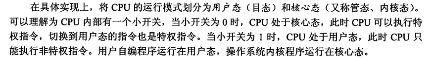

 ### 7、中断与异常

 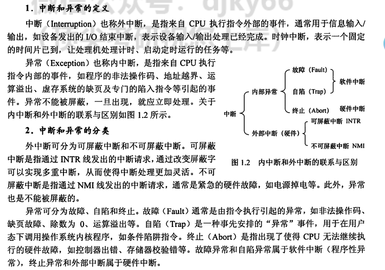 ### 8、系统调用的概念 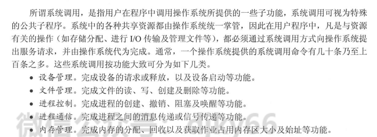 

### 9、进程的概念

 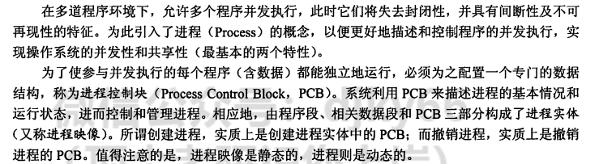 

### 10、线程与进程

 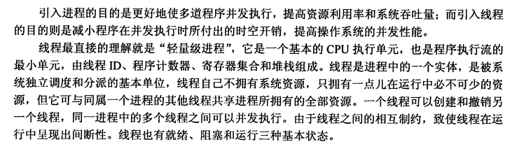 

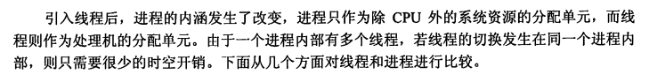 

### 11、进程的状态转换

 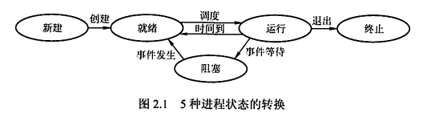 

###  12、进程的三级调度

 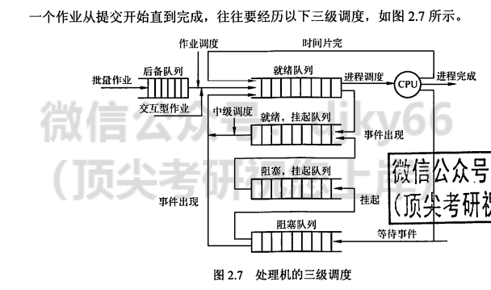 

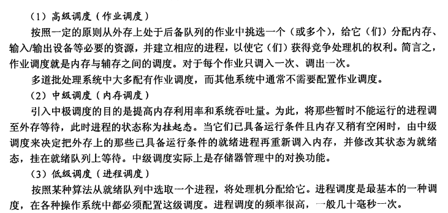 

### 13、典型的调度算法

 操作系统中存在多种调度算法，有的调度算法适用于作业调度，有的调度算法适用于进程调度，有的调度算法两者都适用。 

（1）先来先服务调度算法 

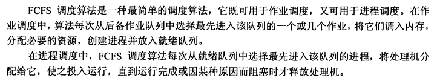 

（2）短作业优先调度算法

 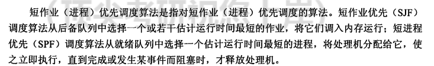 

（3）优先级调度算法

 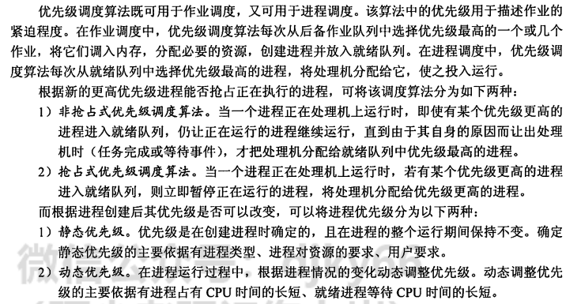 

（4）高响应比优先调度算法

 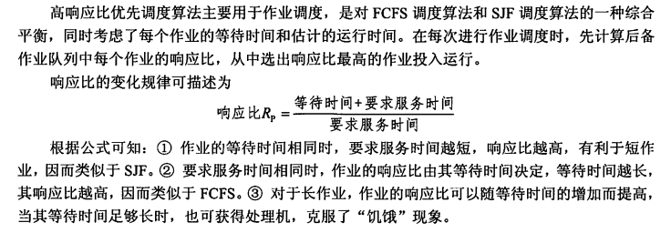 

（5）时间片轮转调度算法

 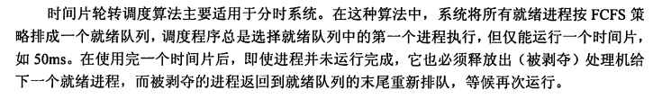 

（6）多级队列调度算法

 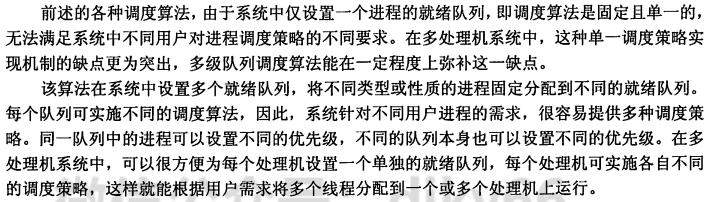 

（7）多级反馈队列调度算法

 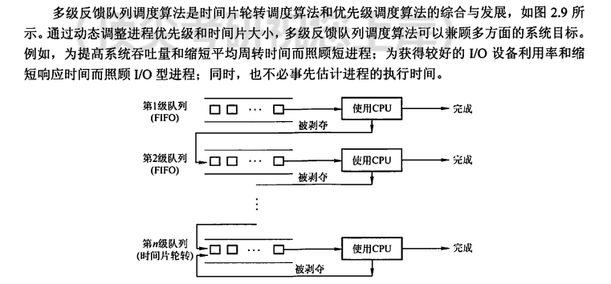 

### 14、临界区

 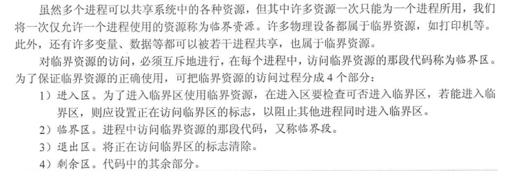 

### 15、同步与互斥

 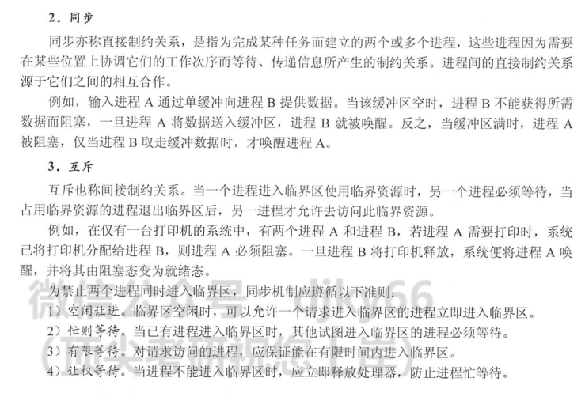 

### 16、死锁产生的条件

 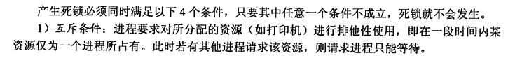 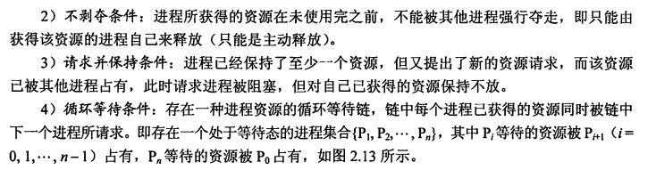 

### 17、银行家算法

 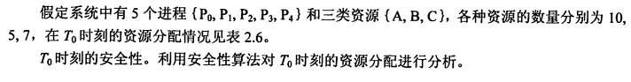 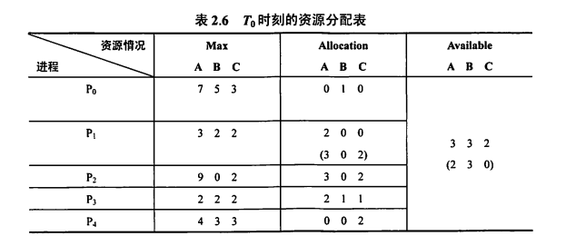 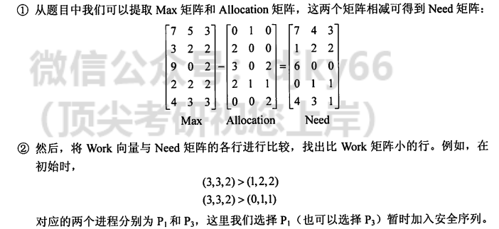 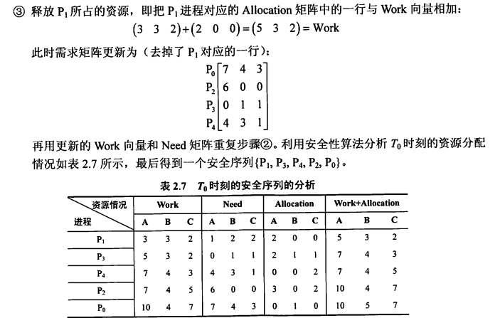 

### 18、系统分配内存的算法

 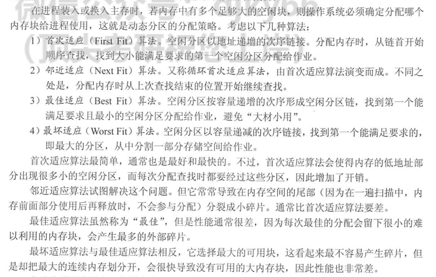 

### 19、页面置换算法

 （1）最佳置换算法

 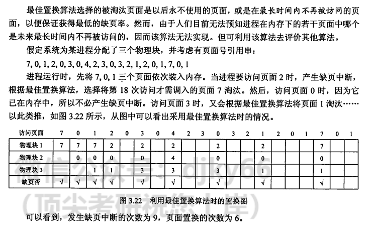 

（2）先进先出页面置换算法 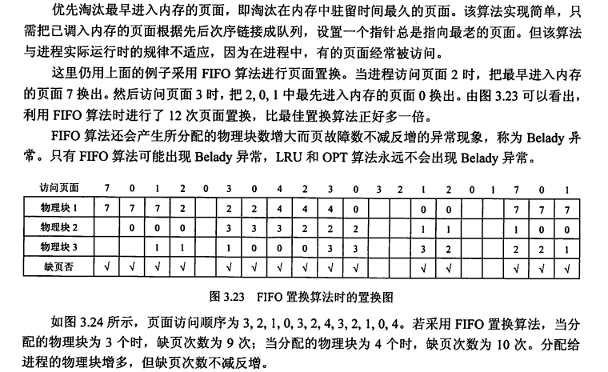 

（3）最近最久未使用置换算法 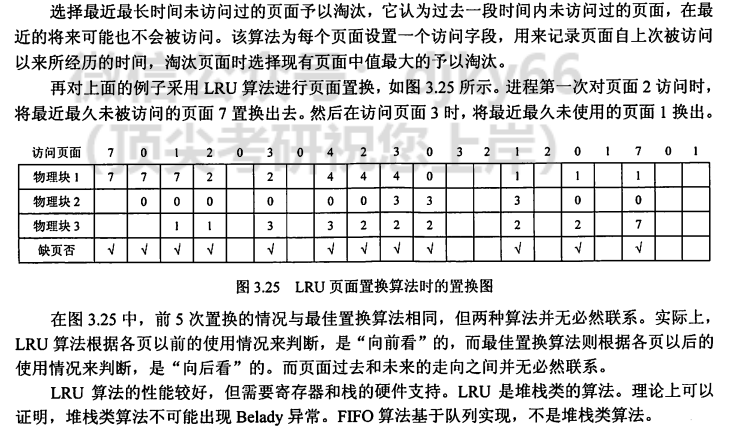 

###  20、为什么需要虚拟内存

 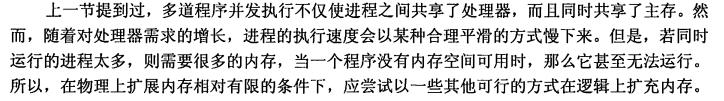 

### 21、磁盘调度算法

 （1）先来先服务

 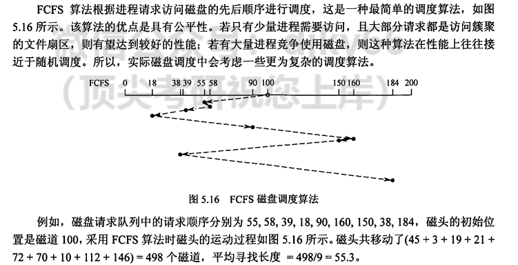 

（2）最短寻道时间优先

 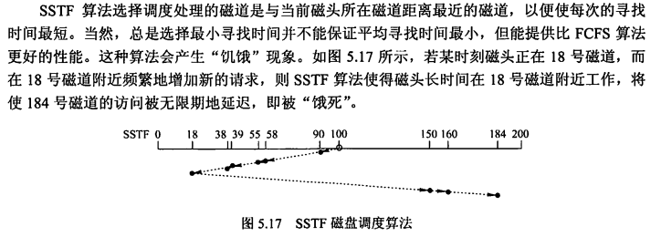 

（3）扫描算法（又称电梯调度算法）

 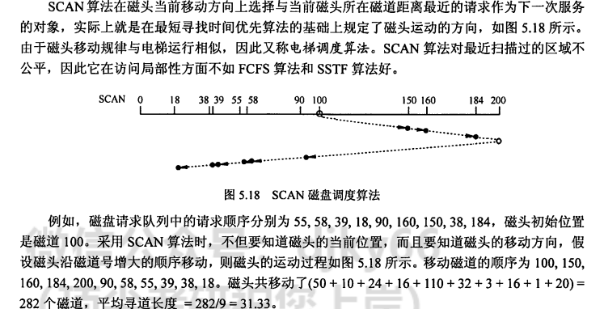 

（4）循环扫描算法

 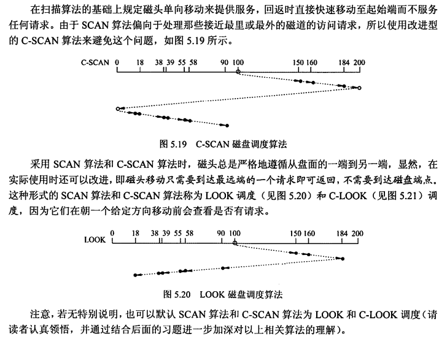 