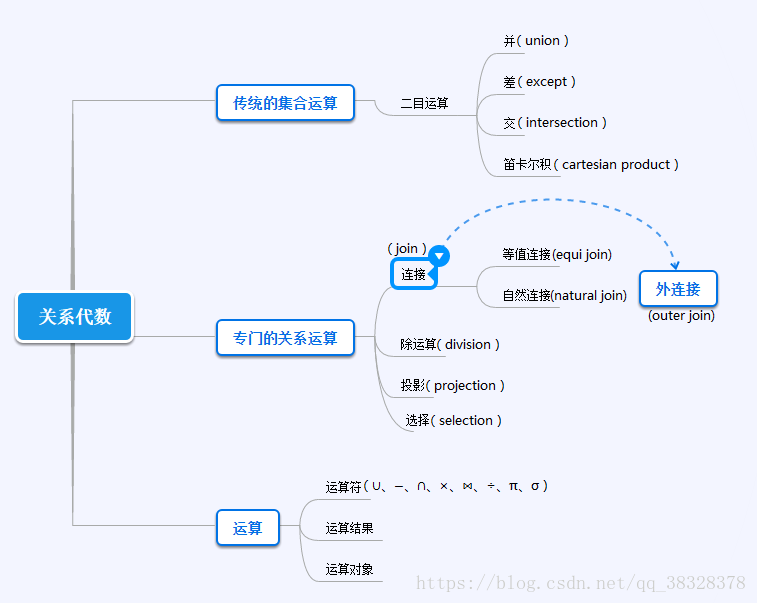

## 一、关系代数

关系代数是一种抽象的查询语言，它用对关系的运算来表达查询。任何一种运算都是将一定的运算符作用于一定的运算对象上，得到预期的结果。所以运算对象、运算符、运算结果是运算的三大要素。按运算符的不同分为传统的集合运算和专门的关系运算两类：

- 传统的集合运算包括：并（∪）、差（−）、交（∩）、笛卡尔积（×）。

- 专门的关系运算包括：选择（σ）、投影（π）、连接（⋈）、除运算（÷）。

## 二、传统的集合运算

传统的集合运算是二目运算，并（∪）、差（−）、交（∩）、笛卡尔积（×）四种运算。

设关系 R 和关系 S 具有相同的目 n（即两个关系都有 n 个属性），且相应的的属性取自同一个域，t 是元组变量，t∈R 表示 t 是 R 的一个元组。

下图分别是具有三个属性列的关系 R、S ：

可以定义并、差、交、笛卡尔积运算如下：

### 1、并（union）

关系 R 与关系 S 的并由属于 R 且属于 S 的元组组成。其结果关系仍为 n 目关系。记作：下图为关系 R 与关系 S 的并：

### 2、差（except）

关系R与关系S的差由属于R而不属于S的所有元组组成。其结果关系仍为n目关系。记作：

下图为关系R与关系S的差：

### 3、交（intersection）

关系R与关系S的交由既属于R又属于S的元组组成。其结果关系仍为n目关系。记作：

下图为关系R与关系S的交：

### 4、笛卡尔积（cartesian product）

这里的笛卡尔积严格地讲是广义笛卡尔积。两个分别为 n 目和 m 目的关系 R 和 S 的广义笛卡尔积是一个 (n+m) 列的元组的集合。元组的前 n 列是关系R的一个元组，后 m 列是关系 S 的一个元组。若 R 有 k1 个元组，S 有 k2 个元组，则关系 R 和关系 S 的广义笛卡尔积有 k1×k2 个元组。记作：

下图为关系R与关系S的笛卡尔积：

## 三、专门的关系运算

专门的关系运算(Specific relation operations)包括**选择**、**投影**、**连接**、**除**等。

### 1、选择（selection）

选择又称为限制（Restriction）。它是在关系R中选择满足给定条件的诸元组，记作：

其中F表示选择条件，它是一个逻辑表达式，取逻辑值‘真’或‘假’。逻辑表达式F的基本形式为：

θ 表示比较运算符。φ 表示逻辑运算符。[ ] 表示任选项。

例子：

- 查询信息系（IS系）全体学生：

- 查询年龄小于20岁的学生：

## 参考

- [关系代数](https://www.cnblogs.com/lsqin/p/9342923.html)