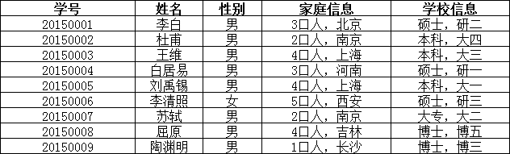
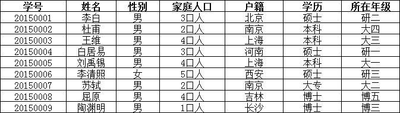
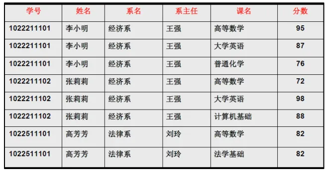
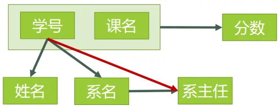
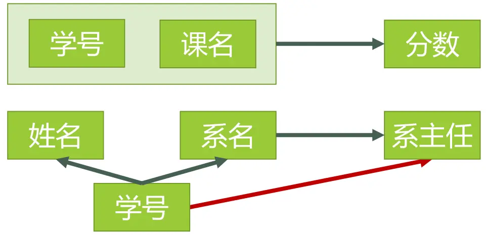
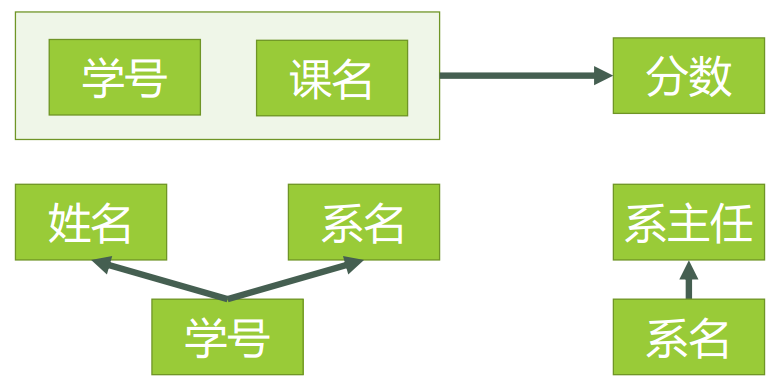
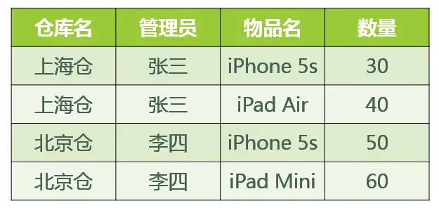

## 一、关系模型

- 关系模式：对关系的描述称为关系模式，即关系模式时命名的属性集合。其格式为：

- 关系名（属性名1，属性名2，属性名3......）

- 码（关键字key）:属性或属性的集合，其值能唯一的标识一个元组。在实际使用中又分为以下几种码（键） 

- 候选码：若关系中的某一属性的值能唯一的标志一个元组，则称之为候选码，候选码可以有多个。

- 主码：用户从候选码中选作元祖标志的候选码称之为主码。

- 外码：如果一个关系中的属性或属性值并非该关系的码，它们是另外一个关系的码，称之为外码。

- 主属性和非主属性: 关系中，候选码中的属性称之为主属性，不包含在任何候选码中的属性称之为非主属性。

## 二、关系的完整性

- 实体完整性：若属性A是基本关系R的主属性，则A不能取空值，因为如果出现空值。那么主码值就起不到唯一标识元组的作用。

- 参照完整性：若属性（或属性组）F是基本关系R的外码，它是基本关系S的主码K相对应，则对于R中每个元组在F上的值必为：①取空值②等于S中的某个元组的主码值

- 用户定义完整性

## 三、函数依赖

函数依赖是指某个属性集决定另一个属性集时，称另一属性集依赖于该属性集。例如：在学生关系中，如果知道一个学生的学号，就可以知道学生的姓名，学生的学号决定学生的姓名，也可以称为姓名属性依赖于学号，这就是函数依赖。函数依赖又分为**非平凡依赖**，**平凡依赖**；从性质上还可以分为**完全函数依赖**、**部分函数依赖**和**传递函数依赖**。

1. 函数依赖是语义范畴的概念。只能根据数据的语义来确定函数依赖。例如“姓名→年龄”这个函数依赖只有在不允许有同名人的条件下成立。

1. 函数依赖与属性之间的联系类型有关，在关系模式中 

- 如果属性X于Y有1：1联系时，则存在函数依赖X->Y,Y->X即X<=>Y，例如当学生不重名时，学号<=>姓名。

- 如果属性X与Y有m：1联系时，则只存在函数依赖X->Y，例如SNO于SAGE之间为m:1联系，所以有SNO->SAGE

- 如果属性X与Y有m：n联系时，则X与Y之间不存在任何函数依赖联系，例如一个学生可以选修多门课程，每门课程可以有多个学生选修，所以SNO与CNO之间不存在依赖关系。

1. **平凡函数依赖**：若X->Y，并且Y属于X，则称X->Y是平凡函数依赖。例如：(学号，姓名)->姓名，姓名属于(学号，姓名)，所以(学号，姓名)->姓名是平凡函数依赖。

1. **非平凡函数依赖**：若X->Y，并且Y不属于X，则称X->Y是非平凡函数依赖。
   例如：学号->班级，但班级不属于学号。

1. **完全函数依赖**：设X，Y是关系R中的两个属性集合，X’是X的真子集，存在X->Y，但对于每一个X’都有X‘!->Y，则称Y完全函数依赖于X。
   例如：成绩(学号，课程号，成绩)，(学号，课程号)->成绩，但是单一的学号或课程号都不可以推出某个学生的成绩。像这样的依赖关系就是完全函数依赖。

1. **部分函数依赖**：设X,Y是关系R的两个属性集合，存在X→Y，若X’是X的真子集，存在X’→Y，则称Y部分函数依赖于X。
   例：学生(学号，姓名，性别，班级)，(学号，姓名)->性别，并且学号->性别，所以(学号，姓名)->性别是部分函数依赖。

1. **传递函数依赖**：设X,Y,Z是关系R中互不相同的属性集合，存在X→Y(Y !→X),Y→Z，则称Z传递函数依赖于X。例：R(学号，系名，系主任)。学号->系名(系名!->学号)，系名->系主任，所以学号->系主任是传递函数依赖。

## 四、范式（NF）

下文转自：https://www.zhihu.com/question/24696366

### **1、第一范式(1NF)**

- **1NF的定义为：符合1NF的关系中的每个属性都不可再分**。

在上面的表中，“家庭信息”和“学校信息”列均不满足原子性的要求，故不满足第一范式，调整如下：

### 2、第二范式（2NF）

2NF在1NF的基础之上，消除了非主属性对于码的部分函数依赖。**第二范式需要确保数据库表中的每一列都和主键相关，而不能只与主键的某一部分相关（主要针对联合主键而言）。**

首先，我们需要判断，表3是否符合2NF的要求？根据2NF的定义，判断的依据实际上就是看数据表中**是否存在非主属性对于码的部分函数依赖**。判断的方法是：

第一步：找出数据表中所有的**码**。 第二步：根据第一步所得到的码，找出所有的**主属性**。 第三步：数据表中，除去所有的主属性，剩下的就都是**非主属性**了。 第四步：查看是否存在非主属性对码的**部分函数依赖**。

举例子：

对于该，根据前面所说的四步，我们可以这么做：

**第一步：**

1. 查看所有每一单个属性，当它的值确定了，是否剩下的所有属性值都能确定。
2. 查看所有包含有两个属性的属性组，当它的值确定了，是否剩下的所有属性值都能确定。
3. ……

看起来很麻烦是吧，但是这里有一个诀窍，就是假如A是码，那么所有包含了A的属性组，如（A，B）、（A，C）、（A，B，C）等等，都不是码了（因为作为码的要求里有一个“**完全**函数依赖”）。

下图表示了表中所有的函数依赖关系：

这一步完成以后，可以得到，表3的码只有一个，就是（学号、课名）。

**第二步：** 主属性有两个：**学号** 与 **课名**

**第三步：** 非主属性有四个：**姓名**、**系名**、**系主任**、**分数**

**第四步：** 对于**（学号，课名） → 姓名**，有 **学号 → 姓名**，存在非主属性 **姓名** 对码**（学号，课名）**的部分函数依赖。 对于**（学号，课名） → 系名**，有 **学号 → 系名**，存在非主属性 系**名** 对码**（学号，课名）**的部分函数依赖。 对于**（学号，课名） → 系主任**，有 **学号 → 系主任**，存在非主属性  对码**（学号，课名）**的部分函数依赖。

所以表3存在非主属性对于码的部分函数依赖，最高只符合1NF的要求，不符合2NF的要求。

为了让表3符合2NF的要求，我们必须消除这些部分函数依赖，只有一个办法，就是将大数据表拆分成两个或者更多个更小的数据表，在拆分的过程中，要达到更高一级范式的要求，这个过程叫做”模式分解“。模式分解的方法不是唯一的，以下是其中一种方法：

- 选课（学号，课名，分数）
- 学生（学号，姓名，系名，系主任）

我们先来判断以下，**选课**表与**学生**表，是否符合了2NF的要求？

- 对于**选课**表，其码是**（学号，课名）**，主属性是**学号**和**课名**，非主属性是**分数**，**学号**确定，并不能唯一确定**分数**，**课名**确定，也不能唯一确定**分数**，所以不存在非主属性**分数**对于码 **（学号，课名）**的部分函数依赖，所以此表符合2NF的要求。
- 对于**学生**表，其码是**学号，**主属性是**学号**，非主属性是**姓名、系名**和**系主任**，因为码只有一个属性，所以不可能存在非主属性对于码的部分函数依赖，所以此表符合2NF的要求。

下**图**表示了[模式分解](https://www.zhihu.com/search?q=模式分解&search_source=Entity&hybrid_search_source=Entity&hybrid_search_extra={"sourceType"%3A"answer"%2C"sourceId"%3A29189700})以后的新的函数依赖关系

### 3、**第三范式（3NF）**

**3NF在2NF的基础之上，消除了非主属性对于码的传递函数依赖**。

- 对于**选课**表，主码为（学号，课名），主属性为**学号**和**课名，**非主属性只有一个，为分数，不可能存在传递函数依赖，所以**选课**表的设计，符合3NF的要求。
- 对于**学生**表，主码为**学号**，主属性为**学号**，非主属性为**姓名**、**系名**和**系主任**。因为 学号 → 系名，同时 系名 → 系主任，所以存在非主属性**系主任**对于码**学号**的传递函数依赖，所以**学生**表的设计，不符合3NF的要求。

为了让[数据表设计](https://www.zhihu.com/search?q=数据表设计&search_source=Entity&hybrid_search_source=Entity&hybrid_search_extra={"sourceType"%3A"answer"%2C"sourceId"%3A29189700})达到3NF，我们必须进一步进行模式分解为以下形式：

- 选课（学号，课名，分数）
- 学生（学号，姓名，系名）
- 系（系名，系主任）

### 4、BCNF 范式

要了解 BCNF 范式，那么先看这样一个问题，若：

1. 某公司有若干个仓库；
2. 每个仓库只能有一名管理员，一名管理员只能在一个仓库中工作；
3. 一个仓库中可以存放多种物品，一种物品也可以存放在不同的仓库中。每种物品在每个仓库中都有对应的数量。

那么关系模式 仓库（仓库名，管理员，物品名，数量） 属于哪一级范式？

答：已知函数依赖集：仓库名 → 管理员，管理员 → 仓库名，（仓库名，物品名）→ 数量

- 码：（管理员，物品名），（仓库名，物品名）
- 主属性：仓库名、管理员、物品名
- 非主属性：数量

∵ 不存在非主属性对码的部分函数依赖和传递函数依赖。∴ 此关系模式属于3NF。

基于此关系模式的关系（具体的数据）可能如图所示：

好，既然此关系模式已经属于了 3NF，那么这个关系模式是否存在问题呢？我们来看以下几种操作：

1. 先新增加一个仓库，但尚未存放任何物品，是否可以为该仓库指派管理员？——不可以，因为物品名也是主属性，根据实体完整性的要求，主属性不能为空。
2. 某仓库被清空后，需要删除所有与这个仓库相关的物品存放记录，会带来什么问题？——仓库本身与管理员的信息也被随之删除了。
3. 如果某仓库更换了管理员，会带来什么问题？——这个仓库有几条物品存放记录，就要修改多少次管理员信息。

造成此问题的原因：存在着**主属性**对于码的部分函数依赖与传递函数依赖。（在此例中就是存在主属性【仓库名】对于码【（管理员，物品名）】的部分函数依赖。

解决办法就是要在 3NF 的基础上消除**主属性**对于码的部分与传递函数依赖。

仓库（仓库名，管理员）

库存（仓库名，物品名，数量）

这样，之前的插入异常，修改异常与删除异常的问题就被解决了。

## 五、模式的分解

### 1、模式分解的三个定义

对于一个模式的分解是多种多样的，但是分解后产生的模式应与原模式等价。人们从不同的角度去观察问题，对等价的概念形成三种不同的定义：

- 分解具有**无损连接性**

- 分解要保持**函数依赖**

- 分解既要保持**函数依赖**，又要具有**无损连接性**

这三个定义是实行分解的三条不同的准则，按照不同的分解准则，模式所能达到的分离程度各不相同，各种范式就是分离程度的测度。

要讨论的问题是：

- 无损连接性和保持函数依赖的含义是什么？如何判断？

- 对于不同的分解等价定义究竟能达到何种程度的分离。即分离后的关系模式是第几范式。

- 如何实现分离，即给出分解的算法。

一个关系分解为多个关系，相应的原来存储在一张二维表内的数据就要分散存储到多张二维表中，要使这个分解有意义，起码的要求是后者不能丢弃前者的信息。

对于分解后的数据库，要回答“S1 在哪个系学习”也不可能了。这样的分解还有什么用呢？

如果分解后的数据库能够恢复到原来的情况，不丢失信息的要求也就达到了。Ri像R的恢复是通过自然连接来实现的，这就产生了无损连接性的概念。

### 2、分解的无损连接性和保持函数依赖性

例：已知R<U,F>,U={A,B,C,D,E},F={AB->C,C->D,D->E},R的一个分解为R1(A,B,C),R2(C,D),R3(D,E)。
（1）首先构造初始表。

（2）对AB->C，因各元组的第一、二列没有相同的分量，所以表不改变。由C->D可以把b14改成a4,再由D->E可使b15,b25全改为a5。最后结果为下图。

表中第一行成为a1,a2,a3,a4,a5，所以此分解具有无损连接性。

如果F上的每一个函数依赖都在其分解后的某一个关系上成立，则这个分解是保持依赖的（这是一个充分条件）。

例：

有属性集，ABCDEF，存在这样的函数依赖集{A->BC , CD->E , B->D , BE->F , EF->A},然后有这样的分解 {ABC , BD , BEF}。设 U1=ABC，A->BC，U2=BD，B->D ，U3=BEF，BE->F ，即我们不能推出 CD->E，EF->A，所以也不具有保持函数依赖的特性。

### 3、模式分解的算法

关于模式分解的几个重要事实：

- 若要求分解保持函数依赖，那么模式分离总可以达到3NF，但不一定达到BCNF。

- 若要求分解既保持函数依赖，又具有无损连接性，可以达到3NF，但不一定达到BCNF。

- 若要求分解具有无损连接性，那么一定达到BCNF。

#### （1）转换为3NF的保持函数依赖的分解（合成法）

例：关系模式 `R<U,F>`，其中 `U={C,T,H,R,S,G}`，`F={CS→G,C→T,TH→R,HR→C,HS→R}`，将其分解成3NF并保持函数依赖。

- 计算 F 的最小函数依赖集 `F={CS→G,C→T,TH→I,HI→C,HS→I}`

- 由于 R 中的所有属性均在F中都出现，所以转下一步。

- 对 F 按具有相同左部的原则分为：`R1=CSG，R2=CT，R3=THI，R4=HIC，R5=HSI`。所以 `ρ={R1(CSG),R2(CT),R3(THI),R4(HIC),R5(HSI)}`。

#### （2）转换为3NF既有无损连接性又保持函数依赖的分解

例题：同上

- 先转换为3NF的保持函数依赖的分解，就是上面的结果 `ρ={R1(CSG),R2(CT),R3(THR),R4(HRC),R5(HSR)}`。

- 求关系模式 `R<U，F>`的码为 `HS`，令 `τ= ρ∪{HS} = {R1(CSG),R2(CT),R3(THR),R4(HRC),R5(HSR),R*(HS)}`

- 由于存在 `HS⊆HSR`，所以去掉 `R*(HS)`。

- 综上`τ={R1(CSG),R2(CT),R3(THR),R4(HRC),R5(HSR)}`为所求分解。

#### （3）转换为BCNF的无损连接分解

## 参考

- https://www.zhihu.com/question/24696366

