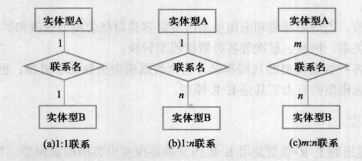
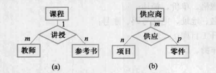
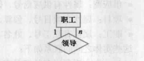
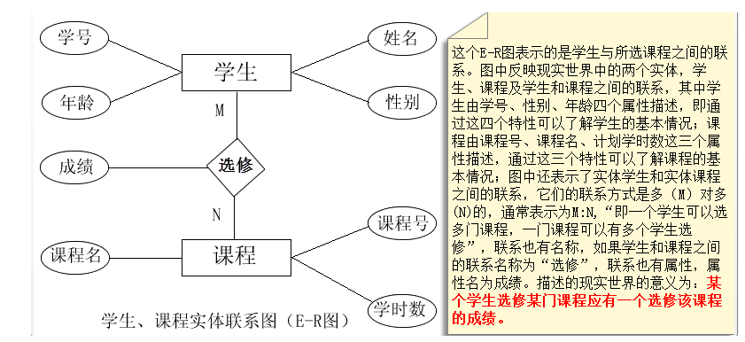
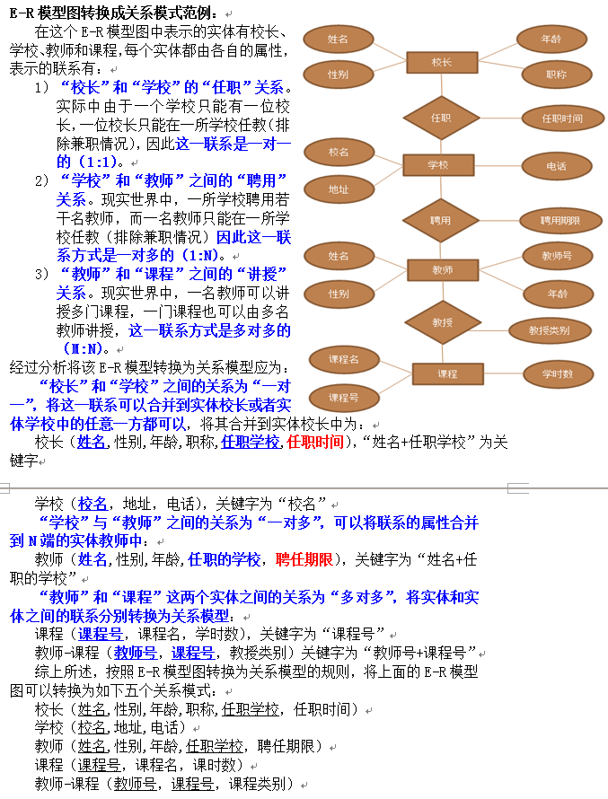

### **1、 概念数据模型**

**E-R实体联系图**是直观表示概念模型的工具，其中**包含了实体、联系、属性三个成分，。**

#### **（1)实体之间的关系**

| 两个实体之间的关系     |  |
| ---------------------- | ------------------------------------------------------------ |
| 两个以上实体之间的关系 |  |
| 单个实体型内的关系     |  |

#### **（2）E-R图**

E-R图提供了表示实体型、属性和联系的方法。

- 实体型用矩形表示，矩形框内写明实体名
- 属性用椭圆形表示，并用无向边将其与相应的实体型连结起来。
- 联系用菱形表示，菱形框内写明联系名，并用无向边分别与有关实体型连接起来，同时在无向边旁标上联系的类型(1:1、1：n、m:n),需要注意的是，如果一个联系也有属性，需要将属性用无向边与该联系连接起来。

实体和实体之间的联系用无向线段连接，在线段上标注联系的类型，实体和联系都由各自的属性。

#### **（1）E-R图向关系模型的转换**

- 概念结构是独立于任何一种数据模型的信息结构，逻辑结构设计的任务就是将概念结构设计阶段设计好的基本E-R图转换为与选用数据库管理产品所支持的数据模型相符合的逻辑结构。
- E-R图向关系模型转换要解决的问题是，如何将实体型和实体之间的联系转换为关系模式，如何确定这些关系模式的属性和码。
- 关系模式的逻辑结构是一组关系模式的集合。E-R图则是由是实体型、实体的属性和实体型之间的联系三个元素组成的，所以将E-R图转换为关系模型实际上就是将实体型、实体的属性和实体型之间的联系转换为关系模式。下面介绍转换的一般原则。
  - **将一个实体转换成一个关系模型**。实体的属性为关系模型的属性，实体的标识符为关系模型的关键字，如上图所示的E-R模式中有两个实体：学生、课程，可以分别转换学生模型和课程模型：
    - 学生模型（学号,姓名,性别,年龄），学号是学生模型的关键字
    - 课程模型（课程号，课程名，学时数），课程号是课程模型的关键字
  - **联系转换为关系模型**。联系转换成关系模型时，要根据联系方式的不同采用不同的转换方式：
    - 若**联系的方式是一对一的(1:1)**，可以在两个实体关系模型中的任意一个关系模型中加入另一个关系模型的**关键字**和**联系类型的属性**。
    - 若**联系方式是一对多的(1:N)**，则在N端（为多的一端）实体的关系模型中加入1端实体关系模型的关键字和联系类型的属性
    - 若**联系方式是多对多的（M:N）**，则将联系也转换成关系模型，其属性是互为联系的两个实体的关键字和联系的属性

