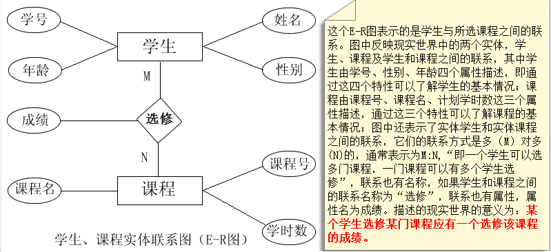
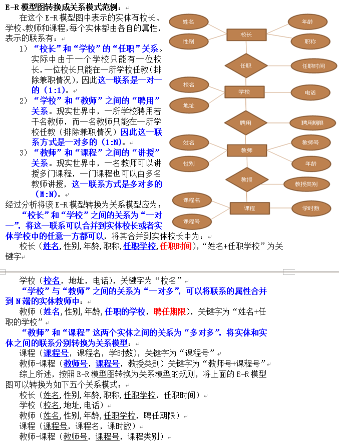

数据库设计通常包括六个阶段：需求分析阶段、概念结构设计阶段、逻辑结构设计阶段、物理结构设计阶段、实施阶段、运行与维护阶段。

## 一、概念结构设计

在需求分析阶段所得到的应用需求应该首先抽象为信息世界的结构，然后才能更好、更准确的用某一数据库管理系统实现这些需求。概念模型是各种数据模型的共同基础，它比数据模型更独立于机器、更抽象，从而更加稳定。描述概念模型的有力工具是"**实体-联系图方法（Entity-Relationship Approach），简称E-R模型**"

### 1、 概念数据模型

**E-R实体联系图**是直观表示概念模型的工具，其中**包含了实体、联系、属性三个成分，。**

E-R模型图，既表示实体，也表示实体之间的联系，是现实世界的抽象，与计算机系统没有关系，是可以被用户理解的数据描述方式。通过E-R模型图可以使用户了解系统设计者对现实世界的抽象是否符合实际情况，从某种程度上说E-R模型图也是用户与系统设计者进行交流的工具，E-R模型图已成为概念模型设计的一个重要设计方法。

#### （1)实体之间的关系

-  两个实体之间的关系 

- 一对一关系

- 一对多关系

- 多对多关系

-  两个以上实体之间的关系 

-  单个实体型内的关系 

#### （2）E-R图

E-R图提供了表示实体型、属性和联系的方法。

- 实体型用矩形表示，矩形框内写明实体名

- 属性用椭圆形表示，并用无向边将其与相应的实体型连结起来。

- 联系用菱形表示，菱形框内写明联系名，并用无向边分别与有关实体型连接起来，同时在无向边旁标上联系的类型(1:1、1：n、m:n),需要注意的是，如果一个联系也有属性，需要将属性用无向边与该联系连接起来。

E-R图具体范例

实体和实体之间的联系用无向线段连接，在线段上标注联系的类型，实体和联系都由各自的属性。

### 2. 逻辑结构设计

概念结构是独立于任何一种数据模型的信息结构，逻辑结构设计的任务就是把概念结构设计阶段设计好的E-R图转换为与选用数据库管理系统产品所支持的数据模型相符合的逻辑结构。

#### （1）E-R图向关系模型的转换

E-R图向关系模型转换要解决的问题是，如何将实体型和实体之间的联系转换为关系模式，如何确定这些关系模式的属性和码。

将E-R模型图转换成关系模型的规则：E-R模型图中的主要成分是实体及实体之间的联系，对于实体的转换方式是：

1) **将一个实体转换成一个关系模型**。实体的属性为关系模型的属性，实体的标识符为关系模型的关键字，如上图所示的E-R模式中有两个实体：学生、课程，可以分别转换学生模型和课程模型：

学生模型（学号,姓名,性别,年龄），学号是学生模型的关键字

课程模型（课程号，课程名，学时数），课程号是课程模型的关键字

2) **联系转换为关系模型**。联系转换成关系模型时，要根据联系方式的不同采用不同的转换方式：

- 若**联系的方式是一对一的(1:1)**，可以在两个实体关系模型中的任意一个关系模型中加入另一个关系模型的**关键字**和**联系类型的属性**。

- 若**联系方式是一对多的(1:N)**，则在N端（为多的一端）实体的关系模型中加入1端实体关系模型的关键字和联系类型的属性

- 若**联系方式是多对多的（M:N）**，则将联系也转换成关系模型，其属性是互为联系的两个实体的关键字和联系的属性

