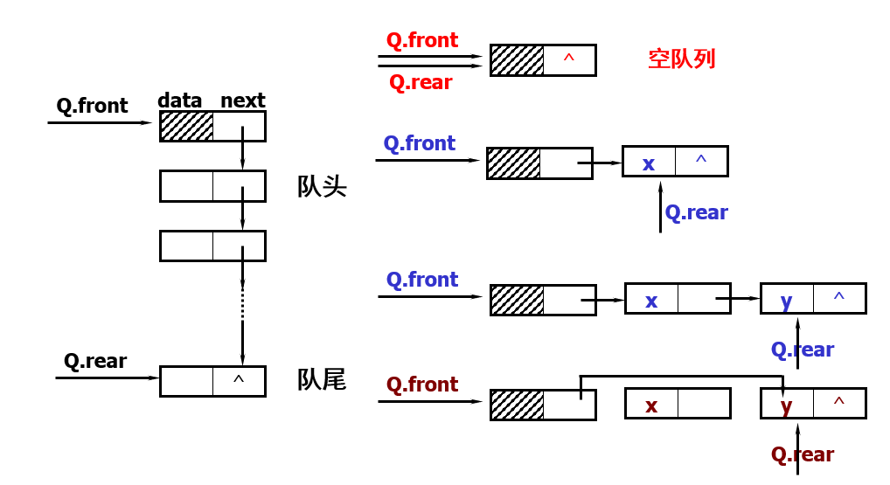
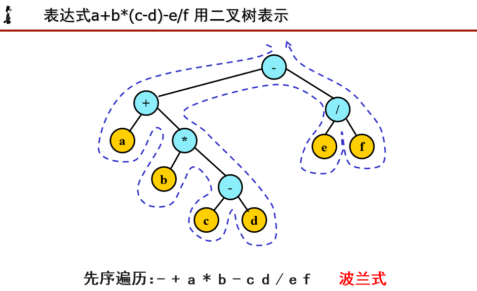
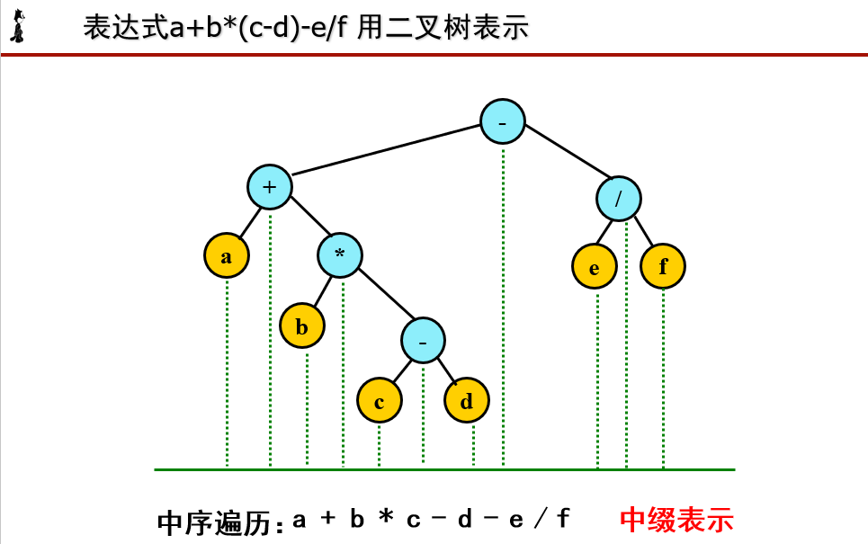
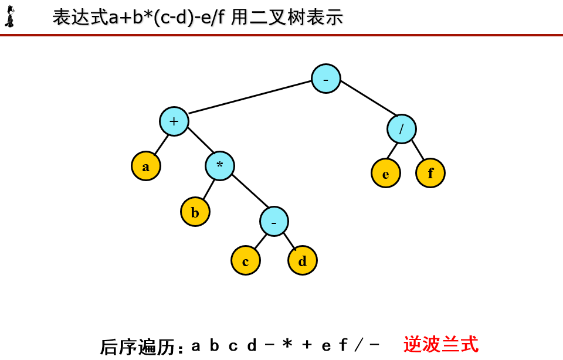

## 一、栈


### 1、栈的定义与特点

- 定义：只能在表的一端（栈顶）进行插入和删除运算的线性表

- 逻辑结构：与线性表相同，仍为一对一关系

- 存储结构： 用顺序栈或链栈存储均可，但以顺序栈更常见

- 运算规则：只能在栈顶运算，且访问结点时依照后进先出（LIFO）或先进后出（FILO）的原则。

- 实现方式：关键时编写入栈和出栈函数，具体实现依顺序栈和链栈的不同而不同。

- 基本操作有入栈、出栈、读栈顶元素值、建栈、判断栈满、栈空等。


### 2、顺序栈的表示与实现


```cpp
#define  MAXSIZE 100

//顺序栈的存储结构
typedef  struct {
    char *top;
    char *base;
    int stacksize;  //栈可用的最大容量
} SqlStack;

//顺序栈的初始化
void InitSqlStack(SqlStack &S){
    S.base = new char[MAXSIZE];
    S.stacksize = MAXSIZE;
    S.top = S.base;
}

//顺序栈的入栈
bool pushStack(SqlStack &S,char e){
    if((S.top - S.base)==S.stacksize ){
        return false;
    }else{
        *S.top++=e;
        return true;
    }
}

//顺序栈的出栈
bool PopStack(SqlStack &S,char &e){
    if (S.top == S.base){
        return false;
    }else{
        e = *--S.top;
        return true;
    }
}

//取栈顶元素
bool GetTop(SqlStack S,char &t){
    if (S.top != S.base){
        t=*(S.top-1);
        return true;
    }else{
        return false;
    }
}
```


### 3、链栈的表示和实现


```cpp
#include <iostream>
using  namespace std;

/*链栈的存储结构
 * 由于栈的主要操作是在栈顶插入和删除，
 * 显然以链表的的头部作为栈顶是最方便的，
 * 而且没必要像单链表那样为了操作方便附加头结点
 */
typedef  struct StackNode{
    char data;
    StackNode *next;
}StackNode,*LinkStack;


//链栈的初始化
bool  InitStack(LinkStack L){
    L = NULL;
    return true;
}

//链栈的入栈
bool PushStack(LinkStack &L,char e){
    LinkStack elem = new StackNode;
    elem->data = e;
    elem->next = L;
    L = elem;
    return true;
}

//链栈的出栈
bool PopStack(LinkStack &L,char &e){
    e = L->data;
    LinkStack  p = L;
    L = L->next;
    free(p);
    return true;

}

//取链栈的栈顶元素
bool GetTop(LinkStack L,char &e){
    e = L->data;
    return true;
}
```


## 二、队列


### 1、队列的定义和特点


- 定义：只能在表的一端（队尾）进行插入，在另一端（队头）进行删除运算的线性表。

- 逻辑结构：与线性表相同，仍为一对一关系

- 存储结构：用顺序队列或链队存储均可

- 运算规则：先进先出（FIFO）

- 实现方式：关键是编写入队和出队函数，具体实现依顺序队或链队的不同而不同


### 2、顺序序列的表示与实现


```cpp
//队空：front==rear
//队满：（rear+1）%M==front
//
#include <iostream>
using  namespace std;
#define  MAXSIZE 100

//队列的顺序存储结构
typedef  struct {
    char *base;
    int front;
    int rear;
}SqQueue;

//循环队列的初始化
void InitSqQueue(SqQueue &S){
    S.base = new char[MAXSIZE];
    S.front = S.rear = 0;
}

//求循环队列长度
int GetLenth(SqQueue S){
    return (S.rear+MAXSIZE-S.front)%MAXSIZE;
}

//循环队列的入队
bool EnQueue(SqQueue &S,char c){
    if((S.rear+1)%MAXSIZE ==S.front)
        return false;
    S.base[S.rear]=c;
    S.rear=(S.rear+1)%MAXSIZE;
    return true;
}

//循环队列的出队
bool DeQueue(SqQueue &S,char &c){
    if(S.front==S.rear)
        return false;
    c = S.base[S.front];
    S.front = (S.front+1)%MAXSIZE;
    return true;
}

//取循环队列的队头
bool GetHead(SqQueue S,char &c){
    if (S.front == S.rear)
        return false;
    c = S.base[S.front];
    return true;
}
```


### 3、链队列的表示与实现





```cpp
#include <iostream>
using  namespace std;

typedef struct QNode{
    char data;
    QNode *next;
}QNode,*QueuePtr;

typedef struct {
    QueuePtr front;
    QueuePtr rear;
}LinkQueue;

//链队列的入队
void EnQueue(LinkQueue &L, char e) {
    QueuePtr p = new QNode;
    p->data = e;
    p->next = NULL;
    L.rear->next=p;
    L.rear = p;
}
//链队列的出队
void DeQueue(LinkQueue &L,char&e){
    if (L.front==L.rear)
        return;
    QueuePtr q = L.front->next;
    e = q->data;
    L.front->next = q->next;
    if(L.rear==q)
        L.rear = L.front;
    free(q);
}
//构造一个空队列
void InitQueue(LinkQueue &L) {
    L.front=L.rear = new QNode;
    L.front->next = NULL;
}

//取队头元素
void GetHead(LinkQueue L,char &e){
    if (L.front==L.rear)
        return;
    e = L.front->next->data;
}
```


### 4、循环队列


- 入队：`rear=(rear+1)%M; sq[rear]=x;`

- 出队：`front=(front+1)%M; x=sq[front];`

- 队空：`front==rear`

- 队满：`(rear+1)%M==front`


## 三、栈的应用


### 1、数制转换


对于输入的任意一个非负十进制整数，打印输出与其等值的八进制数。


```plain
void conversion (){
		InitStack(S);
		scanf(“%d”,N);
		while(N){
            Push(S,N%8);
            N = N/8;
            }
		while (!StackEmpty(s)){
                Pop(S,e);
                printf(“%d”,e);
            } 
}
```


### 2、波兰式与逆波兰式











### 3、回文游戏

顺读与逆读字符串一样（不含空格，算法思想：

-  读入字符串； 

-  去掉空格（原串）； 

-  压入栈； 

-  原串字符与出栈字符依次比较； 

- 若不等，非回文；

- 若直到栈空都相等，回文。