## 一、树的基本概念


- 树的度：一棵树中各结点的度的最大值。

- 祖先：从根结点到该结点所经分支上的所有结点。

- 堂兄弟：其双亲在同一层的结点互为堂兄弟。

- 结点的层次(level)：从根结点算起，根为第一层，根的孩子为第二层……。

- 深度(depth)：树中结点的最大层次。

- 有序树：将树中结点的各子树看成从左至右是有次序的，即不能互换。

- 无序树：将树中结点的各子树看成从左至右是无次序的，即可以互换。


## 二、二叉树


定义：是n(n>=0)个结点的有限集，其子树分为互不相交的两个集合，分别称为左子树和右子树，左子树和右子树也是二叉树。二叉树的子树有左、右之分，且其次序不能任意颠倒。


### 1、二叉树的种类


#### （1）满二叉树


除最后一层无任何子节点外，每一层上的所有结点都有两个子结点。


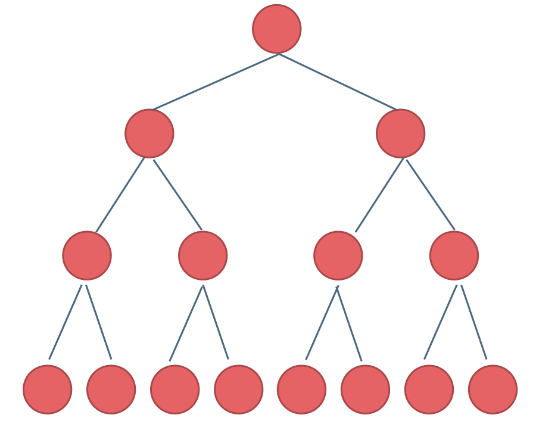


#### （2）完全二叉树


在最后一层，并不是所有节点都有两个子节点,最后一层所有的结点都连续集中在最左边。


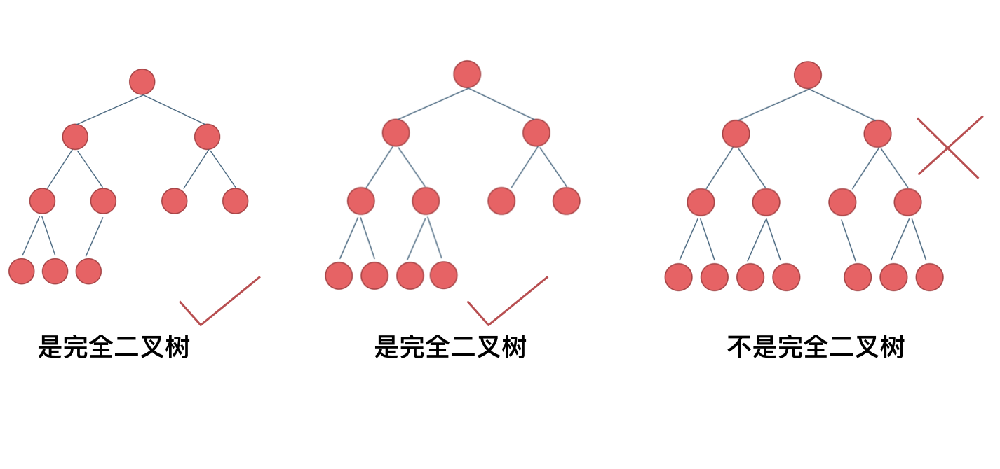

#### （3）二叉搜索树


前面介绍的树，都没有数值的，而二叉搜索树是有数值的了，**二叉搜索树是一个有序树**。


- 若它的左子树不空，则左子树上所有结点的值均小于它的根结点的值；

- 若它的右子树不空，则右子树上所有结点的值均大于它的根结点的值；

- 它的左、右子树也分别为二叉排序树


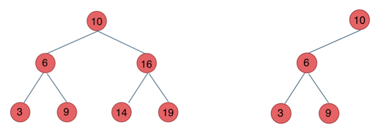


### 2、二叉树的存储结构


二叉树是非线性结构，其存储结构可以分为两种，即顺序存储结构和链式存储结构。


#### （1）、顺序存储结构


```cpp
#define MAXSIZE 100
typedef TElemType  SqBiTree[MAXSIZE];
SqBiTree bt;
```


二叉树的顺序存储，就是用一组连续的存储单元存放二叉树中的结点。即用一维数组存储二叉树中的结点。用编号的方法从树根起，自上层至下层，每层自左至右地给所有结点编号。依据二叉树的性质，完全二叉树和满二叉树采用顺序存储比较合适。一棵完全二叉树（满二叉树）如下图所示：


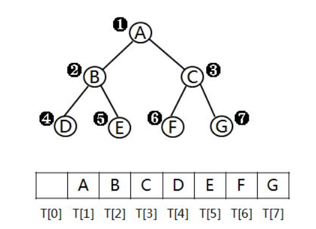

但是对于一般的非完全二叉树来说，则应将其每个结点与完全二叉树上的结点相对照，存储在一维数组的相应分量中，不存在的结点用NULL代替。

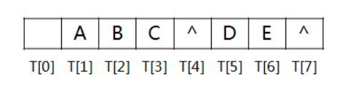


#### （2）、链式存储结构


每个结点除了存储自身的数据外，还应设置两个指针分别指向左、右孩子结点。


```cpp
typedef struct BiTNode{
    TElemType data;
    Struct BiTNode *lchild,*rchild;
}BiTNode,*BiTree;
```


注：在n个结点的二叉链表中，有n+1个空指针域。


### 3、遍历二叉树


#### （1） 二叉树的遍历方式


二叉树的遍历方式主要有先序遍历、中序遍历、后序遍历和层次遍历。


**先序遍历**


基本思想：先访问根结点，再先序遍历左子树，最后再先序遍历右子树即根—左—右。


```cpp
void PreOrderTraverse(BiTree T){
    if(T){
        printf("%c",T->data);//显示结点数据，可以更改为其他对结点的操作
        PreOrderTraverse(T->lchild);//再先序遍历左子树
        PreOrderTraverse(T->rchild)；//最后先序遍历右子树
    }
}
```


中序遍历和后序遍历同理。


**层次遍历**


基本思想：从第一层开始，依此遍历每层，直到结束。


注:如果把访问根结点这个不涉及递归的语句抛开，则三个递归算法走过的路线是一样的。


#### （2）根据遍历序列确定二叉树


由二叉树的先序序列和中序序列、或由其后序序列和中序序列均能唯一地确定一棵二叉树。
根据定义，二叉树的先序遍历是先访问根结点，其次再按先序遍历方式遍历根结点的左子树，最后按先序遍历方式遍历根结点的右子树。也就是说，在先序序列中，第一个结点一定是二叉树的根结点。另一方面中序遍历是先遍历左子树，然后访问根结点，最后再遍历右子树。这样根结点在中序序列中必然将中序序列分割成两个子序列，前一个子序列是根结点的左子树的中序序列，而后一个子序列是是根结点的右子树的中序序列。根据两个子序列，在先序序列中找到对应的左子序列和右子序列。在先序序列中，左子序列的第一个结点是左子树的根结点，右子树的第一个结点是右子树的根结点。这样就确定了二叉树的三个结点。同时，左子树和右子树的根结点又可以将左子序列和右子序列划分成两个子序列，如此递归下去，当取尽先序序列中的结点时，便可以得到一棵二叉树。
同理，由二叉树的后序序列和中序序列也可以唯一确定一棵二叉树。因为，依据后序遍历和中序遍历的定义，后序序列的最后一个结点，就如同先序序列的第一个结点一样，可将中序序列分为两个子序列，分别为这个结点左子树的中序序列和右子树的中序序列，后面的思想同上。


### 4、二叉树遍历的应用


#### （1）求表达式的值


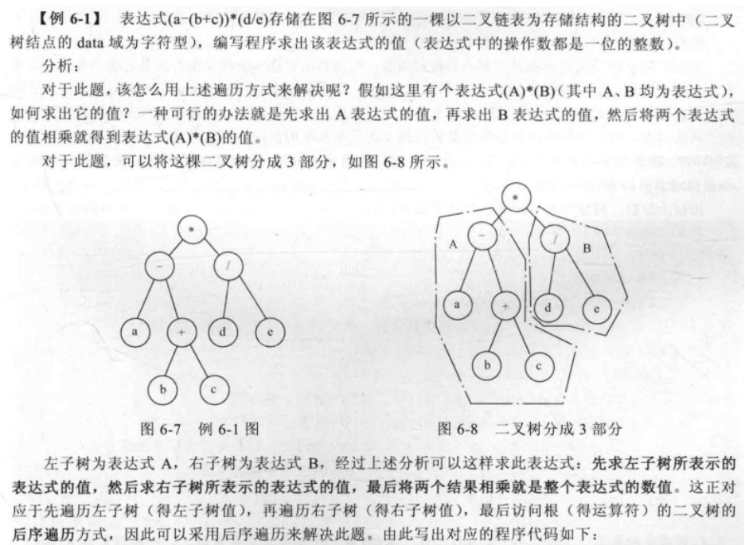


```cpp
int comp(BTNode *p)
{
    int A,B;
    if(p==NULL)
        return 0;
    else{
      if(p->lchild!=NULL&&p->rchild!=NULL)
         {
        A=comp(p->lchild);
        B=comp(p->rchild);        
        return op(A,B,p->data);
      }      
      else
          return p->data-'0';
    }
}
//说明：函数int op(int A,int B,char C)返回的是以C为运算符，以A、B为操作数的算术的数值
```


#### （2）、求二叉树的深度


```cpp
int Depth(BiTree T){
    if(T){
        m = Depth(T->lchild);
        n = Depth(T->rchild);
        if(m>n) 
            return m+1;
        else
            return n+1;
    }
    return  0;
}
```


#### （3）、 交换左右子树


```cpp
void Exchange(BiTree T)  
{  
    BiTree temp;  
    if(T)  
    {  
        Exchange1(T->lchild);  
        Exchange1(T->rchild);  
        temp=T->lchild;  
        T->lchild=T->rchild;  
        T->rchild=temp;  
    }  
}
```


#### （4）判断两棵树是否等价


```cpp
int Is_equal( BiTree T1 , BiTree T2 )  {  
    int t=0;  
    if(NULL == T1 && NULL == T2) {  
        t=1;  
    }  
    else {  
        if(NULL !=T1 &&NULL != T2 ){  
            if(T1->data == T2->data) {  
                if(Is_equal(T1->lchild,T2->lchild))  
                {  
                    t=Is_equal(T1->rchild,T2->rchild);  
                }  
            }  
        }  
    }  
    return t;  
}
```


#### （5）统计二叉树中叶子结点的数目


```cpp
int NodeCount(BiTree T){
    if (T==NULL){
        return 0;   //如果是空树，则结点个数为0，递归结束
    }else{
        return NodeCount(T->lchild)+NodeCount(T->rchild)+1;
        //否则结点个数为左子树结点个数+右子树结点个数+1
    }
}
```


#### （6）先序遍历的顺序建立二叉链表


```cpp
void CreateBiTree(BiTree &T){

    cin>>ch;
    if(ch == '#') T=NULL;　　　　　　
    else {
        T = new BiTNode;
        T->data = ch;        
        CreateBiTree(T->Lchild);
        CreateBiTree(T->Rchild);
}
```


#### （7） 复制二叉树


```cpp
void copy(BiTree T,BiTree &NewT){
    if(T==NULL){
        NewT = NULL;    //如果是空树，递归结束
        return;
    }else
    {
        NewT = new BiTNode;
        NewT->data = T->data;     //复制根结点
        copy(T->lchild,NewT->lchild); //递归复制左子树
        copy(T->rchild,NewT->rchild);  //递归复制右子树
    }
}
```


#### （8）输出后续序列的逆序


```cpp
void preorder(tree T){//输出后序序列的逆序
    if (T!=NULL){ 
        printf(“%f”, T->data);
        preorder(T->rchild);
        preorder(T->lchild);
    }
}
```


### 5、非递归方式实现遍历算法


#### （1）先序遍历非递归算法


要写出其遍历的非递归算法，主要任务就是用自己定义的栈来代替系统栈的功能。栈在遍历过程中主要做了哪些事情呢？以下图为例，各个结点进栈、出栈过程如6-12所示。


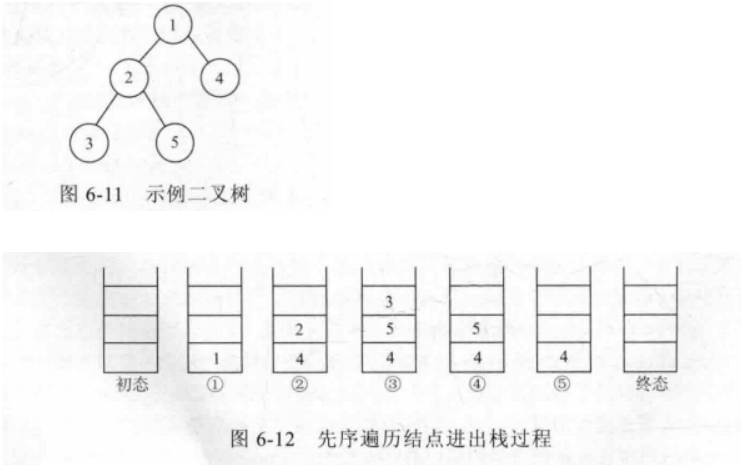

1）结点1入栈

 

2）出栈，输出栈顶结点1，并将1的左右孩子结点（2和4）入栈；右孩子先入栈，左孩子后入栈，因为对左孩子的访问要先于右孩子，后入栈的会先出栈访问。

 

3）出栈，输出栈顶结点2，并将2的左右孩子结点（3和5）入栈。

 

4）出栈，输出栈顶结点3，3为叶子结点，无孩子，本步无结点入栈

 

5）出栈，输出栈顶结点5

 

6）出栈，输出栈顶结点4，此时栈空，进入终态。

 

遍历序列为1，2，3，5，4


由此可以写出以下代码：
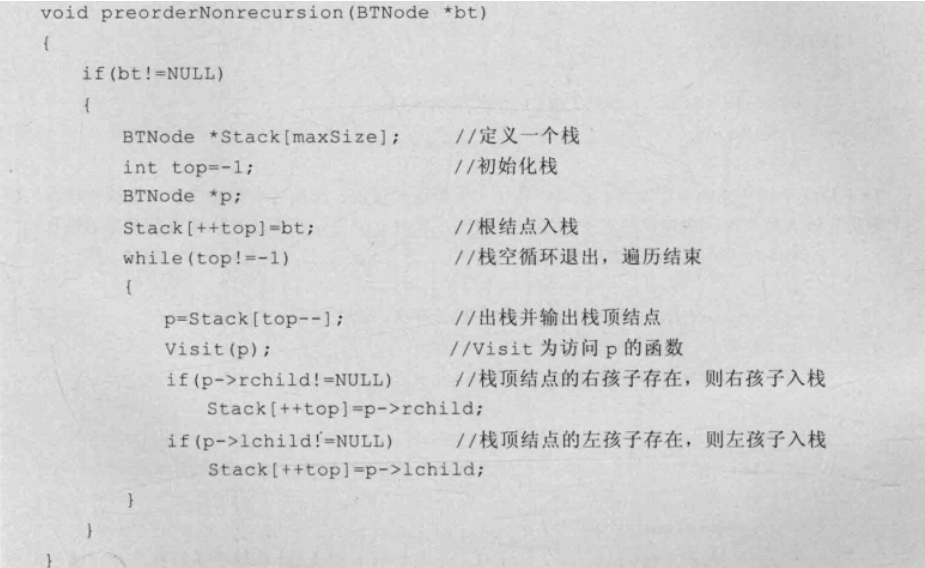


#### （2）中序遍历非递归算法


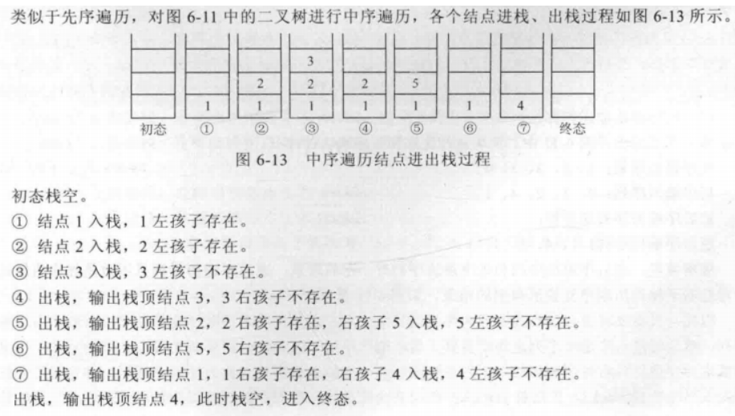


遍历序列为3，2，5，1，4


由以上步骤看出，中序非递归遍历过程如下：


- 开始根结点入栈

- 循环执行如下操作：如果栈顶结点左孩子存在，则左孩子入栈；如果栈顶结点左孩子不存在，则出栈并输出栈顶结点，然后检查其右孩子是否存在，如果存在，则右孩子入栈。

- 当栈空时算法结束。


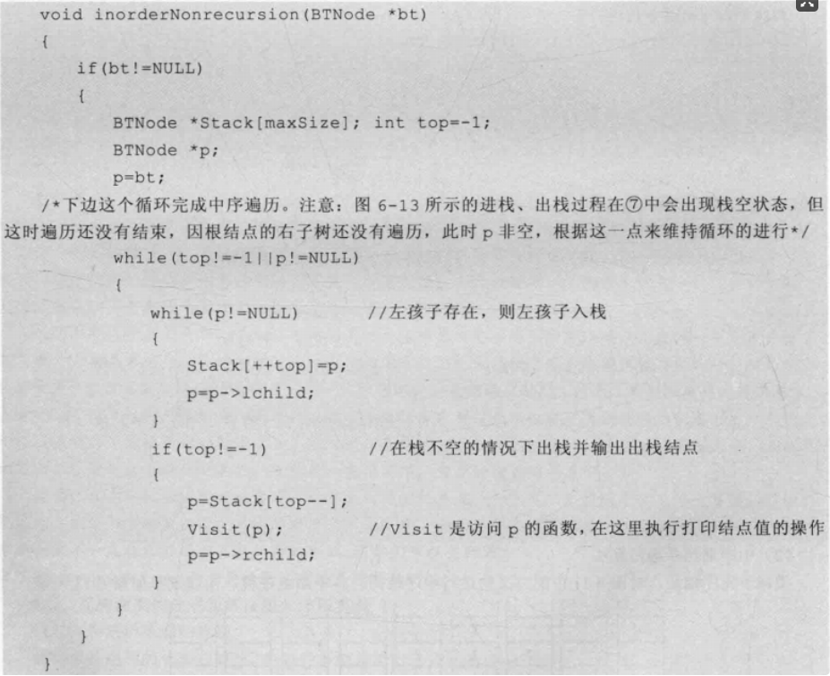


### 6、线索二叉树


#### （1）线索二叉树的原理


对于二叉链表存储结构，n个结点的二叉树有n+1个空链表，能不能把这些空链域有效地利用起来，以使二叉树的遍历更加高效呢？答案是肯定的，这就是线索二叉树的由来。在一般的二叉树中，我们只知道某个结点的左、右孩子，并不能知道某个结点在某种遍历方式下的直接前驱和直接后继，如果能够知道“前驱”和“后继”信息，就可以把二叉树看作一个链表结构，从而可以像遍历链表那样来遍历二叉树，进而提高效率。


#### （2）中序线索二叉树的构造


记ptr指向二叉链表中的一个结点，以下是建立线索的规则：


- 如果ptr->lchild为空，则存放指向中序遍历序列中该结点的前驱结点。这个结点称为ptr的中序前驱；

- 如果ptr->rchild为空，则存放指向中序遍历序列中该结点的后继结点。这个结点称为ptr的中序后继；


显然，在决定lchild是指向左孩子还是前驱，rchild是指向右孩子还是后继，需要一个区分标志的。因此，我们在每个结点再增设两个标志域ltag和rtag。


- ltag 为0时指向该结点的左孩子，为1时指向该结点的前驱；

- rtag 为0时指向该结点的右孩子，为1时指向该结点的后继；

对应的线索二叉树存储结构定义如下：


```cpp
typedef struct BiThrNode{
    char data;
    int ltag,rtag;//线索标记
    struct BiThrNode *lchild;
    struct BiThrNode *rchild;
}BiThrNode,*BiThrTree;
```


线索二叉树可以分为前序线索二叉树、中序线索二叉树和后序线索二叉树。对一棵二叉树中所有结点的空指针域按照某种遍历方式加线索的过程叫做线索化，被线索化了的二叉树称为线索二叉树。下图为中序线索二叉树及其二叉链表表示。

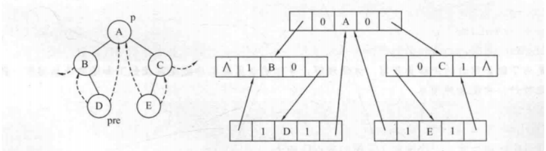


## 5、树和森林


### 1、树的存储结构


树的存储结构分为顺序存储结构与链式存储结构，其中又可分为三种不同的表示法：双亲表示法、孩子表示法、孩子兄弟表示法。


#### （1）双亲表示法


以一组连续的存储空间存放树的结点，每个结点中附设一个指针指示其双亲结点在这连续的存储空间中的位置。


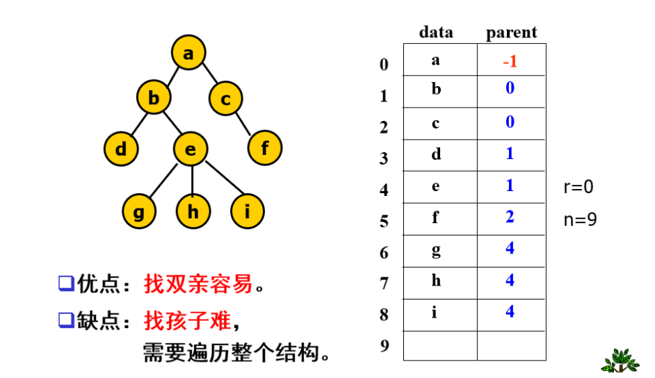


#### （2）孩子表示法


把每个结点的孩子排列起来，看成一个线性表，以单链表存储；令其头指针和结点的数据元素构成一个结点，并将所有这样的结点存放在一个地址连续的存储空间里。


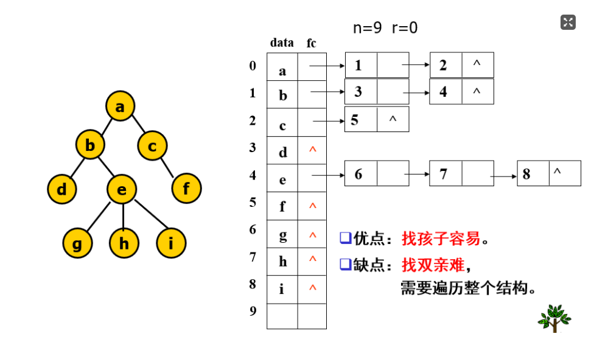


与双亲表示法相反，孩子表示法便于对孩子的操作。可以把双亲表示法与孩子表示法结合起来，如下图：
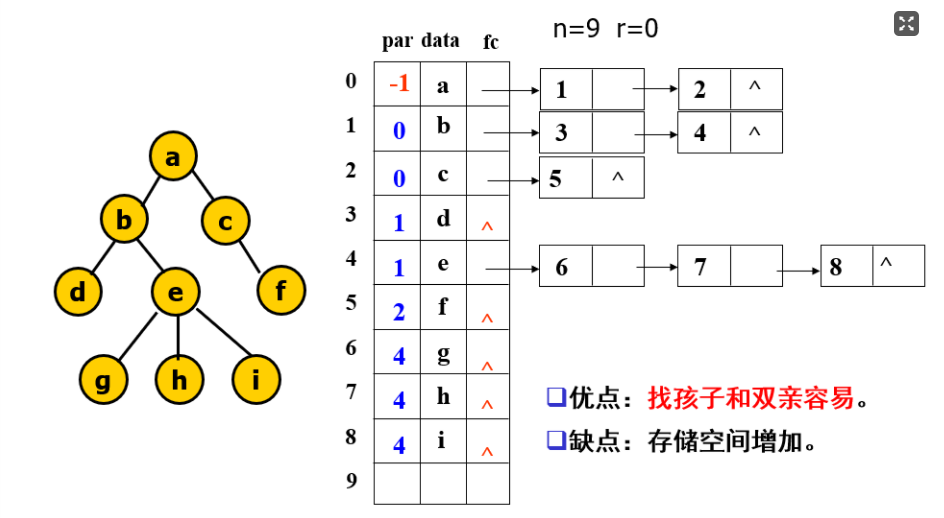


#### （3）孩子兄弟表示法


用二叉链表作树的存储结构，链表中每个结点的两个指针域分别指向其第一个孩子结点和下一个兄弟结点。


```cpp
typedef struct CSNode{
    ElemType data;
    struct CSNode *firstchild, *nextsibling;
} CSNode, *CSTree;
```


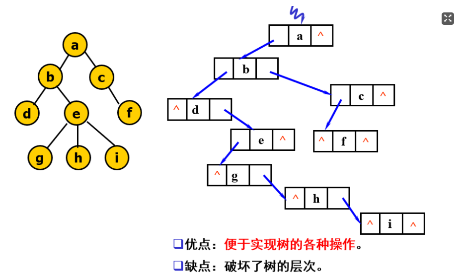


### 2、树和森林与二叉树的转换


#### （1）树转换为二叉树


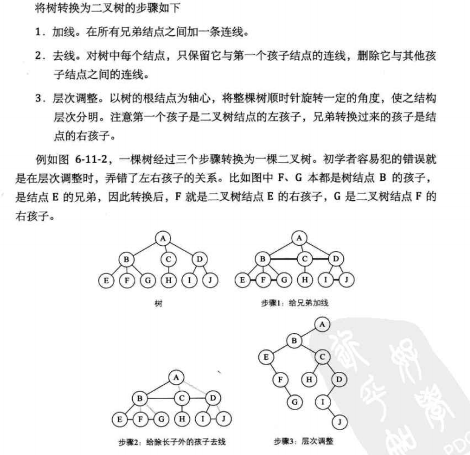


#### （2）森林转换为二叉树


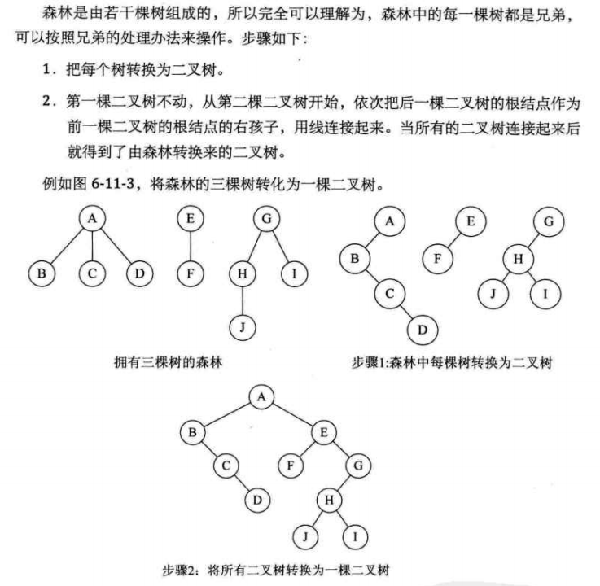


#### （3）二叉树转换为树


- 加线：若p结点是双亲结点的左孩子，则将p的右孩子，右孩子的右孩子，……沿分支找到的所有右孩子，都与p的双亲用线连起来。

- 抹线：抹掉原二叉树中双亲与右孩子之间的连线。

- 调整：将结点按层次排列，形成树结构。


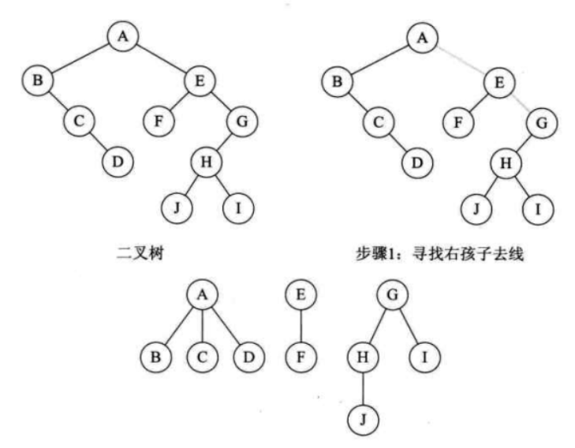


#### （4）二叉树转换为森林


- 从根结点开始，若右孩子存在，则把与右孩子结点的连线删除，再查看分离后的二叉树，若右孩子存在，则连线删除...，直到所有右孩子连线都删除为止，得到分离的二叉树。

- 再将每棵分离后的二叉树转换为树即可。


### 3、树和森林的遍历

#### （1）树的遍历

- 先根遍历:若树不空，则先访问根结点，然后依次从左到右先根遍历根的各棵子树。

- 后根遍历:若树不空，则先依次从左到右后根遍历根的各棵子树，然后访问根结点。


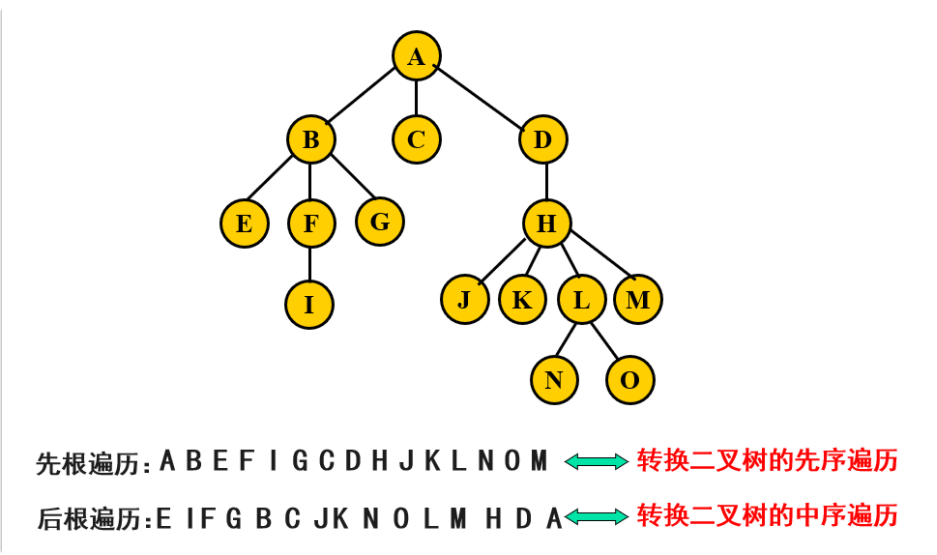

#### （2）森林的遍历

- 先序遍历 

- 访问森林中第一棵树的根节点

- 先序遍历第一棵树中的子树森林

- 先序遍历除去第一棵树之后剩余的树构成的森林

- 中序遍历 

- 中序遍历第一棵树中的子树森林

- 访问森林种第一棵树的根结点’

- 中序遍历除去第一棵树之后剩余的树构成的森林


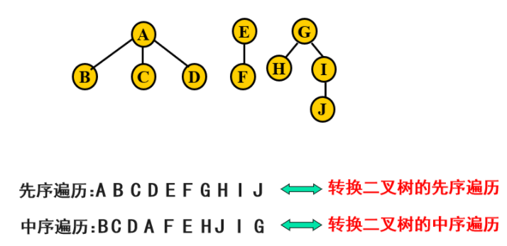

## 四、 赫夫曼树及其应用

### 1、基本概念

- **路径**：从树中一个结点到另一个结点之间的分支。

- **路径长度**：路径上的分支数目称为路径长度。

- **树的路径长度**：从树根到每一结点的路径长度之和（完全二叉树是路径长度最短的二叉树）。

- **结点的带权路径长度**：从该结点到树根之间的路径长度与结点上的权值的乘积记作WPL。

- **树的带权路径长度**：树中所有叶子结点的带权路径长度之和。（加权后路径长度最小的并非是完全二叉树，而是权大的叶子离根最近的二叉树。）
  **哈夫曼树**：设有n个权值{w1,w2,……wn}，构造一棵有n个叶子结点的二叉树，每个叶子的权值为wi，WPL最小的二叉树。

### 2、赫夫曼树的构造方法

- 根据给定的n个权值{w1,w2,……wn}，构造n棵只有根结点的二叉树，令初始权值为wj；

- 在森林中选取两棵根结点权值最小的树作左右子树，构造一棵新的二叉树，置新二叉树根结点权值为其左右子树根结点权值之和；

- 在森林中删除这两棵树，同时将新得到的二叉树加入森林中；

- 重复上述两步，直到只含一棵树为止，这棵树即哈夫曼树。


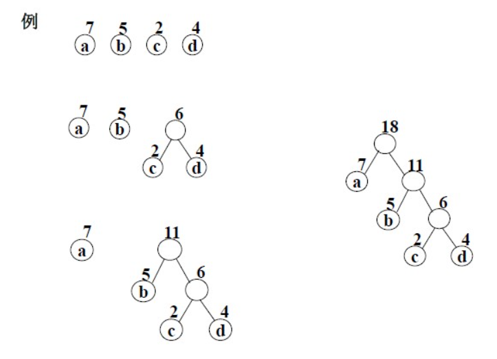

哈夫曼树的形态不是唯一的，但对具有一组权值的各哈夫曼树的WPL是唯一的。

### 3、哈夫曼树的应用

#### （1）、赫夫曼编码


在电文传输中，需要将电文中出现的每个字符进行二进制编码。在设计编码时需要遵守两个原则：


- 发送方传输的二进制编码，到接收方解码后必须具有唯一性，即解码结果与发送方发送的电文完全一样；

- 发送的二进制编码尽可能地短。下面我们介绍两种编码的方式。


**等长编码**


这种编码方式的特点是每个字符的编码长度相同。假设字符集只含有4个字符A，B，C，D，用二进制两位表示的编码分别为00，01，10，11。若现在有一段电文为：ABACCDA，则应发送二进制序列：00010010101100，总长度为14位。当接收方接收到这段电文后，将按两位一段进行译码。这种编码的特点是译码简单且具有唯一性，但编码长度并不是最短的。


**不等长编码**


在传送电文时，为了使其二进制位数尽可能地少，可以将每个字符的编码设计为不等长的，使用频度较高的字符分配一个相对比较短的编码，使用频度较低的字符分配一个比较长的编码。例如，可以为A，B，C，D四个字符分别分配0，00，1，01，并可将上述电文用二进制序列：000011010发送，其长度只有9个二进制位，但接收方接到这段电文后无法进行译码，因为无法断定前面4个0是4个A，1个B、2个A，还是2个B，即译码不唯一，因此这种编码方法不可使用。


因此，为了设计长短不等的编码，以便减少电文的总长，还必须考虑编码的唯一性，即在建立不等长编码时必须使任何一个字符的编码都不是另一个字符的前缀，这种编码称为前缀编码（prefix code）


**前缀编码和哈夫曼编码**


- 前缀编码：任意一个字符的编码都不能是另一个字符的编码的前缀，这种编码称为**前缀编码**。

- 哈夫曼编码 

- 目标：使电文总长最短。

- 以字符出现的次数为权，构造一棵赫夫曼树；将树中结点引向其左孩子的分支标“0”，引向其右孩子的分支标“1”；每个字符的编码即为从根到每个叶子的路径上得到的0、1序列，这样得到的编码称为哈夫码编码。

- 哈夫曼编码为前缀编码。

- 以这组编码传送电文可使电文总长最短(对所有其它前缀编码而言)。


例题：假设一个文本文件TFile中只包含7个字符{A，B，C，D，E，F，G}，这7个字符在文本中出现的次数为{5，24，7，17，34，5，13}利用哈夫曼树可以为文件TFile构造出符合前缀编码要求的不等长编码


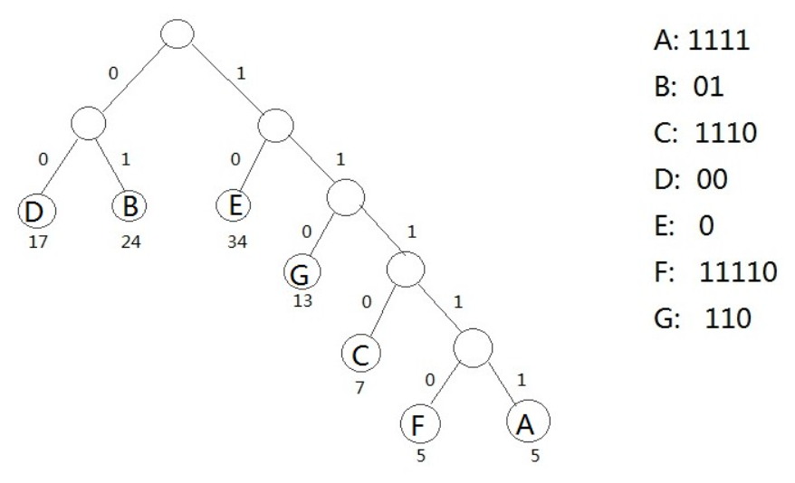