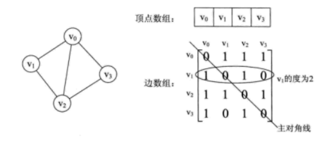
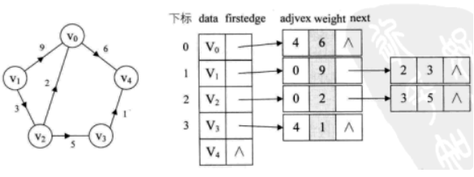
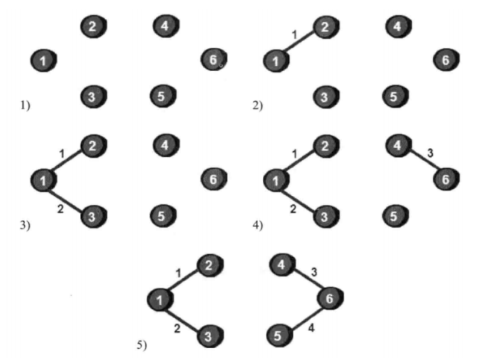

## 一、图的基本概念


- 图、有向图、无向图就不解释了，注意有向边用<a,b>表示，无向边用(a,b)表示。

- **弧**：在有向图中通常将边称为弧，含箭头的一端称为弧头，另一端称为弧尾，记作<vi,vj>。

- **无向完全图**：对n个顶点的无向图，若每个顶点和其它n-1个顶点都有边，该图称为无向完全图。图中共有n(n-1)/2条边。

- **有向完全图**：若有向图中有n个顶点，则最多有n(n-1)条边（图中任意两个顶点都有两条边相连），将具有n（n-1）条边的有向图称为有向完全图。

- **路径和路径长度**：在一个图中，路径为相邻顶点序偶所构成的序列。路径长度是指路径上边的数目。

- **简单路径**：序列中顶点不重复出现的路径称为简单路径。

- **回路**：第一个顶点和最后一个顶点相同的路径。

- **简单回路**：除了第一个顶点和最后一个顶点外，其余顶点不重复出现的回路。

- **连通、连通图和连通分量**：在**无向图**中，如果从顶点vi到顶点vj有路径，则称vi和vj连通。如果图中任意两个顶点之间都连通，则称该图为连通图，否则将其中的极大连通子图称为连通分量。如下图a，b就是c的两个两个连通分量。


- **强连通图和强连通分量**:在有向图中，若从vi到vj有路径，则称vi和vj是连通的，如果对于每一对顶点vi和vj，从vi到vj和从vj到vi都有路径，则称该图为强连通图，否则，将其中的极大强连通子图称为强连通分量。

- **权和网**：与图的边或弧相关的数，可以表示从一个顶点到另一个顶点的距离或耗费。


边上带有权的图称为带权图，也称为网。


- **稀疏（稠密）图**：有很少（很多）条边或弧的图。

- **生成树**：一个含 n 个顶点的连通图的生成树是该图中的一个极小连通子图，它包含图中 n 个顶点和足以构成一棵树的 n-1 条边。

- **生成森林**：对于非连通图，对其每个连通分量可以构造一棵生成树，合成起来就是一个生成森林。


## 二、图的存储结构


### 1、邻接矩阵


图的邻接矩阵存储方式是用两个数组来表示图。一个一维数组存储图中顶点信息，一个二维数组（邻接矩阵）存储图中的边或弧的信息。设图G有n个顶点，则邻接矩阵是一个 n*n 的方阵，定义为：


看一个实例，下图左就是一个无向图。





从上面可以看出，无向图的边数组是一个对称矩阵。


而有向图讲究入度和出度，下面是一个有向图样例。


若图G是网图（带权图），有n个顶点，则邻接矩阵是一个n*n的方阵，定义为：


这里的wij表示(vi,vj)上的权值。和无权图不同的是若无边存在，则无权图的0改成正无穷。


那么邻接矩阵是如何实现图的创建的呢？代码如下。


```cpp
typedef char VertexType;    //顶点类型
typedef int EdgeType;        //边权值类型
#define MAXVEX 100
#define INF    65535        //用65535来代表无穷大
typedef struct
{
    VertexType vexs[MAXVEX];    //顶点表
    EdgeType   arc[MAXVEX][MAXVEX];    //邻接矩阵，可看作边
    int numVertexes, numEdges;    //图中当前的顶点数和边数
}Graph;

void CreateGraph(Graph *G)
{
    int i,j,k,w;
    printf("输入顶点数和边数：\n");
    scanf("%d%d",&G->numVertexes,&G->numEdges);
    getchar();
    printf("输入%d个顶点符号：\n",G->numVertexes);
    for(i=0;i<G->numVertexes;i++)
        scanf("%c",&G->vexs[i]);
    getchar();
    for(i=0;i<G->numVertexes;i++)
        for(j=0;j<G->numVertexes;j++)
            G->arc[i][j]=INF;  //初始化邻接矩阵
        for(k=0;k<2*G->numEdges;k++)//循环次数：无向图G->numEdges次，有向图G->numEdges*2次
        {
            printf("输入边(vi,vj)上的下标i,j和权w:");//如果是有向图，就按照方向输入下标
            scanf("%d%d%d",&i,&j,&w);


            G->arc[i][j]=w;
            //G->arc[j][i]=G->arc[i][j];//有向图去掉这句
        }
}
```


**特点：**


- 无向图的邻接矩阵对称，可压缩存储；有n个顶点的无向图需存储空间为n(n+1)/2。

- 无向图中顶点Vi的度TD(Vi)是邻接矩阵A中第i行元素之和。

- 有向图中，顶点Vi的出度是A中第i行元素之和。顶点Vi的入度是A中第i列元素之和。


邻接矩阵的优缺点


- 优点：容易判定顶点间有无边（弧）和计算顶点的度（出度、入度）。

- 缺点：边数较少时，空间浪费较大。


### 2、邻接表


引入原因：邻接矩阵在稀疏图时空间浪费较大。因此，找到一种数组与链表相结合的存储方法称为邻接表。


#### 实现


为图中每个顶点建立一个单链表，第i个单链表中的结点表示依附于顶点Vi的边（有向图中指以Vi为尾的弧）。例如，下图就是一个无向图的邻接表的结构。


若是有向图邻接表结构是类似的，但要注意的是有向图由于有方向，我们是以顶点为弧尾来存储边表的，这样就很容易的到每个顶点的出度。但也有时为了便于确定顶点的入度或以顶点为弧头的弧，我们可以建立一个有向图的**逆邻接表**，即对每个顶点vi都建立一个链接为vi为弧头的表。


对于带权值的网图，可以在边表结点定义中再增加一个weight的数据域，存储权值信息即可。如下图所示。





对于邻接表结构，图的建立代码如下。（无向图）


```cpp
#define MAXVEX 1000         //最大顶点数
typedef char VertexType;        //顶点类型
typedef int EdgeType;           //边上权值类型

typedef struct EdgeNode         //边表结点
{
    int adjvex;         //邻接点域，存储该顶点对应的下标
    EdgeType weigth;        //用于存储权值，对于非网图可以不需要
    struct EdgeNode *next;      //链域，指向下一个邻接点
}EdgeNode;

typedef struct VertexNode       //顶点表结构
{
    VertexType data;        //顶点域，存储顶点信息
    EdgeNode *firstedge;        //边表头指针
}VertexNode, AdjList[MAXVEX];

typedef struct
{
    AdjList adjList;
    int numVertexes, numEdges;  //图中当前顶点数和边数
}GraphList;

//建立图的邻接表结构
void CreateGraph(GraphList *g)
{
    int i, j, k;
    EdgeNode *e;
    printf("输入顶点数和边数:\\n");
    scanf("%d%d", &g->numVertexes, &g->numEdges);
    getchar();
    for(i = 0; i <g->numVertexes; i++)
    {
        printf("请一次一个输入顶点%d:\n", i);
        scanf("%c",&g->adjList[i].data);          //输入顶点信息
        getchar();
        g->adjList[i].firstedge = NULL;          //将边表置为空表

    }
    g->adjList[i].firstedge = NULL; 
    //建立边表
    for(k = 0; k < g->numEdges; k++)//关于邻接表的循环次数无向图与与有向图都是g->numEdges次
    {
        printf("输入无向图边(vi,vj)上的顶点序号和权值:\n");
        int w;
        scanf("%d%d%d",&i,&j,&w);
        e =new EdgeNode;

        e->adjvex = j;        //邻接序号为j
        e->weigth = w;        //边<vi,vj>的权值
        e->next = g->adjList[i].firstedge;//将e指针指向当前顶点指向的结构
        g->adjList[i].firstedge = e;//将当前顶点的指针指向e

        e = new EdgeNode;

        e->adjvex =i;
        e->weigth = w;        //边<vj,vi>的权值
        e->next = g->adjList[j].firstedge;
        g->adjList[j].firstedge = e;
    }
}
```


### 3、十字链表


#### （1）引入目的


对于同一个有向图需要同时用邻接表和逆邻接表时，不方便。


#### （2）实现


将在有向图的邻接表和逆邻接表中两次出现的同一条弧用一个结点表示，由于在邻接表和逆邻接表中的顶点数据是相同的，则在十字链表中只需要出现一次，但需保留分别指向第一条"出弧"和第一条"入弧"的指针。


### 4、邻接多重表


#### （1）引入原因


无向图的邻接表中每一条边有两个结点，给对图的边进行访问的操作带来不便。有些时候需要同时找到表示同一条边的两个结点（如删除一条边）。


#### （2）、实现方式


#### 5、边集数组


变集数组是由两个一维数组构成。一个存储顶点的信息；另一个是存储边的信息，这个边数组每个数据元素由一条边的起点下标（begin）、终点下标（end）和权（weight）组成，如下图。显然边集数组关注的是边的集合，在边集数组中要查找一个顶点的度需要扫描整个边数组，效率并不高。因此它更适合对边依次进行处理的操作，而不适合对顶点相关的操作。


## 三、图的遍历


### 1、深度优先遍历


#### （1）主要思想


首先访问出发点v，并将其标记为已访问过；然后选取与v邻接的未被访问的任意一个顶点w，并访问它；再选取与w邻接的未被访问的任一顶点并访问，以此重复进行。当一个顶点所有的邻接顶点都被访问过时，则以此退回到最近被访问过的顶点，若该顶点还有其他邻接顶点未被访问，则从这些未被访问的顶点中取一个并重复上述访问过程，直至图中所有顶点都被访问过为止。


#### （2）算法实现


显然深度优先遍历连通图是一个递归的过程。为了在遍历过程中便于区分顶点是否已经被访问，需设访问标志数组 visited[n]，其初始值为 false。


**采用邻接矩阵表示图的深度优先遍历**


```cpp
/*
    从第v个顶点出发深度优先搜索遍历图
 */
void DFS_AM(AMGraph G,int v){
    cout<<v;
    visited[v] = true;
    for (int w = 0; w < G.vexnum; w++)
    {
        //如果w是v的邻接点，且w未被访问，则递归调用DFS_AM
        if ((G.arcs[v][w]!=0)&&(!visited[w]))
        {
            DFS_AM(G,w);
        }
    }
}
```


**采用邻接表表示图的深度优先搜索遍历**


```cpp
void DFS_AL(ALGraph G,int v){
    //图G为邻接表类型，从第v个顶点出发深度优先搜索遍历图G
    cout<<v;
    visited[v]=true;
    while(p!=NULL){
        w = p->adjvex;    //表示w是v的邻接点
        if(!visited[w]){//如果w未被访问，则递归调用DFS_AL
            DFS_AL(G,w);
        }
        p = p->nextarc;
    }
}
```


**深度优先搜索遍历非连通图**


若是非连通图，上述遍历过程执行之后，图中一定还有顶点未被访问，需要从图中另选一个未被访问的顶点作为起始点，重复上述深度优先搜索过程，直到图中所有顶点均被访问过为止。


```cpp
void DFSTraverse(Graph G){
    //对非连通图G做深度优先遍历
    for(v=0;v<G.vexnum;v++){
        visited[v] = false;  //访问标志数组初始化
    }
    for(v =0;v<G.vexnum;v++){  //循环调用算法DFS（可以是DFS_AM或DFS_AL）
        if(!visited[v]){  
            DFS(G,v);  //对尚未访问的顶点调用DFS
        }
    }
}
```


### 2、广度优先遍历


#### （1）主要思想


首先以一个未被访问过的顶点作为起始顶点，访问其所有相邻的顶点，然后对每个相邻的顶点，再访问它们相邻的未被访问过的顶点，直到所有的顶点都被访问过，遍历结束。


广度搜索遍历图的时候，需要用到一个队列（二叉树的层次遍历也要用到队列）,算法执行过程可简单概括如下：


1）任取图中一个顶点访问，入队，并将这个顶点标记为已访问。


2）当队列不空时循环执行：出队，依次检查出队顶点的所有邻接顶点，访问没有被访问过的邻接顶点将其入队。


3）当队列为空时跳出循环，广度优先搜索即完成。


#### （2）算法实现


算法步骤：


1.  从图中某个顶点v出发，访问v，并置visited[v]的值为true，然后将v进队。 

1.  只要队列不空，则重复下列操作： 

- 队头顶点u出队；

- 依次检查u的所有邻接点w，如果 visited[w] 的值为 false，则访问 w，并置 visited[w] 的值为 true；


```cpp
void BFS(Graph G,int v){
    cout<<v;
    visited[v] = true;
    InitQueue(Q);   //辅助队列Q初始化，置空
    EnQueue(Q,v);
    while (!QueueEmpty(Q))  //队列非空
    {
        DeQueue(Q,u);  //队头元素出列并置为u
        for (w = FirstAdjVex(G,u);w>=0;w=NextAdjVex(G,u,w)){
            //依次检查u的所有邻接点w，FirstAdVex表示u的第一个结点，
            //NextAdjVex表示u相对于w的下一个邻接点，w>=0表示存在邻接点
            if (!visited[w]) //w为尚未访问的邻接顶点
            {
                cout<<w;
                visited[w]=true;
                EnQueue(Q,w);
            } 
        } 
    }
}
```


## 四、图的应用


### 1、最小生成树


#### （1）普里姆（prim）算法


从图中任意取出一个顶点，把它当成一棵树，然后从与这棵树相接的边中选取一条最短（权值最小）的边,并将这条边及其所连接的顶点也并入这棵树中，此时得到了一棵有两个顶点的树。然后从与这棵树相接的边中选取一条最短的边，并将这条边及其所连顶点并入当前树中，得到一棵有3个顶点的树。以此类推，直到图中所有顶点都被并入树中为止，此时得到的生成树就是最小生成树。


#### （2）克鲁斯卡尔（Kruskal）算法


思想：为使生成树上总的权值之和达到最小，则应使每一条边上的权值尽可能地小，自然应从权值最小的边选起，直至选出 n-1 条互不构成回路的权值最小边为止。


比如下面这个图：


构建过程为：





#### （3）最小生成树算法的分析


- 普里姆算法和图的边数无关，适合边稠密的情况。

- 克鲁斯卡尔算法适合边稀疏的情况。


### 2、拓扑排序


#### （1）AOV网


用顶点表示活动，用弧表示活动间优先关系的有向图称为顶点表示活动的网(Activity On Vertex network)，简称AOV网。


#### （2）拓扑序列


把AOV网中各顶点按照它们相互之间的优先关系排列成一个线性序列（拓扑序列）的过程。


若网中所有顶点都在它的拓扑有序序列中，则该拓扑序列就是一个工程顺利完成的可行方案；否则，该工程无法顺利完成。


在一个有向图中找到一个拓扑序列的过程如下：


- 从有向图中选择一个没有前驱（入度为0）的顶点输出。

- 删除①中的顶点，并且删除从该顶点发出的全部边。

- 重复上述两步，直到剩余的网中不存在没有前驱的顶点为止


所谓拓扑排序，其实就是对一个有向图构造拓扑序列的过程。构造时会有两个结果，如果此网的全部顶点都被输出，则说明它是不存在环的AOV网；如果输出顶点少了，哪怕是少了一个，也说明这个网存在环，不是AOV网。


### 3、关键路径


用顶点表示事件，弧表示活动，弧上的权值表示活动持续的时间的有向图叫AOE（Activity On Edge Network）网。AOE网常用于估算工程完成时间。


#### （1）关键路径的几个术语


- 路径长度：路径上各活动持续时间之和

- 关键路径：路径长度最长的路径

- 关键活动：关键路径上的活动，即这些活动的时间延迟或提前影响整个工期的延迟或提前。


#### （2）求关键路径的方法


- Ve(j)：表示事件Vj的最早发生时间。

- Vl(j)：表示事件Vj的最迟发生时间。

- e(i)：表示活动ai的最早开始时间。

- l(i)：表示活动ai的最迟开始时间。

- l(i)-e(i)：表示完成活动ai的时间余量。


若时间余量为0，则该活动为关键活动，所在的路径为关键路径。


### 4、最短路径


#### （1）每一对顶点之间的最短路径-弗洛伊算法Floyd


#### （2）迪杰斯特拉Djakarta


迪杰斯特拉Djakarta 可以求单源最短路径，即已知一个有向网和网中某个源点，求得从该源点到图中其它各个顶点之间的最短路径。思想：按路径长度递增次序产生最短路径算法。