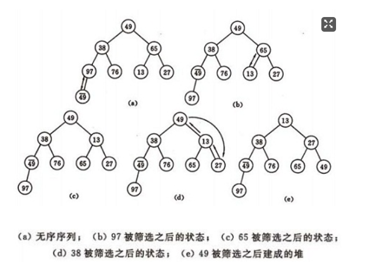
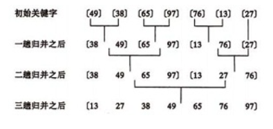

## 一、排序的基本概念


### 1、排序的稳定性


所谓稳定性是指当待排序列中有两个或两个以上相同的关键字时，排序前和排序后这些关键字的相对位置，如果没有发生变化就是稳定的，否则就是不稳定的。


### 2、排序算法的分类


按待排序记录所在位置


- 内部排序：待排序记录存放在内存。

- 外部排序：排序过程中需对外存进行访问的排序。


按排序依据原则


- 插入排序：直接插入排序、折半插入排序、希尔排序。

- 交换排序：冒泡排序、快速排序。

- 选择排序：简单选择排序、堆排序。

- 归并排序：2-路归并排序。

- 基数排序


## 二、插入类排序


### 1.直接插入排序


**基本思想**:整个排序过程为n-1趟插入，即先将序列中第1个记录看成是一个有序子序列，然后从第2个记录开始，逐个进行插入，直至整个序列有序。


如果碰见一个和插入元素相等的，那么插入元素把想插入的元素放在相等元素的后面。所以，相等元素的前后顺序没有改变，从原无序序列出去的顺序就是排好序后的顺序，所以插入排序是稳定的。


算法的实现：


```cpp
void InsertSort(int R[],int n){

    int i,j,temp;

    for( i = 0; i < n; i++){

        temp = R[i]; //将待插入关键字暂存temp中
        j = i-1;

        /*从待排关键字之前的关键字开始扫描，如果大于待排关键字，则后移一位*/
        while(j>=0&&temp<R[j]){

            R[j+1]=R[j];
            --j;
        }
        R[j+1]=temp;  //找到插入位置，将temp中暂存的待排关键字插入。
    }
}
```


**性能分析：**


### 2、折半插入排序


折半插入排序的基本思想和直接插入排序类似，区别是查找插入位置的方法不同，折半查找排序是采用折半查找法来查找插入位置的。


```cpp
void InsertSort(int R[],int n){

    int i,j,t;
    int low,mid,high;

    for( i = 1; i < n; i++)
    {
        t=a[i];
        low=0;
        high=i-1;
        while(high>=low){

         mid=(low+high)/2;

         if(t<a[mid]) { 
             high=mid-1; 
         } 
         else{
             low=mid+1; 
         }
        }
        for(j=i-1; j>=low; j--){
            a[j+1]=a[j];
        }
        a[low]=t;
        printarray(a,n);
    }
}
```


性能分析：


### 3、希尔排序


希尔排序又叫做**缩小增量排序**，先将整个待排序记录序列分割成若干个子序列，分别对这些子序列进行直接插入排序；待整个序列中的记录“基本有序”时，再对全体记录进行一次直接插入排序。


排序过程：


- 取一个正整数d1<n，把所有相隔d1的记录放一组，组内进行直接插入排序；

- 然后取d2<d1，重复上述分组和排序操作；

- 直至di=1，即所有记录放进一个组中排序为止。


算法实现：
我们简单处理增量序列：增量序列d = {n/2 ,n/4, n/8 .....1} n为要排序数的个数


```cpp
void print(int a[], int n ,int i){  
    cout<<i <<":";  
    for(int j= 0; j<8; j++){  
        cout<<a[j] <<" ";  
    }  
    cout<<endl;  
}  
/** 
 * 直接插入排序的一般形式 
 * @param int dk 缩小增量，如果是直接插入排序，dk=1 
 */  
void ShellInsertSort(int a[], int n, int dk)  
{  
    for(int i= dk; i<n; ++i){  
        if(a[i] < a[i-dk]){          //若第i个元素大于i-1元素，直接插入。小于的话，移动有序表后插入  
            int j = i-dk;     
            int x = a[i];           //复制为哨兵，即存储待排序元素  
            a[i] = a[i-dk];         //首先后移一个元素  
            while(x < a[j]){     //查找在有序表的插入位置  
                a[j+dk] = a[j];  
                j -= dk;             //元素后移  
            }  
            a[j+dk] = x;            //插入到正确位置  
        }  
        print(a, n,i );  
    }  
}  
  
/** 
 * 先按增量d（n/2,n为要排序数的个数进行希尔排序 
 */  
void shellSort(int a[], int n){  
  
    int dk = n/2;  
    while( dk >= 1  ){  
        ShellInsertSort(a, n, dk);  
        dk = dk/2;  
    }  
}  
int main(){  
    int a[8] = {3,1,5,7,2,4,9,6};  
    //ShellInsertSort(a,8,1); //直接插入排序  
    shellSort(a,8);           //希尔插入排序  
    print(a,8,8);  
}
```


增量序列取法


- 无除1以外的公因子；

- 最后一个增量值必须为1；

- 如……,9,5,3,2,1或……,31,15,7,3,1或……,40,13,4,1等。


## 三、交换类排序


### 1、 冒泡排序


冒泡排序是通过一系列的交换动作完成的，首先第一个关键字和第二个关键字比较，如果第一个大，则二者交换，否则不交换；然后第二个关键字和第三个关键字比较，如果第二个大，则二者交换，否则不交换....一只按这种方式进行下去，最终最大的那个关键字就被交换到了最后，一趟冒泡排序完成。


算法的实现：


```cpp
void bubbleSort(int a[], int n){  
    for(int i =0 ; i< n-1; ++i) {  
        for(int j = 0; j < n-i-1; ++j) {  
            if(a[j] > a[j+1])  
            {  
                int tmp = a[j] ; a[j] = a[j+1] ;  a[j+1] = tmp;  
            }  
        }  
    }  
}
```


冒泡排序算法的改进


对冒泡排序常见的改进方法是加入一标志性变量exchange，用于标志某一趟排序过程中是否有数据交换，如果进行某一趟排序时并没有进行数据交换，则说明数据已经按要求排列好，可立即结束排序，避免不必要的比较过程。本文再提供以下两种改进算法：


1．设置一标志性变量pos,用于记录每趟排序中最后一次进行交换的位置。由于pos位置之后的记录均已交换到位,故在进行下一趟排序时只要扫描到pos位置即可。


改进后算法如下:


```cpp
void Bubble_1 ( int r[], int n) {  
    int i= n -1;  //初始时,最后位置保持不变  
    while ( i> 0) {   
        int pos= 0; //每趟开始时,无记录交换  
        for (int j= 0; j< i; j++)  
            if (r[j]> r[j+1]) {  
                pos= j; //记录交换的位置   
                int tmp = r[j]; r[j]=r[j+1];r[j+1]=tmp;  
            }   
        i= pos; //为下一趟排序作准备  
     }   
}
```


2．传统冒泡排序中每一趟排序操作只能找到一个最大值或最小值,我们考虑利用在每趟排序中进行正向和反向两遍冒泡的方法一次可以得到两个最终值(最大者和最小者) , 从而使排序趟数几乎减少了一半。


改进后的算法实现为:


```cpp
void Bubble_2 ( int r[], int n){  
    int low = 0;   
    int high= n -1; //设置变量的初始值  
    int tmp,j;  
    while (low < high) {  
        for (j= low; j< high; ++j) //正向冒泡,找到最大者  
            if (r[j]> r[j+1]) {  
                tmp = r[j]; r[j]=r[j+1];r[j+1]=tmp;  
            }   
        --high;                 //修改high值, 前移一位  
        for ( j=high; j>low; --j) //反向冒泡,找到最小者  
            if (r[j]<r[j-1]) {  
                tmp = r[j]; r[j]=r[j-1];r[j-1]=tmp;  
            }  
        ++low;                  //修改low值,后移一位  
    }   
}
```


性能分析：


### 2、 快速排序


快速排序也是交换类的排序，它通过多次划分操作实现排序。以升序为例，其执行流程可以概括为：每一趟选择当前所有子序列中的一个关键字（通常是第一个）作为枢纽，将子序列中比枢纽小的移到枢纽前边，比枢纽大的移到枢纽后边；当本趟所有子序列都被枢纽以上规则划分完毕后会得到新的一组更短的子序列，它们成为下一趟划分的初始序列集。


（a）一趟排序的过程：


（b）排序的全过程


算法的实现：


递归实现：


```cpp
int partition(int a[], int low, int high)  
{  
    int privotKey = a[low];                             //基准元素  
    while(low < high){                                   //从表的两端交替地向中间扫描  
        while(low < high  && a[high] >= privotKey) --high; 
        swap(&a[low], &a[high]);  
        while(low < high  && a[low] <= privotKey ) ++low;  
        swap(&a[low], &a[high]);  
    }  
    print(a,10);  
    return low;  
}  


void quickSort(int a[], int low, int high){  
    if(low < high){  
        int privotLoc = partition(a,  low,  high);  //将表一分为二  
        quickSort(a,  low,  privotLoc -1);          //递归对低子表递归排序  
        quickSort(a,   privotLoc + 1, high);        //递归对高子表递归排序  
    }  
}  

int main(){  
    int a[10] = {3,1,5,7,2,4,9,6,10,8};  
    cout<<"初始值：";  
    print(a,10);  
    quickSort(a,0,9);  
    cout<<"结果：";  
    print(a,10);  //输出排序后的结果
}
```


性能分析：


## 四、选择类排序


### 1、简单选择排序


选择类排序的主要动作是选择，简单选择排序采用最简单的选择方式，从头至尾顺序扫描序列，找出最小的一个关键字，和第一个关键字交换，接着从剩下的关键字中继续这种选择和交换，最终使序列有序。


简单选择排序的示例：


算法实现：


```cpp
void SelectSort(int R[],int n){
    int i,j,k;
    int temp;

    for( i = 0; i < n; i++){
        k=i;
        //从无序序列中挑选一个最小的关键字

        for(j = i+1; j<n; j++)
            if (R[k]>R[j]){
                k=j;
            }

        //完成最小关键字与无序序列第一个关键字的交换
        temp = R[i];
        R[i]=R[k];
        R[k]=temp; 
    }  
}
```


性能分析


   


**简单选择排序的改进——二元选择排序**


简单选择排序，每趟循环只能确定一个元素排序后的定位。我们可以考虑改进为每趟循环确定两个元素（当前趟最大和最小记录）的位置,从而减少排序所需的循环次数。改进后对n个数据进行排序，最多只需进行[n/2]趟循环即可。具体实现如下：


```cpp
void SelectSort(int r[],int n) {  
    int i ,j , min ,max, tmp;  
    for (i=0 ;i <= n/2;i++) {    
        // 做不超过n/2趟选择排序   
        min = i; max = i ; //分别记录最大和最小关键字记录位置  
        for (j= i; j< n-i; j++) {  
            if (r[j] > r[max]) {   
                max = j ; continue ;   
            }    
            if (r[j]< r[min]) {   
                min = j ;   
            }     
      }    
      //该交换操作还可分情况讨论以提高效率  
      tmp = r[i-1]; r[i-1] = r[min]; r[min] = tmp;  
      tmp = r[n-i]; r[n-i] = r[max]; r[max] = tmp;   

    }   
}
```


### 2、堆排序


堆是一种数据结构，可以把堆看成一棵完全二叉树，这棵二叉树满足：任何一个非叶结点的值都不大于（或不小于）其左右孩子结点的值。若父亲大孩子小，则这样的叫做 大顶堆如a；反之为 小顶堆 如b。


**堆排序**：将无序序列建成一个堆，得到关键字最小（或最大）的记录；输出堆顶的最小（大）值后，使剩余的n-1个元素重又建成一个堆，则可得到n个元素的次小值；重复执行，得到一个有序序列的过程。


因此，实现堆排序需解决两个问题：


1. 如何将n 个待排序的数建成堆；

1. 输出堆顶元素后，怎样调整剩余n-1 个元素，使其成为一个新堆。


首先讨论第二个问题：输出堆顶元素后，对剩余n-1元素重新建成堆的调整过程。以小顶堆为例：


- 输出堆顶元素之后，以堆中最后一个元素替代之；

- 然后将根结点值与左、右子树的根结点值进行比较，并与其中小者进行交换；

- 重复上述操作，直至叶子结点，将得到新的堆，称这个从堆顶至叶子的调整过程为“筛选”。


再讨论对 n 个元素初始建堆的过程。


建堆方法：对初始序列建堆的过程，就是一个反复进行筛选的过程。

 

1）n 个结点的完全二叉树，则最后一个结点是第个结点的子树。

 

2）筛选从第个结点为根的子树开始，该子树成为堆。

 

3）之后向前依次对各结点为根的子树进行筛选，使该子树成为堆，直到根结点。


如图建堆初始过程：无序序列：（49，38，65，97，76，13，27，49）





性能分析:


①时间复杂度

 

设树深度为k，。从根到叶的筛选，元素比较次数至多2(k-1)次，交换记录至多k 次。所以，在建好堆后，排序过程中的筛选次数不超过下式：

 


 

②空间复杂度

 

算法所需的辅助存储空间不随待排序规模的变化而变化，是个常量，因此空间复杂度为O(1)。


## 五、归并排序


基本思想：


归并（Merge）排序法是将两个（或两个以上）有序表合并成一个新的有序表，即把待排序序列分为若干个子序列，每个子序列是有序的。然后再把有序子序列合并为整体有序序列。


归并排序示例：





合并方法：


设r[i…n]由两个有序子表r[i…m]和r[m+1…n]组成。


```cpp
//将r[i…m]和r[m +1 …n]归并到辅助数组rf[i…n]  
void Merge(ElemType *r,ElemType *rf, int i, int m, int n)  
{  
    int j,k;  
    for(j=m+1,k=i; i<=m && j <=n ; ++k){  
        if(r[j] < r[i]) rf[k] = r[j++];  
        else rf[k] = r[i++];  
    }  
    while(i <= m)  rf[k++] = r[i++];  
    while(j <= n)  rf[k++] = r[j++];  
}
```


归并的迭代算法


1 个元素的表总是有序的。所以对n 个元素的待排序列，每个元素可看成1 个有序子表。对子表两两合并生成n/2个子表，所得子表除最后一个子表长度可能为1 外，其余子表长度均为2。再进行两两合并，直到生成n 个元素按关键码有序的表。


```cpp
void MergeSort(ElemType *r, ElemType *rf, int lenght)  
{   
    int len = 1;  
    ElemType *q = r ;  
    ElemType *tmp ;  
    while(len < lenght) {  
        int s = len;  
        len = 2 * s ;  
        int i = 0;  
        while(i+ len <lenght){  
            Merge(q, rf,  i, i+ s-1, i+ len-1 ); //对等长的两个子表合并  
            i = i+ len;  
        }  
        if(i + s < lenght){  
            Merge(q, rf,  i, i+ s -1, lenght -1); //对不等长的两个子表合并  
        }  
        tmp = q; q = rf; rf = tmp; //交换q,rf，以保证下一趟归并时，仍从q归并到rf  
    }  
}
```


两路归并的递归算法


```cpp
void MSort(ElemType *r, ElemType *rf,int s, int t)  
{   
    ElemType *rf2;  
    if(s==t) r[s] = rf[s];  
    else  
    {   
        int m=(s+t)/2;          /*平分*p 表*/  
        MSort(r, rf2, s, m);        /*递归地将p[s…m]归并为有序的p2[s…m]*/  
        MSort(r, rf2, m+1, t);      /*递归地将p[m+1…t]归并为有序的p2[m+1…t]*/  
        Merge(rf2, rf, s, m+1,t);   /*将p2[s…m]和p2[m+1…t]归并到p1[s…t]*/  
    }  
}  
void MergeSort_recursive(ElemType *r, ElemType *rf, int n)  
{   /*对顺序表*p 作归并排序*/  
    MSort(r, rf,0, n-1);  
}
```


## 六、总结


各种排序的稳定性，时间复杂度和空间复杂度总结：


- 平均情况下 

- 快些归队（快速排序、希尔排序、归并排序、堆排序）：O(nlogn)

- 基数排序：O(d(r+n))

- 其他：O(n)

- 最坏情况下 

- 快速排序的时间复杂度为O(n^2)（有序）,其他和平均情况下相同。

- 如果初始序列已经有序，直接插入排序和冒泡排序变成O(n)


我们比较时间复杂度函数的情况：


所以对n较大的排序记录。一般的选择都是时间复杂度为O(nlog2n)的排序方法。


**稳定性：**


稳定性的好处：排序算法如果是稳定的，那么从一个键上排序，然后再从另一个键上排序，第一个键排序的结果可以为第二个键排序所用。基数排序就是这样，先按低位排序，逐次按高位排序，低位相同的元素其顺序再高位也相同时是不会改变的。另外，如果排序算法稳定，可以避免多余的比较；

 

稳定的排序算法：冒泡排序、插入排序、归并排序和基数排序

 

不是稳定的排序算法(快些选一堆)：选择排序、快速排序、希尔排序、堆排序


**其他细节**


- 经过一趟排序，能够保证一个关键字到达最终位置，这样的排序是交换类的两种（冒泡，快排）和选择类的两种（简单选择排序、堆排序）

- 排序算法的关键字比较次数和原始序列无关（简单选择排序，折半插入排序）

- 排序算法的排序趟数和原始序列有关--交换类的两种（冒泡排序、快速排序），快速排序越有序效率越低。