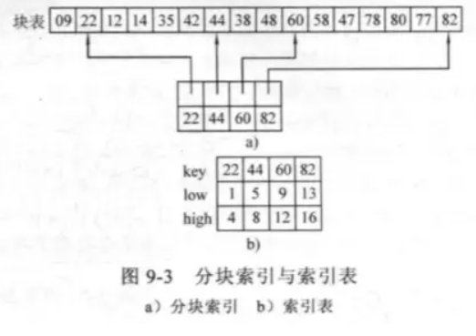
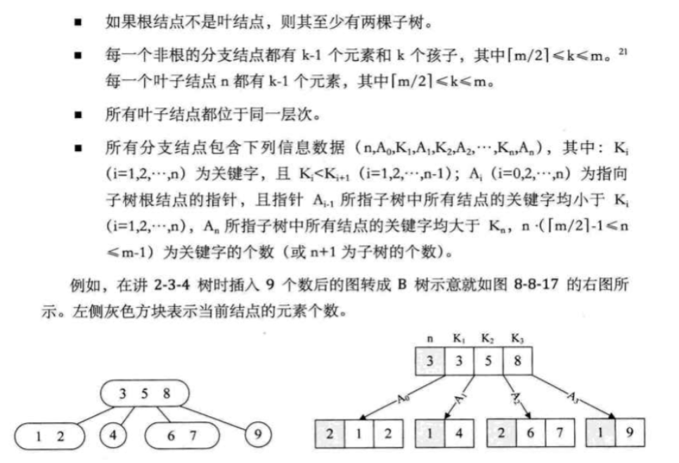

## 一、基本概念


-  查找表：由一些具有相同可辨认特性的数据元素（或记录）构成的集合。该集合中的数据元素用于查找。 

-  静态查找表：只对查找表进行如下两种操作： 

- 查询某个特定的元素是否在表中

- 检索某个特定的数据元素的各种属性

-  动态查找表：若在查找的同时对表做修改操作（如插入和删除），则相应的表称之为动态查找表。 


## 二、静态查找表


### 1、顺序查找


顺序查找（Sequential Search）基本思想是：从线性表一端开始，依次将每个记录的关键字与给定值比较，若关键字等于给定值，表示查找成功，返回记录序号，若将线性表中所有记录都比较完，没有找到关键字和给定值相等的记录，查找失败，返回失败值。


### 2、折半查找


折半查找又叫二分查找，这种查找方法要求查找表中数据是线性结构保存，而且查找表中数据是按照关键字**有序排列**的（从小到大或从大到小）


下面以数据从小到大的n个元素有序排列介绍折半查找过程：


1.  置查找区间初值，low为1，high为表长 

1.  当low小于等于high时，循环执行以下操作 

- mid取值low与high的中间值

- 将给定值key与中间位置记录的关键字进行比较，若相等则查找成功，返回中间位置mid

- 若不相等则利用中间位置记录将表对分成前、后两个子表。如果key比中间位置记录的关键字小，则high取为mid-1，否则low取为mid+1

1.  循环结束，说明查找区间为空，则查找失败，返回0 


算法如下：


```cpp
int Search_Bin ( SSTable ST, KeyType key ){
    low = 1; 
    high = ST.length; 　
    while (low <= high) {
        mid = (low + high) / 2;
        if (EQ(key,ST.elem[mid].key ))
             return mid;　　　　　　　
    return 0; 　　　　　　　　　　　
}
```


在最坏情况下，折半查找所需要的比较次数是O(logn)，查找效率比顺序查找快很多。


### 2.3、分块查找


分块查找又称为索引顺序查找，其数据结构可以简单的描述为：分块查找把线性表分成若干块，每一块中的元素存储顺序是任意的，但是块与块之间必须按照关键字大小顺序排列，即前一块中的最大关键字要小于后一块中的最小关键字。对顺序表进行分块查找需要额外建立一个索引表，表中的每一项对应线性表中的一块，每个索引项都由键值分量和链值分量组成，键值分量存放对应块的最大关键字，链值分量存放指向本块第一个元素和最后一个元素的指针，显然索引表中的所有索引项都是按照其关键字递增顺序排列的。


索引表定义如下：


```cpp
typedef struct indexElem{
    int key;
    int low,high;
}indexElem;
indexElem index[maxsize];
```




算法描述:


第一步确定待查找元素属于哪一块，第二步在块内精确查找该元素。由于索引表是递增有序的，因此第一步采用二分查找。块内元素一般个数较少，因此第二步采用顺序查找即可。


## 三、动态查找表


### 1、二叉排序树


#### （1）二叉排序树（BST）的定义


二叉排序树是空树，或者是满足以下性质的二叉树：
1）若它的左子树不为空，则左子树上所有关键字的值均小于根关键字的值。
2）若它的右子树不为空，则右子树上所有的关键字的值均大于根关键字的值。
3）左右子树又各是一棵二叉排序书。


注：二叉排序树的递归定义的，且由定义可知，如果输出二叉排序树的中序遍历序列，则这个序列是递增有序的。


#### （2）二叉排序树的存储结构


二叉排序树通常采用二叉链表进行存储，其结点类型定义与一般的二叉树类似。


```cpp
typedef struct{
    KeyType key;
    InfoType otherinfo;
}ElemType;

typedef struct BSTNode{
    ElemType data;
    struct BSTNode *lchild,*rchild;
}BSTNode,*BSTNode;
```


#### （3）二叉排序树的查找


若二叉排序树为空，则查找不成功；否则


- 若给定值等于根结点的关键字，则查找成功；

- 若给定值小于根结点的关键字，则继续在左子树上进行查找；

- 若给定值大于根结点的关键字，则继续在右子树上进行查找。


由此可以写出以下代码，算法中如果查找成功则返回关键字所在结点的指针，否则返回NULL。


```cpp
BiTree SearchBST (BSTree T, KeyType key){
    // 根指针T所指二叉查找树中递归查找关键字等于key的数据元素, 
    // 若查找成功，则返回指向该数据元素结点的指针，否则返回空指针。
    if (!T && key==T->data.key) return(T);　　// 查找结束
    else if (key < T->data.key)      
        return (SearchBST(T->lchild.key));　　　　　　　　　　　　　　　　　　    // 在左子树中继续查找
    else 
        return (SearchBST (T->rchild.key)); // 在右子树中继续查找
} // SearchBST
```


#### （4）二叉排序树的插入


用递归过程实现在一棵二叉排序树中插入一个结点


- 若二叉排序树为空，则新结点作为二叉排序树的根结点；

- 若给定结点的关键字值小于根结点关键字值，则插入在左子树上；

- 若给定结点的关键字值大于根结点关键字值，则插入在右子树上。


算法实现如下：


```cpp
int BSTInsert(BSTNode &T,ElemType e)
    if(T==null){
        S=new  BSTNode;
        S->data = e;
        S->lchild=S->rchild=NULL;
        T=S;
        return 1;
    }
    else{
        if(e.key==T->key)
         return 0;          
        else if(e.key<T->key)
         return BSTInsert(T->lchild,e);
        else
         return BSTInsert(T->rchild,e);
    }
}
```


#### （5）二叉排序树的构造


掌握了二叉排序树的插入操作以后，二叉排序树的构造就变得非常简单。只需要建立一个空树，然后将关键字逐个插入到空树中即可构造一棵二叉排序树。


算法实现代码如下，假设关键字已经存入数组key[]中：


```cpp
void CreateBST(BSTNode &T,int key[],int n){
    int i;
    bt = NULL;  //将树清空

    for( i = 0; i < n; i++){
        BSTInsert(bt,key[i]);
    }
}
```


#### （6）删除关键字的操作


当在二叉树中删除一个关键字时不能把以该关键字所在的结点为根的子树都删除，而是只删除这一个结点，并保持二叉树的特性。


假设在二叉排序树上被删除结点为p，f为其双亲结点，则删除结点p的过程分为以下三种情况。


-  若 p 结点为叶子结点，即 PL (左子树)和 PR (右子树)均为空树。由于删去叶子结点不破坏整棵树的结构，则只需修改其双亲结点的指针即可。 

-  若 p 结点只有左子树PL或右子树PR，此时只要令PL或PR直接成为其双亲结点f的左子树（当p是左子树）或右子树（当p是右子树）即可，作此修改也不破坏二叉排序树的特性。 


- 若 p 结点的左子树和右子树均不空。在删去 p 之后，为保持其它元素之间的相对位置不变，可按中序遍历保持有序进行调整。比较好的做法是，找到p的直接前驱（或直接后继）s，用s来替换结点p，然后再删除结点s。


### 2、平衡二叉树


#### （1）平衡二叉树的概念


**结点的平衡因子**：结点的左子树的深度减去它的右子树的深度


**平衡二叉树的定义**：它或是空树，或具有下列特性：其左子树和右子树都是平衡二叉树，且左右子树深度之差的绝对值不大于1。


即，所有结点的平衡因子的绝对值不超过1的二叉树。


注：平衡二叉树首先是二叉排序树，原因是有人先发明了二叉排序树，实现了较高的查找效率，后来发现基于这种查找方法，树越矮查找效率越高，进而又发明了平衡二叉树。


#### （2）平衡二叉树的建立


建立平衡二叉树的过程和建立二叉排序树的过程是基本一样的，都是把关键字插入空树中的过程。所不同的是，在建立平衡二叉树的过程中，每插入一个新的关键字都要进行检查，看是否新关键字的插入会使的原平衡二叉树失去平衡，即树中出现平衡因子绝对值大于1的结点。如果失去平衡需要进行平衡调整。本节的重点就是**平衡调整**。


#### （3）平衡调整


假定向平衡二叉树中插入一个新的结点后破坏了平衡二叉树的平衡性，则首先要找出插入新节点后失去平衡的最小子树，然后再调整这棵子树，使之成为平衡子树。所谓失去平衡的最小子树是以距离插入结点最近，且以平衡因子绝对值大于1的结点作为根的子树，又称为**最小不平衡子树。**


平衡调整有四种情况，分别为LL型、RR型、LR型和RL型。


**LL型**


原因：由于在*a的左子树根结点的左子树上插入结点，*a的平衡因子由1增至2，致使以*a为根的子树失去平衡。


处理：进行一次向右的顺时针旋转。


**RR型**


原因：由于在*a的右子树根结点的右子树上插入结点，*a的平衡因子由-1增至-2，致使以*a为根的子树失去平衡。


处理：进行一次向左的逆时针旋转。


**LR型**


原因：由于在*a的左子树根结点的右子树上插入结点，*a的平衡因子由1增至2，致使以*a为根的子树失去平衡。


处理：进行先左旋、后右旋的两次旋转。


**RL型**


原因：由于在*a的右子树根结点的左子树上插入结点，*a的平衡因子由-1增至-2，致使以*a为根的子树失去平衡。


处理：进行先右旋、后左旋的两次旋转。


### 3、B-树和B+树


#### （1）B树（B-树）


一个 m 阶的B树具有如下性质：




#### （2）B- 树的查找


B树的查找很简单，是二叉排序树的扩展，二叉排序树是二路查找，B-树是多路查找。因为B-树结点内的关键字是有序的，在结点内进行查找的时候除了顺序查找之外，还可以使用折半查找来提高效率。


#### （3）B+树的基本操作


B+ 树是应文件系统所需而出的一种B树的变形。在 B-树种，每一个元素在该树中只出现一次，有可能在叶子结点上，也有可能在分支结点上。而在 B+ 树中，出现在分支结点中的元素会被当作它们在该分支结点位置的中序后继者（叶子结点）中再次列出。另外，每一个叶子结点都会保存一个指向后一叶子结点的指针。


如下图所示，灰色关键字即是根结点中的关键字在叶子结点再次列出，并且所有叶子结点都链接在一起。


这样的数据结构最大的好处就在于，如果要随机查找，我们就从根节点出发，与B树的查找方式相同，只不过即使在分支结点找到了待查找的关键字，它也只是用来索引的，而不是提供实际记录的访问，还是需要到达包含此关键字的终端结点。


如果我们是需要从最小关键字进行从小到大的顺序查找，我们就可以从最左侧的叶子结点出发，不经过分支结点，而是沿着指向下一叶子的指针就可以遍历所有的关键字。