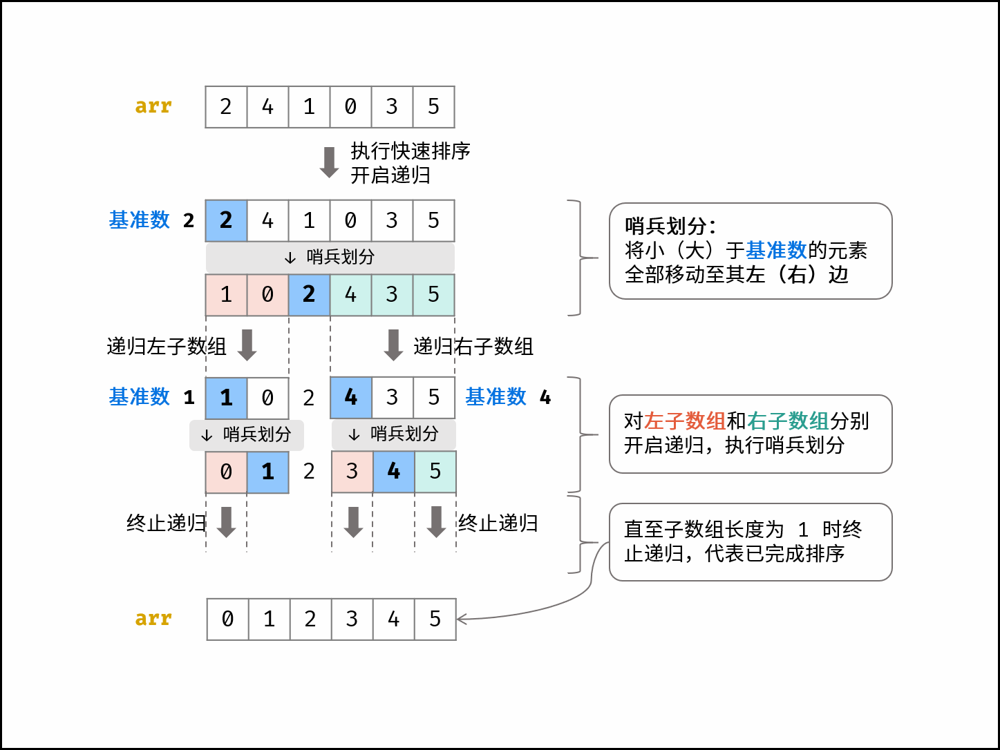

# 快速排序

**+算法解析**

快速排序算法有两个核心点，分别为 **哨兵划分** 和 **递归**。

**哨兵划分：**

以数组某个元素（一般选取首元素）为 基准数 ，将所有小于基准数的元素移动至其左边，大于基准数的元素移动至其右边。

通过一轮 哨兵划分 ，可将数组排序问题拆分为 两个较短数组的排序问题 （本文称之为左（右）子数组）。

**递归：**<font style="color:rgb(38, 38, 38);">对 </font>**<font style="color:rgb(38, 38, 38);">左子数组</font>**<font style="color:rgb(38, 38, 38);"> 和 </font>**<font style="color:rgb(38, 38, 38);">右子数组</font>**<font style="color:rgb(38, 38, 38);"> 分别递归执行 </font>**<font style="color:rgb(38, 38, 38);">哨兵划分</font>**<font style="color:rgb(38, 38, 38);">，直至子数组长度为 1 时终止递归，即可完成对整个数组的排序。</font>



```java
void quickSort(int[] nums, int l, int r) {
    // 子数组长度为 1 时终止递归
    if (l >= r) return;
    // 哨兵划分操作
    int i = partition(nums, l, r);
    // 递归左（右）子数组执行哨兵划分
    quickSort(nums, l, i - 1);
    quickSort(nums, i + 1, r);
}

int partition(int[] nums, int l, int r) {
    // 以 nums[l] 作为基准数
    int i = l, j = r;
    while (i < j) {
        while (i < j && nums[j] >= nums[l]) j--;
        while (i < j && nums[i] <= nums[l]) i++;
        swap(nums, i, j);
    }
    swap(nums, i, l);
    return i;
}

void swap(int[] nums, int i, int j) {
    // 交换 nums[i] 和 nums[j]
    int tmp = nums[i];
    nums[i] = nums[j];
    nums[j] = tmp;
}

// 调用
int[] nums = { 4, 1, 3, 2, 5 };
quickSort(nums, 0, nums.length - 1);
```


> 更新: 2024-08-28 00:21:38  
> 原文: <https://www.yuque.com/thinkspace/wdkdul/fncmnw>