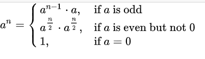
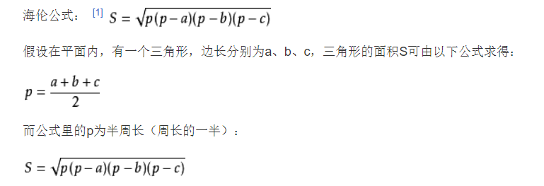

# 常用算法总结

## 递归算法

递归就是自己调用自己，能采用递归描述的算法通常有以下特征：为求解规模为N的问题，设法将它分解成规模较小的问题，从小问题的解容易的构造出大问题的解，并且这些规模较小的问题也能采用同样的分解方法，分解成规模更小的问题。一般情况下，规模N=1时，问题的解是已知的。

### 一、简单递归

求n的阶乘、斐波那契数列、求n个数的最大值、数制转换、求最大公约数等都属于比较简单的递归。

#### 1、求N的阶乘

```cpp
int F(int N);
int main()
{
    int N;
    printf("请输入整数N:");
    scanf("%d",&N);
    printf("N的阶乘为：%d",F(N));
    return 0;
}

int F(int N){
    if(N==1){
        return 1;
    }else{
        return N*F(N-1);
    }
}
```

#### 2、斐波那契数列

```cpp
int F(int N);
int main()
{
    int N;
    printf("请输入整数N:");
    scanf("%d",&N);
    printf("第%d项的值为：%d",N,F(N));
    return 0;
}

int F(int N)
{
    if(N==0){
        return 0;
    }
    else if(N==1){
        return 1;
    }
    else{
        return F(N-1)+F(N-2);
    }
}
```

#### 3、求n个数中的最大值

```cpp
int findMax(int a[],int n);
int main()
{
    int a[]={55,33,22,77,99,88,11,44},n;
    n = sizeof(a)/sizeof(a[0]);
    printf("max:%d",findMax(a,n));
    return 0;
}
int findMax(int a[],int n){
    int m;
    if(n<=1){
        return a[0];
    }else{
        m = findMax(a,n-1);
        return a[n-1]>=m?a[n-1]:m;
    }
}
```

#### 4、进制转换

> 十进制整数转换为二进制整数。

```cpp
void DectoBin(int n);
int main()
{
    int n;
    printf("please input:");
    scanf("%d",&n);
    DectoBin(n);
    return 0;
}

void DectoBin(int n){
    if(n<2){
        printf("%d",n);
    }else{
        DectoBin(n/2);
        printf("%d",n%2);
    }
}
```

#### 5、求最大公约数

```cpp
int gcd(int m, int n);
int main()
{
    int m,n;
    printf("input m and n:");
    scanf("%d %d",&m,&n);
    printf("%d",gcd(m,n));
    return 0;
}

int gcd(int m, int n){
    if(m>n){
        return gcd(m-n,n);
    }else if(m<n){
        return gcd(n-m,m);
    }else{
        return m;
    }
}
```

## 迭代算法

迭代算法也称为辗转法，它是一种不断用旧的变量值递推得到新值的过程。迭代法和递推法的相同之处在于都是使用循环语句实现，不同之处在于：

* 迭代法使用while循环求解，递归法使用for循环实现。
* 迭代法在迭代结束时得到一个解或一组解；递归法的循环控制变量改变一次就得到一个解，循环结束得到一系列的解。
* 迭代法的迭代次数事前未知的，递归法的迭代次数事前是知道的。

迭代法可以分为精确迭代和近似迭代。

### 一、精确迭代法

> 精确迭代法指的是通过迭代可以得到一个精确的值。求最大公约数、进制转换、质因数的分解、谷角猜想所用的方法都属于精确迭代法。

#### 1、最大公约数与最小公倍数

> 任意两个正整数M和N，求最大公约数和最小公倍数

利用辗转相除法求最大公约数，然后根据最大公约数求最小公倍数。辗转相除法求最大公约数的步骤如下：

1. 用M对N求余，余数记为R，即R=M%N
2. 将除数作为被除数，余数作为除数，求新的余数，即M=N,N=R
3. 重复步骤2，直到余数为0为止，此时N为所求。

最小公倍数=M\*N/最大公约数

```cpp
int main()
{

    int M,N,R;
    int M1,N1;
    scanf("%d %d",&M,&N);
    R = M%N;
    M1 = M; N1 = N;
    while(R){
        M = N;
        N = R;
        R = M%N;
    }

    printf("%d %d",N,M1*N1/N);
    return 0;
}
```

#### 2、十进制数转换为二进制整数

分析：用除二取余法。具体步骤如下：

1. 将该数除以2，得到商和余数。
2. 将商作为被除数，并除以2，得到新的商和余数
3. 重复步骤2，直到商为0为止。将余数反向排列即为所求。

```cpp
int main()
{

    int N;
    int i = 0;
    int a[16];
    scanf("%d",&N);
    while(N){
        a[i++]=N%2;
        N = N/2;
    }
    for(int j = i-1;j>=0;j--){
        printf("%d ",a[j]);
    }
    return 0;
}
```

#### 3、质因数分解

> 每个合数都可以写成几个质数相乘的形式，其中每个质数都是这个合数的因数，把一个合数用质因数相乘的形式表示出来，叫做分解质因数。如30=2×3×5 。分解质因数只针对合数。

任给一个整数M编写程序对M进行质因数分解。\
分析：算法步骤如下：

1. 如果M不等于1，则从x=2开始，让M除以x，如果能够被整除，则x是其中的一个因子，将x存入数组a中，并用商代替M。
2. 如果M能被x整除，转步骤1执行；否则，则将x增1。
3. 如果M不为1，则转步骤1执行；否则算法结束。

```cpp
int main()
{

    int a[16],m,m0,x=2,i=0;
    printf("请输入一个待分解的因数:");
    scanf("%d",&m0);
    m = m0;
    while(m!=1){
        while(m%x==0){
            a[i++]=x;
            m=m/x;
        }
        x++;
    }
    printf("因式分解:%d=",m0);
    for(int j=0;j<i-1;j++){
        printf("%d*",a[j]);
    }
    printf("%d\n",a[i-1]);
    return 0;
}
```

#### 4、角谷猜想

> 对于任意一个自然数n,如果n为偶数，则将其除以2，如果是奇数，则将其乘以3，再加1。按照以上规则运算若干次，总可能得到自然数1.

```cpp
int main()
{

    int n;
    printf("请输入一个自然数n:");
    scanf("%d",&n);
    printf("角谷猜想过程的每一个数:\n%d",n);
    while(n!=1){
        if(n%2==0){
            n=n/2;
            printf("->%d",n);
        }else{
            n=n*3+1;
            printf("->%d",n);
        }
    }
    printf("\n");
    return 0;
}
```

## 枚举算法

#### 1、百钱买百鸡

公鸡3元1只，母鸡5元一只，小鸡1元3只，100元买100只鸡，请求出购买策略.

```cpp
int main()
{
    for(int i = 0;i<=33;i++){
        for(int j = 0;j<=20;j++){
            for(int k = 0;k<=100;k=k+3){
                if(i+j+k==100&&i*3+j*5+k/3==100){
                    printf("母鸡:%d,公鸡:%d,小鸡:%d\n",i,j,k);
                }
            }
        }
    }
    return 0;
}
```

#### 2、五猴分桃

五只猴子一起摘了一堆桃子，因为太累了，它们商量决定先睡一会再分。一会儿，其中一个猴子来了，它见别的猴子没来，便将这堆桃子平均分成5份，结果多了1个，就将多的这个吃了，并拿走其中的一份。一会，第二只猴子来了，它不知道已经有一个同伴来过，于是将地上的桃子堆起来，再一次平均分成5份，发现也多了1个，于是吃了这1个桃子，并拿走其中一份，接下来的第3、第4、第5个猴子都是这么做的。问这五只猴子**至少**摘了多少个桃子？

```cpp
int main()
{
    int a[6]={0};
    for(a[5]=1;;a[5]++){

        a[4] = a[5]*5+1;
        if(a[4]%4==0){
            a[4]=a[4]/4;
        }else{
            continue;
        }

        a[3] = a[4]*5+1;
        if(a[3]%4==0){
            a[3]=a[3]/4;
        }else{
            continue;
        }

        a[2] = a[3]*5+1;
        if(a[2]%4==0){
            a[2]=a[2]/4;
        }else{
            continue;
        }

        a[1] = a[2]*5+1;
        if(a[1]%4==0){
            a[1]=a[1]/4;
        }else{
            continue;
        }

        printf("一共有：%d个桃子\n",a[1]*5+1);
        break;
    }
     return 0;
}
```

#### 3、打印水仙花数

所谓水仙花数是指这样的一个三位数，其各位数字立方和等于该数本身。

```cpp
int main()
{
    int a,b,c;

    for(int i = 100;i<=999;i++){
        a = i/100;
        b = (i/10)%10;
        c = i%10;
        if (a*a*a+b*b*b+c*c*c==i){
            printf("%d\n",i);
        }
    }
    return 0;
}
```

## 数学

### 一、同模余定理

#### 1、概念

所谓的同余，顾名思义，就是许多的数被一个数d去除，有相同的余数。记为a≡b(mod d)

#### 2、定理

如果a≡x(mod d),b≡m(mod d),则

* a+b≡x+m(mod d)
* a-b≡x-m(mod d)
* a*b≡x*m(mod d)

#### 3、应用

* (a+b)%c=(a%c+b%c)%c
* (a-b)%c=(a%c-b%c)%c
* (a*b)%c=(a%c*b%c)%c

#### 4、例题1

输入一个整数n(0\<n<1000000)，s(n)=n^5,求s(n)除以3的余数。

> 通过分析我们发现,n的五次方超过了long long的范围，这时我们就可以运用同模余定理。

```cpp
int main(){

    int n;
    int num;
    while(~scanf("%d",&n)){
        num =((n%3)*(n%3)*(n%3)*(n%3)*(n%3))%3;
        printf("%d\n",num);
    }
    return 0;
}
```

#### 5、例题2

大数取余：对于大数的求余，举例如下，设大数m=1234,模n就等于((((1*10)%n+2%n)%n*10%n+3%n)%n\*10%n+4%n)%n

```cpp
int main(){
    int n,sum=0;
    char s[1000];
    while(~scanf("%s %d",&s,&n)){
        int len = strlen(s);
        for(int i=0;i<len;i++){
            sum = ((sum*10)%n+s[i]%n)%n;
        }
        printf("%d\n",sum);
    }
    return 0;
}
```

### 二、求最大公约数

#### 1、辗转相除法

辗转相除法也叫欧几里得算法，其基于的原理：两个正整数a和b(a>b),它们的最大公约数gcd等于a取余b的余数r和b之间的最大公约数。根据上面的原理，辗转相除法的算法流程可以如下：

* 步骤1：计算a与b的余数r。
* 步骤2：如果r为0，则返回gcd=b。否则，转到步骤3。
* 步骤3：使用b的值更新a的值，使用余数r更新b的值，转到步骤1。

```cpp
long int gcd(long int a, long int b);

int main(){

    long int a,b;
    while(~scanf("%ld %ld",&a,&b)){
        printf("最大公约数为:%ld\n",gcd(a,b));
    }
    return 0;
}

long int gcd(long int a, long int b){
    return (a%b==0)?b:gcd(b,a%b);
}
```

等等，为什么不对a和b的大小进行判断呢？上面的算法原理中不是要求a大于b吗？如果调用时a值大于b值，比如a为51，b为21，那么情况跟上述算法原理是相符的。如果调用时a值小于b值，比如a为21，b为51，那么，21除以51的余数r为21，不为0，于是接着调用GetGCD(51, 21)，看到了没？这就和a > b的情况是一样的了。也就是说我们根本无需判断a和b的大小，当a值小于b值时，算法的下一次递归调用就能够将a和b的值交换过来。

#### 2、更相减损术

更相减损术出自《九章算术》，其原理很简单：两个正整数a和b（a > b），它们的最大公约数等于a-b的差值c和较小数b的最大公约数。依次递归下去，直到两个数相等。这相等两个数的值就是所求最大公约数。

代码实现：[代码](#5%E3%80%81%E6%B1%82%E6%9C%80%E5%A4%A7%E5%85%AC%E7%BA%A6%E6%95%B0)

#### 3、例题1

最简真分数：给出n个正整数，任取两个数分别作为分子和分母组成最简真分数，编程求共有几个这样的组合。

题目解析：最简真分数的必要条件就是不可以继续约分，就说明分子和坟墓的最大公约数为1.因此，我们只需要枚举所有组合的情况然后判断gcd即可。

```cpp
int gcd(int m,int n){
    return m%n==0?n:gcd(n,m%n);
}

int main(){
    int n;
    int count = 0;
    int a[1000];
    while(~scanf("%d",&n)){
        for(int i=0;i<n;i++){
            scanf("%d",&a[i]);
        }
        for(int i=0;i<n;i++){
            for(int j = i+1;j<n;j++){
                if(gcd(a[i],a[j])==1){
                        count++;
                }
            }
        }
        printf("count:%d\n",count);
    }
    return 0;
}
```

#### 4、例题2

化简分数 `x/y`：

只用求出它们的最大公约数，然后除一下就可以得到答案了。

### 三、最小公倍数LCM

对于求两个数的最小公倍数，只需要记住：

```plain
LCM(x,y) = x*y/GCD(x,y)
```

两个数的最小公倍数等于两个数的乘积除以两个数的最大公约数。

上面的式子经过变形，可以得到：

```plain
x*y = LCM(x,y)*GCD(x,y)
```

延伸出知识点：

* 给出两个数的乘积和两个数的最小公倍数，就可以求出两个数的的最大公约数
* 给出两个数的最大公约数和最小公倍数。可以求出两个数的乘积。

### 四、斐波那契数列

斐波那契数列指的是一个数列从第三项开始，每一项都等于前两项之和。F(n) = F(n-1)+F(n-2)

Note:

* 这个数列上升速度很快，很容易超过int和long long的范围
* 如果给出一个数列：a(1)=1,a(n+1)=1+1/a(n),那么它的通项公式为：a(n)=fib(n+1)/fib(n)。

### 五、素数

#### 1、判断素数

如何判断一个数x是不是素数呢？\
我们可以根据素数的定义从2到小于这个数x的每个数去除，看是否能除尽。一般情况下，我们没必要判断那么多数，只要判断到sqrt(x)就停止了。因为如果比sqrt(x)大的数能除尽的话，就必然存在一个比sqrt(x)小的数能被除尽。

```cpp
int is_prime(int n) {
    for (int i = 2; i * i <= n; ++i) {
        if (n % i == 0) {
            return 0; // 不是质数
        }
    }
    return 1; // 是质数
}
```

#### 2、素数筛选法

如果按照上面的算法，时间复杂度比较高，于是提出了一种预处理1到N上质数的算法-素数筛选法。

素数筛选法的基本思想是我们假设2到N上所有数都是素数，我们从2开始扫描，对于一个数i，可以得到2i,3i...ki都不是素数，一直枚举到N。对于每一个合数，它至少会被它的一个因子枚举到。

```cpp
for (int i = 2; i <= n; ++i) {
    is_prime[i] = 1;
}
for (int i = 2; i <= n; ++i) {
    for (int j = i * 2; j <= n; j += i) {
        is_prime[j] = 0;
    }
}
```

上面的代码还可以优化。第一是基于每个合数必然有一个质因子，所以我们可以使用质数来筛选，第二是j的初始条件可以写成`j=i*i`，因为比如`j=i*k(k<i)`;那么j肯定被k筛选掉了；第三是可以只用sqrt(n)之前的质数去筛选。

```cpp
for (int i = 2; i <= n; ++i) {
        is_prime[i] = 1;
}
for (int i = 2; i * i <= n; ++i) {
        if (is_prime[i]) {
        for (int j = i * i; j <= n; j +=i) {
          is_prime[j] = 0;
        }
     }
}
```

### 六、快速幂

> 链接：<https://zhuanlan.zhihu.com/p/95902286>

快速幂是一种简单有效的算法，它可以以O(log n)的时间复杂度计算乘方。

***

让我们先来思考一个问题：7的10次方，怎样计算比较快？

* 方法1：最朴素的想法，7*7=49，49*7=343，... 一步一步算，共进行了9次乘法。\
  这样算无疑太慢了，尤其对计算机的CPU而言，每次运算只乘上一个个位数，无疑太屈才了。这时我们想到，也许可以拆分问题。
* 方法2：先算7的5次方，即7*7*7*7*7，再算它的平方，共进行了5次乘法。但这并不是最优解，因为对于“7的5次方”，我们仍然可以拆分问题。
* 方法3：先算7*7得49，则7的5次方为49*49\*7，再算它的平方，共进行了4次乘法。模仿这样的过程，我们得到一个在  时间内计算出幂的算法，也就是快速幂。

***

#### 1、递归快速幂

刚刚我们用到的，无非是一个二分的思路。我们很自然地得到一个递归公式：



计算a的n次方，如果n是偶数（不为0），那么就先计算a的n/2次方，然后平方；如果n是奇数，那么就先计算a的n-1次方，再乘上a；递归出口是a的0次方为1。

```cpp
//递归快速幂
int qpow(int a, int n)
{
    if (n == 0)
        return 1;
    else if (n % 2 == 1)
        return qpow(a, n - 1) * a;
    else
    {
        int temp = qpow(a, n / 2);
        return temp * temp;
    }
}
```

注意，这个temp变量是必要的，因为如果不把\[公式]记录下来，直接写成qpow(a, n /2)\*qpow(a, n/2),那么就会计算两次，整个算法就退化为了O(n)。

### 七、常见数学公式总结

#### 1、错排公式

* 问题：十本不同的书放在书架上。现重新摆放，使每本书都不在原来放地位置。有几种摆法。
* 递推公式：D(n) = (n-1) \[D(n-2) + D(n-1)]，特殊地，D(1) = 0, D(2) = 1.

#### 2、海伦公式




> 更新: 2023-12-17 19:42:53  
> 原文: <https://www.yuque.com/thinkspace/wdkdul/kh92gn>