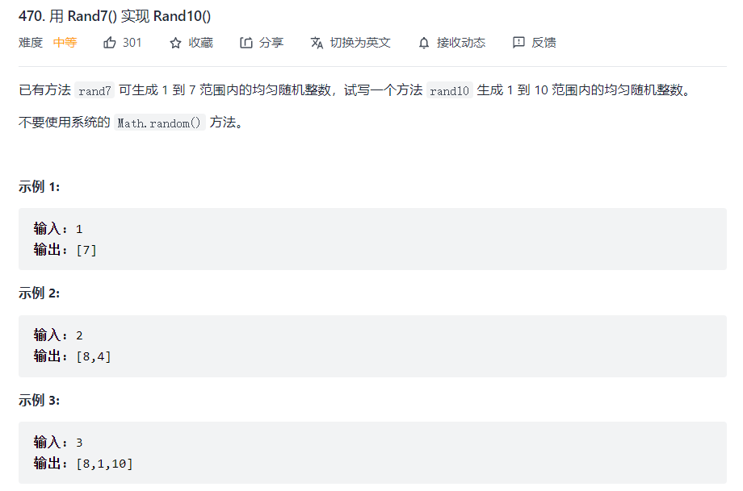
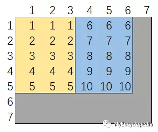

# 拒绝采样

<font style="color:rgb(0, 0, 0);">在这篇文章中，我们从一道 LeetCode 470 题目出发，通过系统地思考，引出拒绝采样（Reject Sampling）的概念，并探索比较三种拒绝采样的解法；接着借助状态转移图来定量计算采样效率；最后，我们利用同样的方法来解一道稍微复杂些的经典抛硬币求期望的统计面试题目。</font>

<font style="color:rgb(0, 0, 0);"></font>

## 一、Leetcode 470



## 二、思维过程

* <font style="color:rgb(0, 0, 0);">我们已有 </font><code><font style="color:rgb(0, 0, 0);">rand7()</font></code><font style="color:rgb(0, 0, 0);"> 等概率生成了 \[1, 7] 中的数字，我们需要等概率生成 \[1, 10] 范围内的数字。第一反应是调用一次 </font><code><font style="color:rgb(0, 0, 0);">rand7()</font></code><font style="color:rgb(0, 0, 0);"> 肯定是不够的，因为覆盖的范围不够。那么，就需要至少2次调用 </font><code><font style="color:rgb(0, 0, 0);">rand7()</font></code><font style="color:rgb(0, 0, 0);"> 才能生成一次 </font><code><font style="color:rgb(0, 0, 0);">rand10()</font></code><font style="color:rgb(0, 0, 0);">，但是还要保证 \[1, 10] 的数字生成概率相等，这个是难点。</font>

<font style="color:rgb(0, 0, 0);"></font>

* <font style="color:rgb(0, 0, 0);">现在我们先来考虑反问题，给定 </font><code><font style="color:rgb(0, 0, 0);">rand10()</font></code><font style="color:rgb(0, 0, 0);"> 生成 </font><code><font style="color:rgb(0, 0, 0);">rand7()</font></code><font style="color:rgb(0, 0, 0);">。这个应该很简单，调用一次 </font><code><font style="color:rgb(0, 0, 0);">rand10()</font></code><font style="color:rgb(0, 0, 0);"> 得到 \[1, 10]，如果是 8, 9, 10 ，则丢弃，重新开始，否则返回。想必大家都能想到这个朴素的方法，这种思想就是统计模拟中的拒绝采样（Reject Sampling）。</font>

<font style="color:rgb(0, 0, 0);"></font>

* <font style="color:rgb(0, 0, 0);">有了上面反问题的思考，我们可能会想到，</font><code><font style="color:rgb(0, 0, 0);">rand7()</font></code><font style="color:rgb(0, 0, 0);"> 可以生成 </font><code><font style="color:rgb(0, 0, 0);">rand5()</font></code><font style="color:rgb(0, 0, 0);">，覆盖 \[1, 5]的范围，如果将区间 \[1, 10] 分成两个5个值的区间 \[1, 5] 和 \[6, 10]，那么 </font><code><font style="color:rgb(0, 0, 0);">rand7()</font></code><font style="color:rgb(0, 0, 0);"> 可以通过先等概率选择区间 \[1, 5] 或 \[6, 10]，再通过 </font><code><font style="color:rgb(0, 0, 0);">rand7()</font></code><font style="color:rgb(0, 0, 0);">  生成 </font><code><font style="color:rgb(0, 0, 0);">rand5()</font></code><font style="color:rgb(0, 0, 0);"> 就可以了。这个问题就</font>**<font style="color:rgb(0, 0, 0);">等价于先用 rand7() 生成 rand2()，决定了 \[1, 5] 还是 \[6, 10]，再通过 rand7() 生成 rand5() 。</font>**

## 三、解法一：rand2() + rand5()

<font style="color:rgb(0, 0, 0);"></font>

<font style="color:rgb(0, 0, 0);">我们来实现这种解法。下图为调用两次 </font><code><font style="color:rgb(0, 0, 0);">rand7()</font></code><font style="color:rgb(0, 0, 0);">  生成 </font><code><font style="color:rgb(0, 0, 0);">rand10</font></code><font style="color:rgb(0, 0, 0);"> 数值的映射关系：横轴表示第一次调用，1，2，3 决定选择区间 \[1, 5] ，4，5，6选择区间 \[6, 10]。灰色部分表示结果丢弃，重新开始（注，若第一次得到7无需再次调用 </font><code><font style="color:rgb(0, 0, 0);">rand7()</font></code><font style="color:rgb(0, 0, 0);">）。</font>

<font style="color:rgb(0, 0, 0);"> </font>

<font style="color:rgb(0, 0, 0);">有了上图，我们很容易写出如下 AC 代码。</font>

```json
class Solution extends SolBase {
    public int rand10() {
        while(true){
            int a = rand7();
            if(a <= 3){
                int b = rand7();
                if(b <= 5){
                    return b;
                }
            }else if(a <= 6){
                int b = rand7();
                if(b <= 5){
                    return b + 5;
                }
            }
        }
    }
}
```

## 参考：

* <https://mp.weixin.qq.com/s/vhNCIg30A7I7QqIQ684DKA>


> 更新: 2024-08-27 20:01:05  
> 原文: <https://www.yuque.com/thinkspace/wdkdul/spfw8y>