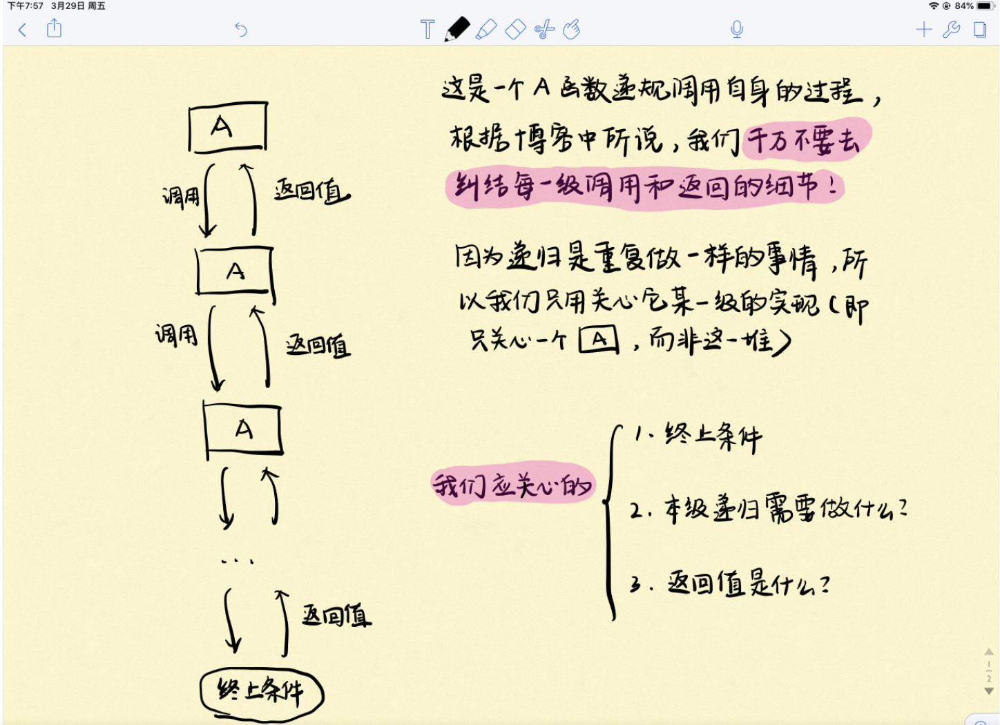
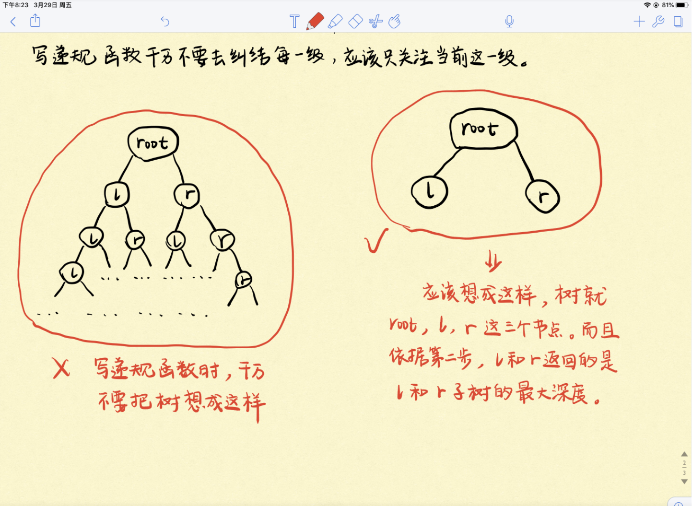
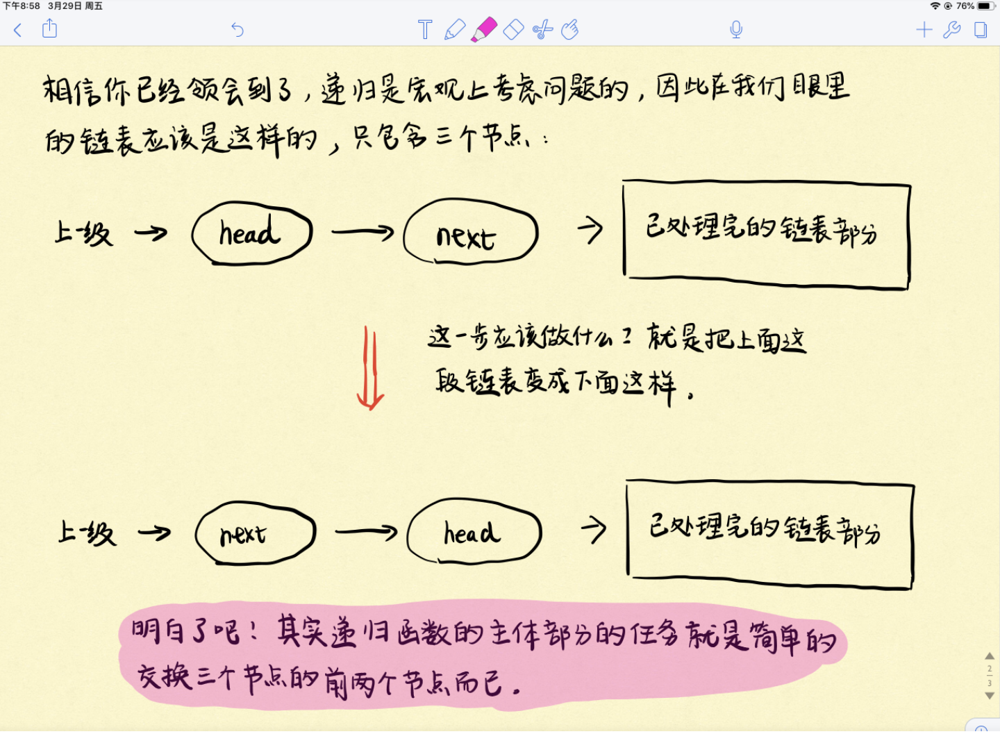

# 递归问题模板

## 一、递归题解三部曲

何为递归？程序反复调用自身即是递归。

我自己在刚开始解决递归问题的时候，总是会去纠结这一层函数做了什么，它调用自身后的下一层函数又做了什么…然后就会觉得实现一个递归解法十分复杂，根本就无从下手。

相信很多初学者和我一样，这是一个思维误区，一定要走出来。既然递归是一个反复调用自身的过程，这就说明它每一级的功能都是一样的，因此我们只需要关注一级递归的解决过程即可。



如上图所示，我们需要关心的主要是以下三点：

1. 整个递归的终止条件。
2. 一级递归需要做什么？
3. 应该返回给上一级的返回值是什么？

一定要理解这3步，这就是以后递归秒杀算法题的依据和思路。

但这么说好像很空，我们来以题目作为例子，看看怎么套这个模版，相信3道题下来，你就能慢慢理解这个模版。之后再解这种套路递归题都能直接秒了。

## 二、例题

### 1、求二叉树的最大深度

先看一道简单的Leetcode题目： Leetcode 104. 二叉树的最大深度

题目很简单，求二叉树的最大深度，那么直接套递归解题三部曲模版：

* **找终止条件。** 什么情况下递归结束？当然是树为空的时候，此时树的深度为0，递归就结束了。
* **找返回值。** 应该返回什么？题目求的是树的最大深度，我们需要从每一级得到的信息自然是当前这一级对应的树的最大深度，因此我们的返回值应该是当前树的最大深度，这一步可以结合第三步来看。
* **本级递归应该做什么。** 首先，还是强调要走出之前的思维误区，递归后我们眼里的树一定是这个样子的，看下图。此时就三个节点：root、root.left、root.right，其中根据第二步，`root.left` 和`root.right`分别记录的是root的左右子树的最大深度。那么本级递归应该做什么就很明确了，自然就是在root的左右子树中选择较大的一个，再加上1就是以root为根的子树的最大深度了，然后再返回这个深度即可。



具体Java代码如下：

```java
class Solution {
    public int maxDepth(TreeNode root) {
        //终止条件：当树为空时结束递归，并返回当前深度0
        if(root == null){
            return 0;
        }
        //root的左、右子树的最大深度
        int leftDepth = maxDepth(root.left);
        int rightDepth = maxDepth(root.right);
        //返回的是左右子树的最大深度+1
        return Math.max(leftDepth, rightDepth) + 1;
    }
}
```

### 2、两两交换链表中的节点

看了一道递归套路解决二叉树的问题后，有点套路搞定递归的感觉了吗？我们再来看一道Leetcode中等难度的链表的问题，掌握套路后这种中等难度的问题真的就是秒：Leetcode 24. 两两交换链表中的节点

直接上三部曲模版：

1. **找终止条件。** 什么情况下递归终止？没得交换的时候，递归就终止了呗。因此当链表只剩一个节点或者没有节点的时候，自然递归就终止了。
2. **找返回值。** 我们希望向上一级递归返回什么信息？由于我们的目的是两两交换链表中相邻的节点，因此自然希望交换给上一级递归的是已经完成交换处理，即已经处理好的链表。
3. **本级递归应该做什么。** 结合第二步，看下图！由于只考虑本级递归，所以这个链表在我们眼里其实也就三个节点：head、head.next、已处理完的链表部分。而本级递归的任务也就是交换这3个节点中的前两个节点，就很easy了。



附上Java代码：

```java
class Solution {
    public ListNode swapPairs(ListNode head) {
      	//终止条件：链表只剩一个节点或者没节点了，没得交换了。返回的是已经处理好的链表
        if(head == null || head.next == null){
            return head;
        }
      	//一共三个节点:head, next, swapPairs(next.next)
      	//下面的任务便是交换这3个节点中的前两个节点
        ListNode next = head.next;
        head.next = swapPairs(next.next);
        next.next = head;
      	//根据第二步：返回给上一级的是当前已经完成交换后，即处理好了的链表部分
        return next;
    }
}
```

> 转载自：<https://lyl0724.github.io/2020/01/25/1/>


> 更新: 2022-12-24 00:48:10  
> 原文: <https://www.yuque.com/thinkspace/wdkdul/adw16xa2rcy6a63l>