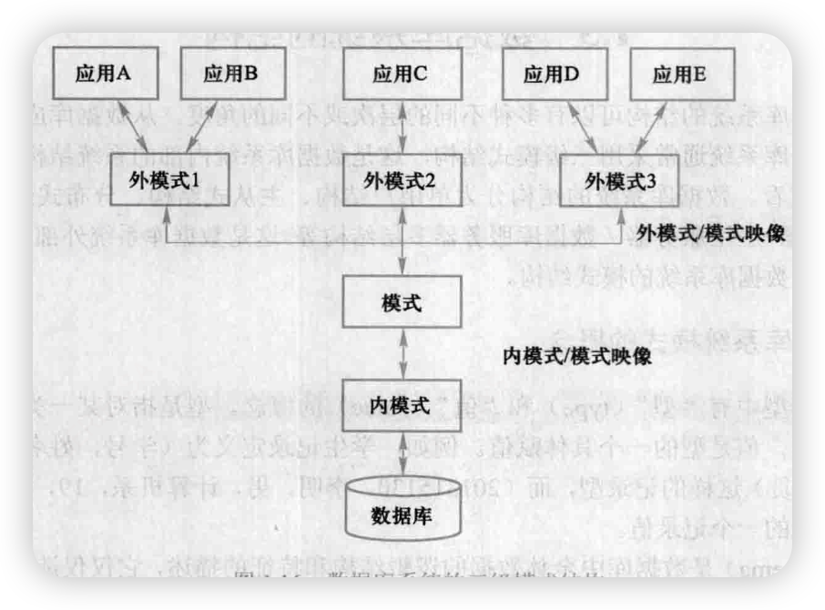
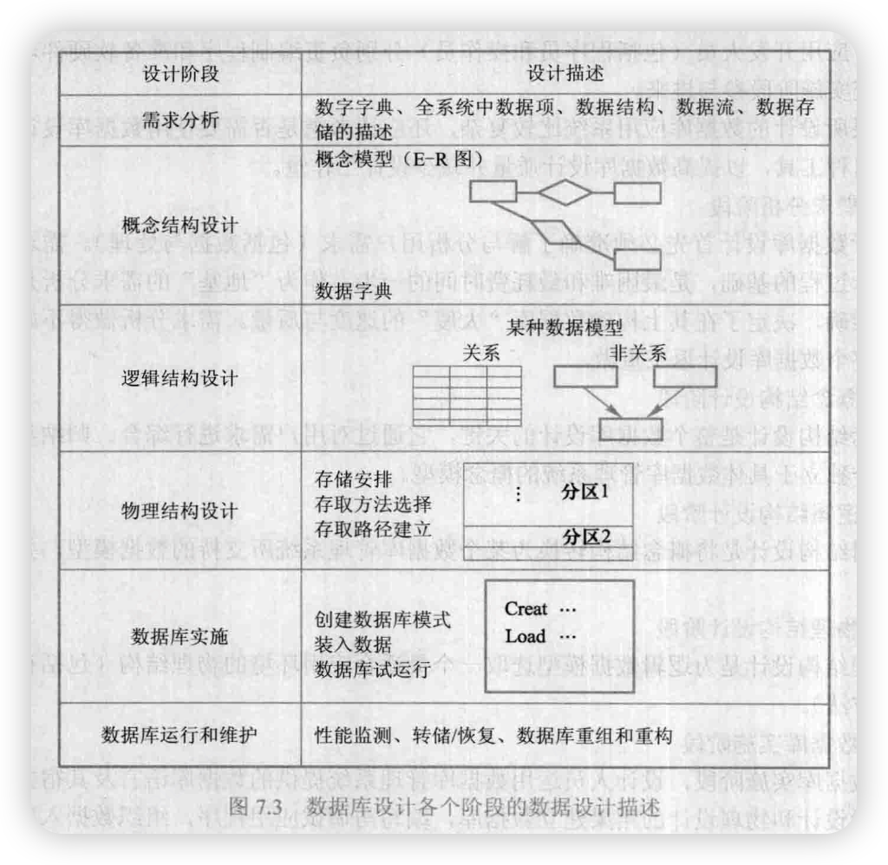
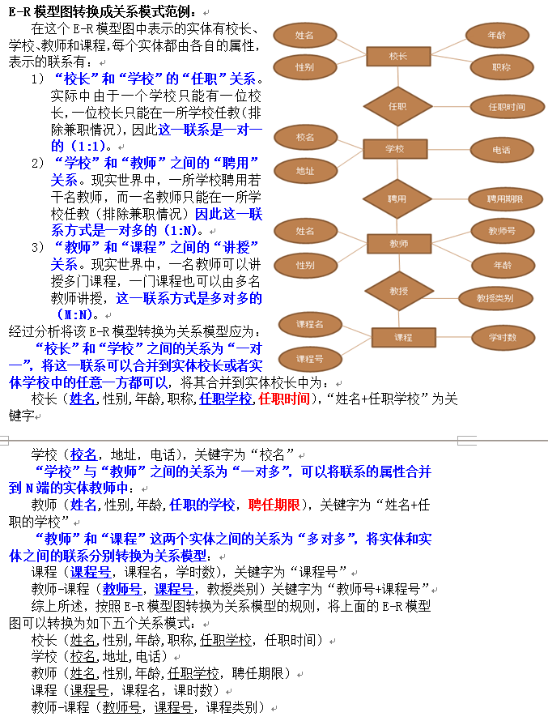
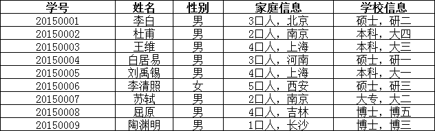
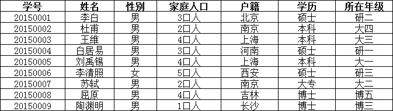
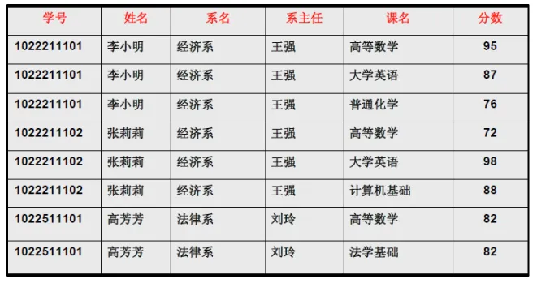
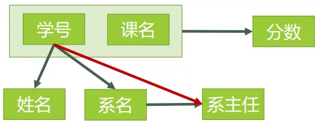
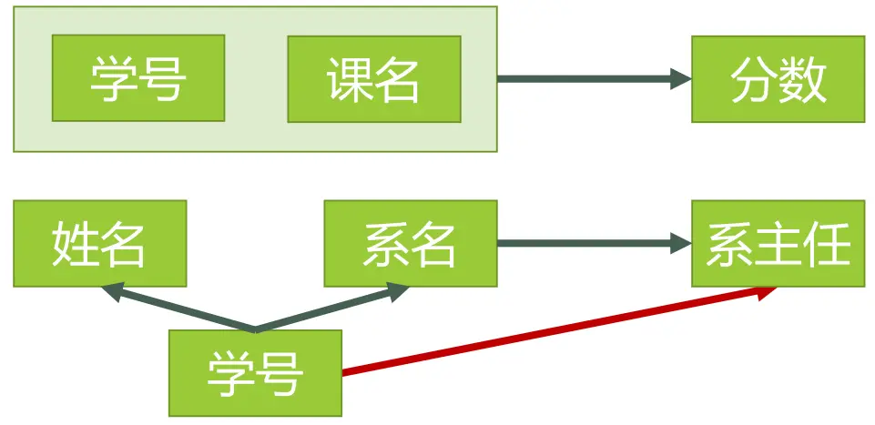
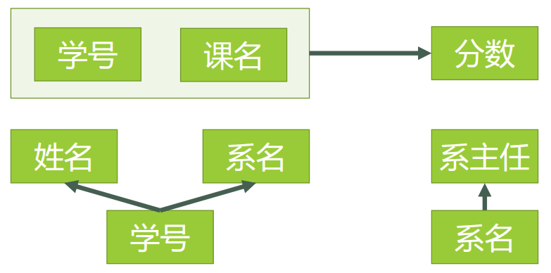
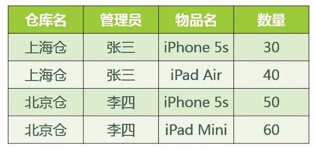

# 数据库技术

### 1、三级模式、两级映像

+ **模式**：模式也称逻辑模式，是数据库中全体数据的逻辑结构和特征的描述，是所有用户的公共数据视图。它是数据库系统模式结构的中间层，既不涉及数据的物理存储细节和硬件环境，又与具体的应用程序、所使用的应用开发工具及高级程序语言无关。
+ **外模式**：外模式也称子模式或用户模式，它是数据库用户（包括程序员和最终用户）能够看到和使用的局部数据的逻辑结构和特征的描述，是数据库用户的数据视图，是与某一应用有关的数据的逻辑表示。外模式通常是模式的子集。一个数据库可以有多个外模式。
+ **内模式**：内模式也称存储模式，一个数据库只有一个内模式。它是数据物理结构和存储方式的描述，是数据在数据库内部的组织方式。
+ **外模式/模式映像**：模式描述的是数据的全局逻辑结构，外模式描述的是数据的局部逻辑结构。对应于同一个模式可以有任意多个外模式。对于每一个外模式，数据库系统都有一个外模式/模式映像，它定义了该外模式与模式之间的对应关系。当模式改变时（例如增加新的关系、新的属性、改变属性的数据类型等），由数据库管理员对各个外模式/模式的映像作相应改变，可以使外模式保持不变。应用程序是依据数据的外模式编写的，从而应用程序不必修改，保证了数据与程序的逻辑独立性，简称**数据的逻辑独立性**。
+ **模式/内模式映像**：数据库只有一个模式，也只有一个内模式，所以模式/内模式映像是唯一的，它定义了数据全局逻辑结构与存储结构之间的对应关系。当数据库的存储结构改变时由数据库管理员对模式/内模式映像作相应改变，可以使模式保持不变，从而应用程序也不必改变，保证了数据与程序的物理独立性，简称**数据的物理独立性**。

### 2、视图，视图的作用
+ 视图是从一个或几个基本表（或视图导出的表）。它与基本表不同，是一个虚表。数据库中只存放视图的定义，而不存放视图对应的数据，这些数据仍存放在原来的基本表中。所以一旦基本表中的数据发生变化，从视图中查询出的数据也就随之改变了。
+ 视图的作用：
    - 视图能够简化用户的操作：视图机制使用户可以将注意力集中在所关心的数据上。如果这些数据不是直接来自基本表，则可以通过定义视图使数据库看起来结构简单、清晰，并且可以简化用户的数据查询操作。
    - 视图使用户能以多种角度看待同一数据：视图机制能使不同的用户以不同的方式看待同一数据，当许多不同种类的用户共享统一数据库时，这种灵活性是非常重要的。
    - 视图对重构数据库提供一定程度的逻辑独立性。数据的逻辑独立性是指当数据库重构造时，如增加新的关系或对原有关系增加新的字段等，用户的应用程序不会受影响。
    - 视图能够对机密数据提供安全保护：有了视图机制，就可以在设计数据库应用系统时对不同的用户定义不同的视图，使机密数据不出现在不应看到这些数据的用户视图上。这样视图机制就自动提供了对机密数据的安全保护功能。

### 3、数据库的设计阶段
+ 需求分析阶段：进行数据库涉及首先必须明确了解与分析用户需求（包括数据与处理）。需求分析是整个设计过程的基础。
+ 概念结构设计阶段：概念结构涉及是整个数据库设计的关键，它通过对用户需求进行综合、归纳与抽象，形成一个独立于具体数据库管理系统的概念模型。
+ 逻辑结构涉及阶段：逻辑结构设计是将概念结构转换为某个数据库管理系统所支持的数据模型，并对其进行优化。
+ 物理结构设计阶段：物理结构设计是对逻辑数据模型选取一个最适合应用环境的物理结构（包括存储结构和存储方法）
+ 数据库实施阶段：在数据库实施阶段，设计人员运用数据库管理系统提供的数据库语言及其宿主语言，根据逻辑涉及和物理涉及的结构建立数据库，编写与调试应用程序，组织数据入库，并进行试运行。
+ 数据库运行和维护阶段：数据库应用系统经过试运行后即可投入正式运行。在数据库系统运行过程中必须不断地对其进行评估、调整与修改。

### 4、E-R图（转换成关系模式）

### 5、关系范式与模式分解
#### （1）第一范式(1NF)
+ **1NF的定义为：符合1NF的关系中的每个属性都不可再分**。

在上面的表中，“家庭信息”和“学校信息”列均不满足原子性的要求，故不满足第一范式，调整如下：

#### （2）第二范式（2NF）
2NF在1NF的基础之上，消除了非主属性对于码的部分函数依赖。**第二范式需要确保数据库表中的每一列都和主键相关，而不能只与主键的某一部分相关（主要针对联合主键而言）。**

首先，我们需要判断，表3是否符合2NF的要求？根据2NF的定义，判断的依据实际上就是看数据表中**是否存在非主属性对于码的部分函数依赖**。判断的方法是：

第一步：找出数据表中所有的**码**。 第二步：根据第一步所得到的码，找出所有的**主属性**。 第三步：数据表中，除去所有的主属性，剩下的就都是**非主属性**了。 第四步：查看是否存在非主属性对码的**部分函数依赖**。

举例子：

对于该，根据前面所说的四步，我们可以这么做：

**第一步：**

1. 查看所有每一单个属性，当它的值确定了，是否剩下的所有属性值都能确定。
2. 查看所有包含有两个属性的属性组，当它的值确定了，是否剩下的所有属性值都能确定。
3. ……

看起来很麻烦是吧，但是这里有一个诀窍，就是假如A是码，那么所有包含了A的属性组，如（A，B）、（A，C）、（A，B，C）等等，都不是码了（因为作为码的要求里有一个“**完全**函数依赖”）。

下图表示了表中所有的函数依赖关系：

这一步完成以后，可以得到，表3的码只有一个，就是（学号、课名）。

**第二步：** 主属性有两个：**学号 **与** 课名**

**第三步：** 非主属性有四个：**姓名**、**系名**、**系主任**、**分数**

**第四步：** 对于**（学号，课名） → 姓名**，有 **学号 → 姓名**，存在非主属性 **姓名 **对码**（学号，课名）**的部分函数依赖。 对于**（学号，课名） → 系名**，有 **学号 → 系名**，存在非主属性 系**名 **对码**（学号，课名）**的部分函数依赖。 对于**（学号，课名） → 系主任**，有 **学号 → 系主任**，存在非主属性 对码**（学号，课名）**的部分函数依赖。

所以表3存在非主属性对于码的部分函数依赖，最高只符合1NF的要求，不符合2NF的要求。

为了让表3符合2NF的要求，我们必须消除这些部分函数依赖，只有一个办法，就是将大数据表拆分成两个或者更多个更小的数据表，在拆分的过程中，要达到更高一级范式的要求，这个过程叫做”模式分解“。模式分解的方法不是唯一的，以下是其中一种方法：

+ 选课（学号，课名，分数）
+ 学生（学号，姓名，系名，系主任）

我们先来判断以下，**选课**表与**学生**表，是否符合了2NF的要求？

+ 对于**选课**表，其码是**（学号，课名）**，主属性是**学号**和**课名**，非主属性是**分数**，**学号**确定，并不能唯一确定**分数**，**课名**确定，也不能唯一确定**分数**，所以不存在非主属性**分数**对于码 **（学号，课名）**的部分函数依赖，所以此表符合2NF的要求。
+ 对于**学生**表，其码是**学号，**主属性是**学号**，非主属性是**姓名、系名**和**系主任**，因为码只有一个属性，所以不可能存在非主属性对于码的部分函数依赖，所以此表符合2NF的要求。

下**图**表示了[模式分解](https://www.zhihu.com/search?q=%E6%A8%A1%E5%BC%8F%E5%88%86%E8%A7%A3&search_source=Entity&hybrid_search_source=Entity&hybrid_search_extra=%7B%22sourceType%22%3A%22answer%22%2C%22sourceId%22%3A29189700%7D)以后的新的函数依赖关系

#### （3）第三范式（3NF）
**3NF在2NF的基础之上，消除了非主属性对于码的传递函数依赖**。

+ 对于**选课**表，主码为（学号，课名），主属性为**学号**和**课名，**非主属性只有一个，为分数，不可能存在传递函数依赖，所以**选课**表的设计，符合3NF的要求。
+ 对于**学生**表，主码为**学号**，主属性为**学号**，非主属性为**姓名**、**系名**和**系主任**。因为 学号 → 系名，同时 系名 → 系主任，所以存在非主属性**系主任**对于码**学号**的传递函数依赖，所以**学生**表的设计，不符合3NF的要求。

为了让[数据表设计](https://www.zhihu.com/search?q=%E6%95%B0%E6%8D%AE%E8%A1%A8%E8%AE%BE%E8%AE%A1&search_source=Entity&hybrid_search_source=Entity&hybrid_search_extra=%7B%22sourceType%22%3A%22answer%22%2C%22sourceId%22%3A29189700%7D)达到3NF，我们必须进一步进行模式分解为以下形式：

+ 选课（学号，课名，分数）
+ 学生（学号，姓名，系名）
+ 系（系名，系主任）

#### （4）BCNF 范式
要了解 BCNF 范式，那么先看这样一个问题，若：

1. 某公司有若干个仓库；
2. 每个仓库只能有一名管理员，一名管理员只能在一个仓库中工作；
3. 一个仓库中可以存放多种物品，一种物品也可以存放在不同的仓库中。每种物品在每个仓库中都有对应的数量。

那么关系模式 仓库（仓库名，管理员，物品名，数量） 属于哪一级范式？

答：已知函数依赖集：仓库名 → 管理员，管理员 → 仓库名，（仓库名，物品名）→ 数量

+ 码：（管理员，物品名），（仓库名，物品名）
+ 主属性：仓库名、管理员、物品名
+ 非主属性：数量

∵ 不存在非主属性对码的部分函数依赖和传递函数依赖。∴ 此关系模式属于3NF。

基于此关系模式的关系（具体的数据）可能如图所示：

好，既然此关系模式已经属于了 3NF，那么这个关系模式是否存在问题呢？我们来看以下几种操作：

1. 先新增加一个仓库，但尚未存放任何物品，是否可以为该仓库指派管理员？——不可以，因为物品名也是主属性，根据实体完整性的要求，主属性不能为空。
2. 某仓库被清空后，需要删除所有与这个仓库相关的物品存放记录，会带来什么问题？——仓库本身与管理员的信息也被随之删除了。
3. 如果某仓库更换了管理员，会带来什么问题？——这个仓库有几条物品存放记录，就要修改多少次管理员信息。

造成此问题的原因：存在着**主属性**对于码的部分函数依赖与传递函数依赖。（在此例中就是存在主属性【仓库名】对于码【（管理员，物品名）】的部分函数依赖。

解决办法就是要在 3NF 的基础上消除**主属性**对于码的部分与传递函数依赖。

仓库（仓库名，管理员）

库存（仓库名，物品名，数量）

这样，之前的插入异常，修改异常与删除异常的问题就被解决了。

> 更新: 2025-01-20 23:47:04  
> 原文: <https://www.yuque.com/thinkspace/vxiyrq/sqxs291ptzwq1wxc>