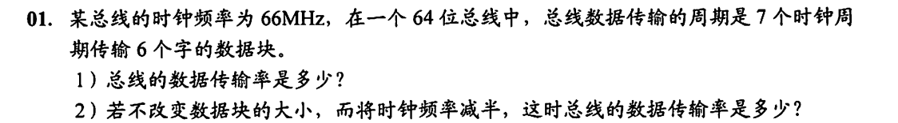
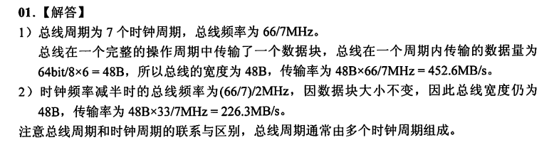

# 计算机基础

### 2、计算机硬件的基本组成
计算机的基本硬件由运算器、控制器、存储器、输入设备和输出设备5大部件组成。

+ 运算器、控制器等部件被集成在一起统称为中央处理器（CPU）。CPU是硬件系统的核心，用于数据的加工处理，能完成各种运算、逻辑运算及控制功能。
+ 存储器是计算机系统中的记忆设备，分为内部存储器和外部存储器。前者速度高、容量小，一般用于临时存放程序、数据及中间结果。而后者容量大、速度慢，可以长期保存程序和数据。
+ 输入设备和输出设备合称为外部设备（简称外设），输入设备用于输入原始数据及各种命令，而输出设备则用于输出计算机运行的结果。

### 3、虚拟存储器的基本原理
+ 虚拟存储器是将很大的数据分成许多较小的块，全部存储在外存中，运行时，将用到的数据调到主存中，马上要用到的数据置于缓存中，这样，一边运行一边进行所需数据块的调入和调出。

### 4、系统总线的分类
+ 数据总线：用来传输各功能部件之间的数据信息，它是双向传输总线，其位数和机器字长、存储字长有关。
+ 地址总线：用来指出数据总线上的源数据或目的数据所在的主存单元或IO端口的地址，它是单向传输总线，地址总线的位数与主存地址空间的大小有关。
+ 控制总线：控制总线传输的是控制信息，包括CPU送出的控制命令和主存（或外设）返回CPU的反馈信号。

> 更新: 2025-01-20 01:44:15  
> 原文: <https://www.yuque.com/thinkspace/vxiyrq/ztfbpp84c9fbl7gd>