# 计算机网络

### 1、ARP 工作过程

* ARP（地址解析协议）的作用是从网络层使用的IP地址中解析出在数据链路层使用的物理地址。在每个主机中都有一个ARP高速缓存，里面有本局域网上各主机和路由器的IP地址到物理地址的映射表，这个映射表还经常动态更新（新增或超时删除）。
* ARP的工作过程：当源主机要向本局域网上的目的主机发送IP数据报时，先在其ARP高速缓存中查看有无目的主机的IP地址。若有，则在ARP高速缓存中查出对应的物理地址，再把这个物理地址写入MAC帧，然后通过局域网把该MAC帧发往此物理地址。若找不到目的主机的IP地址，则执行以下步骤：
  * 源主机自动运行ARP，使ARP进程在本局域网上广播发送一个ARP请求分组。
  * 在本局域网的所有主机上运行的ARP进程都会收到此ARP请求分组。
  * 若目的主机的IP地址与ARP请求分组中要查询的IP地址一致，则手下这个ARP请求分组，并向源主机发送ARP响应分组，同时在这个ARP响应分组中写入自己的物理地址。
  * 源主机收到目的主机的arp请求后，就在其arp高速缓存中写入目的主机的IP地址与物理地址的映射。

ARP解决的是同一个局域网上的主机或路由器的IP地址和物理地址的映射问题。如果目的地址和源主机不在同一个局域网上，那么就要通过arp找到一个位于本局域网上的某个路由器的物理地址，然后把IP数据包发送给这个路由器，让这个路由器把IP数据包转发到下一个网络，下一个网络继续按照类似的方法工作，直至IP数据包最终交付给目的主机。

### 2、TCP 三次握手

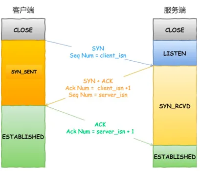

* 一开始，客户端和服务端都处于 `CLOSED` 状态。先是服务端主动监听某个端口，处于 `LISTEN` 状态
* 客户端会随机初始化序号，将此序号置于 TCP 首部的「序号」字段中，同时把 `SYN` 标志位置为 `1` ，表示 `SYN` 报文。接着把第一个 SYN 报文发送给服务端，表示向服务端发起连接。该报文不包含应用层数据。
* 服务端收到客户端的 `SYN` 报文后，首先服务端也随机初始化自己的序号，将此序号填入 TCP 首部的「序号」字段中，其次把收到的 **客户端的序列号+1** 填入到TCP 首部的「确认应答号」中 , 接着把 `SYN` 和 `ACK` 标志位置为 `1`。最后把该报文发给客户端。该报文也不包含应用层数据。
* 客户端收到服务端报文后，还要向服务端回应最后一个应答报文，首先该应答报文 TCP 首部 `ACK` 标志位置为 `1` ，其次将 **服务端的序列号 + 1** 填入「确认应答号」字段中，最后把报文发送给服务端，这次报文可以携带客户到服务器的数据，之后客户端处于 `ESTABLISHED` 状态。
* 服务器收到客户端的应答报文后，也进入 `ESTABLISHED` 状态。
* 一旦完成三次握手，双方都处于 `ESTABLISHED` 状态，此时连接就已建立完成，客户端和服务端就可以相互发送数据了。

**为什么需要三次握手？**

* **信息对等**：
  * 第一次握手：Client 什么都不能确认；Server 确认了对方发送正常，自己接收正常
  * 第二次握手：Client 确认了：自己发送、接收正常，对方发送、接收正常；Server 确认了：对方发送正常，自己接收正常
  * 第三次握手：Client 确认了：自己发送、接收正常，对方发送、接收正常；Server 确认了：自己发送、接收正常，对方发送、接收正常
* **防止超时**：
  * 连续三次握手也是防止出现请求超时导致脏连接。TTL网络报文的生存时间往往都会超过 TCP 请求超时时间，如果两次握手就可以创建连接，传输数据并释放连接后，第一个超时的连接请求才到达 B 机器的话，B机器会以为是 A创建的新连接请求，然后确认同意创建连接。因为 A 已经的状态不是 `SYN_SENT`，所以直接丢弃了 B 的确认数据，以致最后只是 B 机器单方面创建连接完毕。

### 3、四次挥手

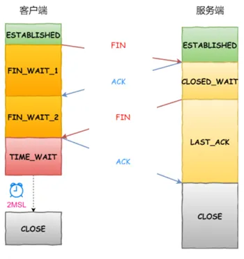

* 客户端打算关闭连接，此时会发送一个 TCP 首部 `FIN` 标志位被置为 `1` 的报文，也就是 `FIN` 报文，之后客户端进入 `FIN_WAIT_1` 状态。
* 服务端收到该报文后，就向客户端发送 `ACK` 应答报文，接着服务端进入 `CLOSED_WAIT` 状态。
* 客户端收到服务端的 `ACK` 应答报文后，之后进入 `FIN_WAIT_2` 状态。
* 等待服务端处理完数据后，也向客户端发送 `FIN` 报文，之后服务端进入 `LAST_ACK` 状态。
* 客户端收到服务端的 `FIN` 报文后，回一个 `ACK` 应答报文，之后进入 `TIME_WAIT` 状态
* 服务器收到了 `ACK` 应答报文后，就进入了 `CLOSED` 状态，至此服务端已经完成连接的关闭。
* 客户端在经过 `2MSL` 一段时间后，自动进入 `CLOSED` 状态，至此客户端也完成连接的关闭。

### 4、DNS 解析过程

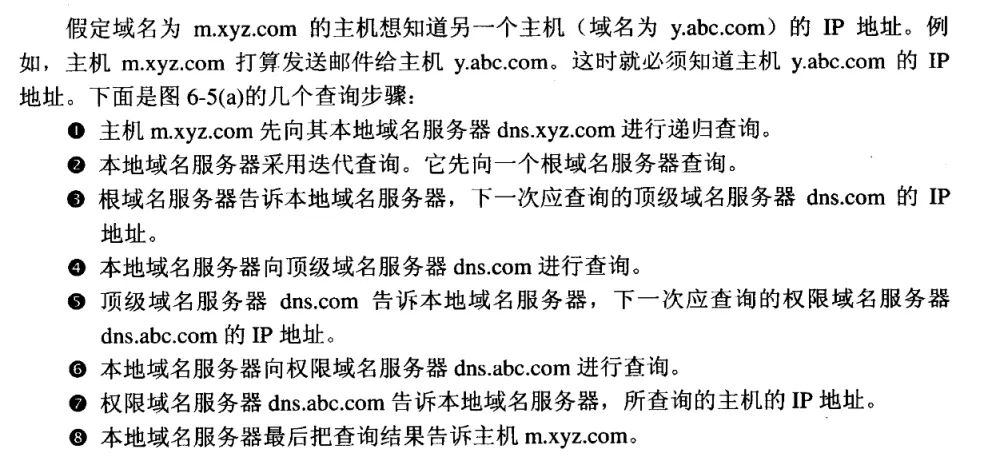

### 5、电子邮件的传送过程

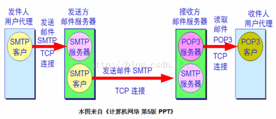

* 收件人调用计算机中的用户代理，编辑要发送的邮件。
* 发件人把邮件发送出去之后，邮件的发送方式就会交给用户代理来完成。用户代理把邮件用SMTP发送给发送方邮件服务器，用户代理充当SMTP客户，发送方邮件服务器充当SMTP服务器。
* SMTP 服务器收到用户代理发来的邮件后，把邮件临时存放在邮件缓存队列中，等待发送给接收方邮件服务器。
* 发送方邮件服务器的SMTP客户与接收方邮件服务器的SMTP服务建立TCP连接，然后把邮件缓存队列中的邮件依次发送出去。
* 运行在接收方邮件服务器的SMTP服务器进程收到邮件后，把邮件放到收件人的邮件中，等待收件人读取。
* 收件人收取邮件时，会运行计算机中的用户代理，使用POP3或IMAP读取发送给自己的邮件。

### 6、防火墙的概念

防火墙是位于两个信任程度不同的网络之间的软件和硬件设备的组合。他对两个或多个网络之间的通信进行控制，通过强制实施统一的安全措施，防止非法存取和访问重要的信息资源，以保护系统安全。

### 7、防火墙的功能

* 对进出的数据报进行过滤，过滤掉不安全的服务和非法用户。
* 监视互联网安全，对网络攻击行为进行检测和报警。
* 记录通过防火墙的信息内容和活动。
* 控制对特殊站点的访问，阻止某些禁止的访问行为。
* 进行用户身份验证，即对一个特定用户的身份进行校验，判断其是否合法。
* 进行网络地址转换，即可以通过防火墙将内部私有地址转换为全球公共地址。

### 8、IP地址块转子网掩码

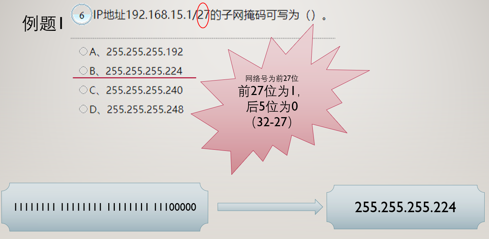

### 9、IPV6 正误判断

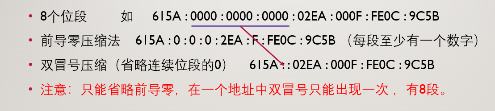

### 10、数据包

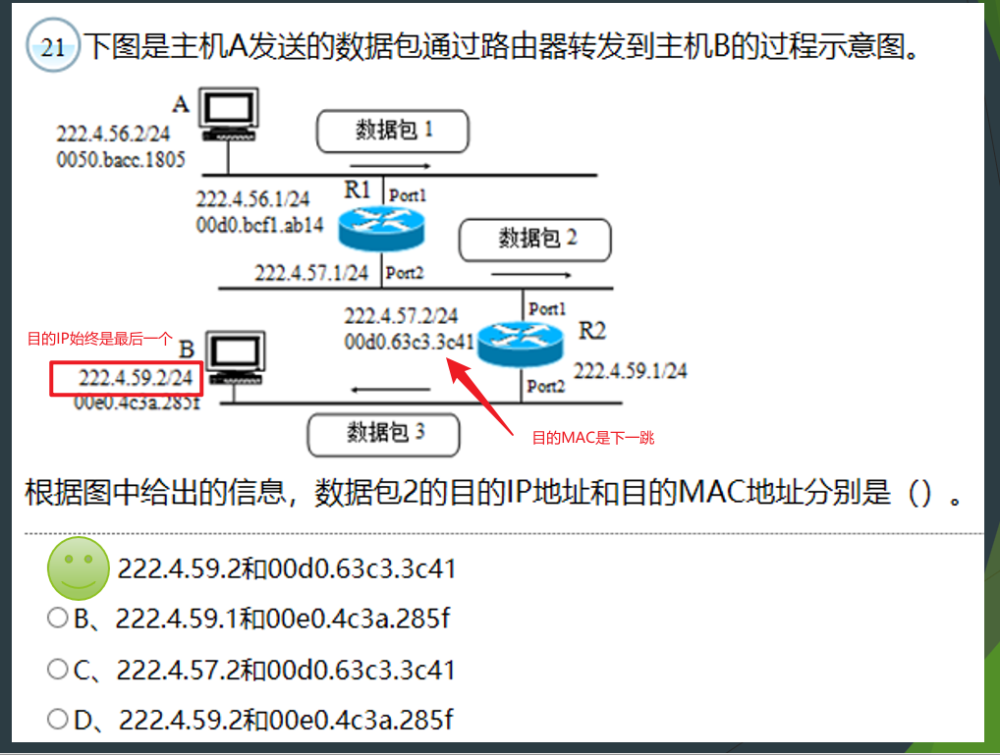

### 11、网络地址转NAT实例

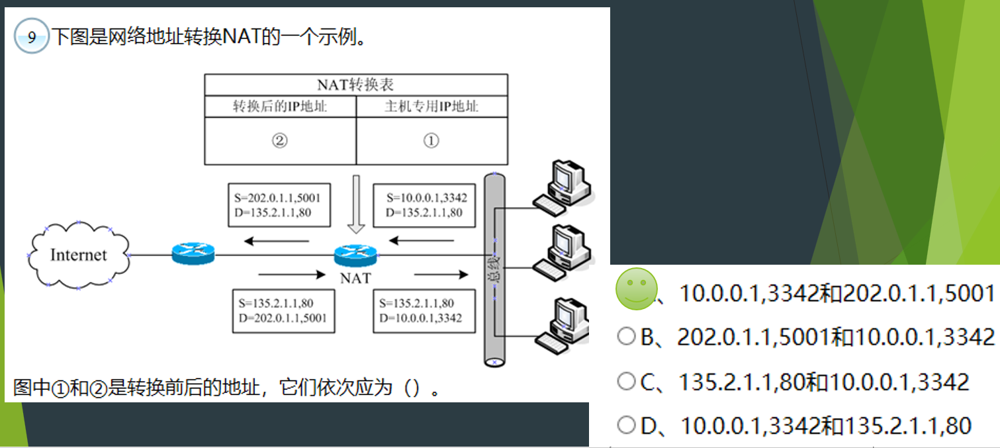

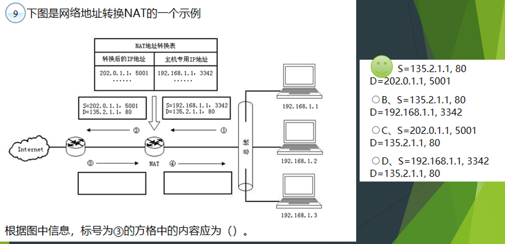

### 12、更新路由表

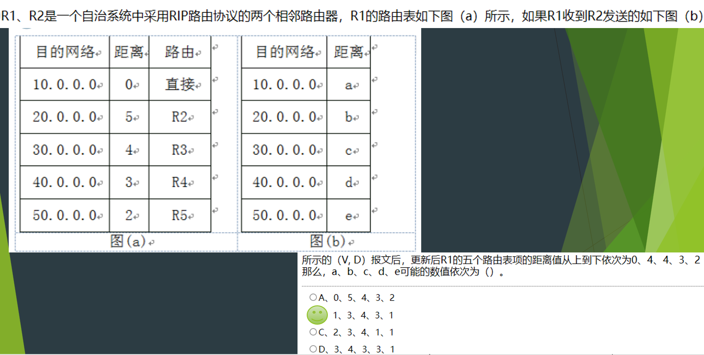

### 13、计算交换机带宽

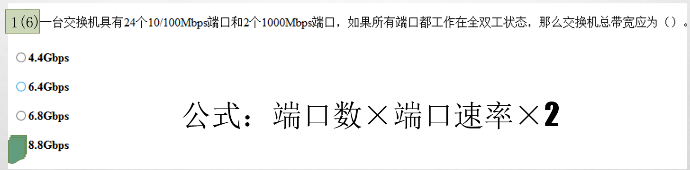

### 14、三种备份比较

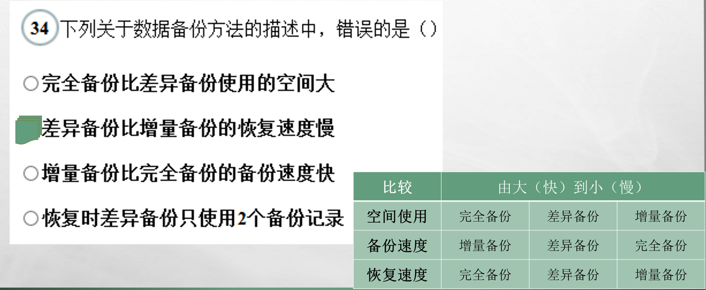

### 15、IP地址块聚合

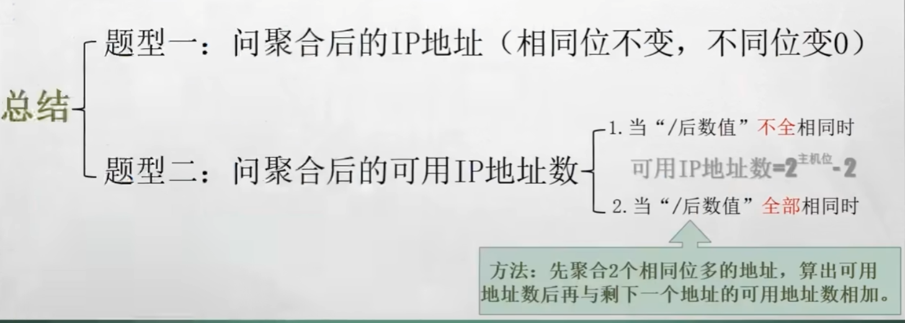

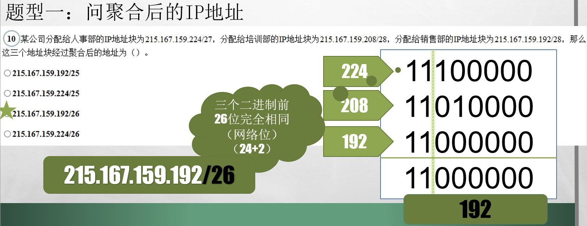

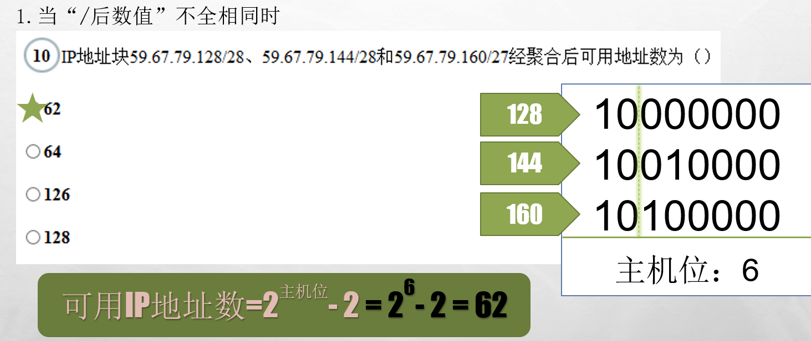

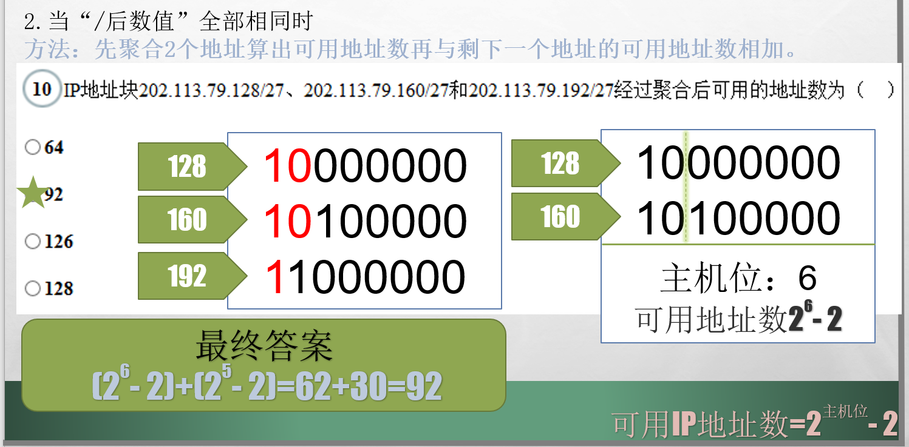

### 16、网络地址

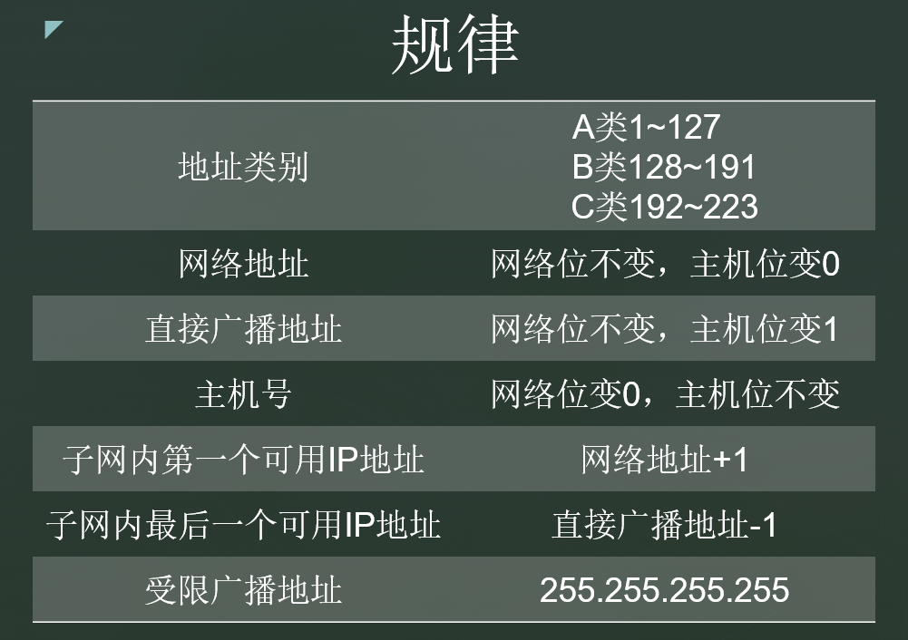

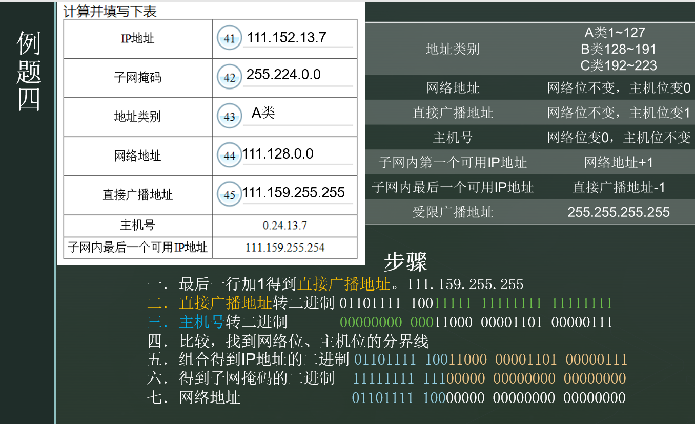

> 更新: 2024-10-03 22:42:07  
> 原文: <https://www.yuque.com/thinkspace/vxiyrq/qegeuvemiskuzbgp>