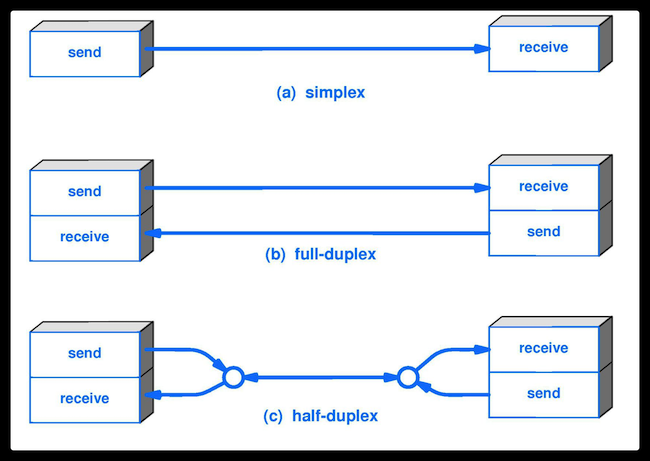

## 一、名词解释

- **数据（data）** :运送消息的实体。

- **信号（signal）** ：数据的电气的或电磁的表现。或者说信号是适合在传输介质上传输的对象。

- **码元（ code）** ：在使用时间域（或简称为时域）的波形来表示数字信号时，代表不同离散数值的基本波形。

- **失真**：失去真实性，主要是指接受到的信号和发送的信号不同，有磨损和衰减。影响失真程度的因素：1.码元传输速率 2.信号传输距离 3.噪声干扰 4.传输媒体质量
  

- AM；AmplitudeModulation；调幅；载波的振幅随基带数字信号而变化。

- FM；Frequency Modulation；调频；载波的频率随基带数字信号而变化。

- PM；Phase Modulation；调相；载波的初始相位随基带数字信号而变化。

- STDM；Statistic TDM；统计时分复用；是一种根据用户实际需要动态分配线路资源的时分复用方法。

- **比特率（bit rate ）** ：单位时间（每秒）内传送的比特数。

- **波特率/调制速率（baud）**：信号每秒钟变化的次数。比特率（bit）：每秒钟传送的二进制位数。

- 模拟的（analogous）：消息的参数的取值是连续的。数字的（digital）：消息的参数的取值是离散的。

- 基带信号（baseband signal） : 来自信源的信号。指没有经过调制的数字信号或模拟信号。

- 带通（频带）信号（bandpass signal） ：把基带信号经过载波调制后，把信号的频率范围搬移到较高的频段以便在信道中传输（即仅在一段频率范围内能够通过信道），这里调制过后的信号就是带通信号。

- 调制（modulation ） : 对信号源的信息进行处理后加到载波信号上，使其变为适合在信道传输的形式的过程。

- 信噪比（signal-to-noise ratio ） : 指信号的平均功率和噪声的平均功率之比，记为 S/N。信噪比（dB）=10*log10（S/N）。

- 信道复用（channel multiplexing ） ：指多个用户共享同一个信道。（并不一定是同时）。
  

- ADSL（Asymmetric Digital Subscriber Line ） ：非对称数字用户线。

- 光纤同轴混合网（HFC 网） :在目前覆盖范围很广的有线电视网的基础上开发的一种居民宽带接入网

## 二、重要知识点

- 物理层的主要任务就是确定与传输媒体接口有关的一些特性，如机械特性，电气特性，功能特性，过程特性。

- 一个数据通信系统可划分为三大部分，即源系统，传输系统，目的系统。源系统包括源点（或源站，信源）和发送器，目的系统包括接收器和终点。

- 通信的目的是传送消息。如话音，文字，图像等都是消息，数据是运送消息的实体。信号则是数据的电气或电磁的表现。

- 根据信号中代表消息的参数的取值方式不同，信号可分为模拟信号（或连续信号）和数字信号（或离散信号）。在使用时间域（简称时域）的波形表示数字信号时，代表不同离散数值的基本波形称为码元。

- 根据双方信息交互的方式，通信可划分为单向通信（或单工通信），双向交替通信（或半双工通信），双向同时通信（全双工通信）。

- 来自信源的信号称为基带信号。信号要在信道上传输就要经过调制。调制有基带调制和带通调制之分。最基本的带通调制方法有调幅，调频和调相。还有更复杂的调制方法，如正交振幅调制。

- 要提高数据在信道上的传递速率，可以使用更好的传输媒体，或使用先进的调制技术。但数据传输速率不可能任意被提高。

- 传输媒体可分为两大类，即导引型传输媒体（双绞线，同轴电缆，光纤）和非导引型传输媒体（无线，红外，大气激光）。

- 为了有效利用光纤资源，在光纤干线和用户之间广泛使用无源光网络 PON。无源光网络无需配备电源，其长期运营成本和管理成本都很低。最流行的无源光网络是以太网无源光网络 EPON 和吉比特无源光网络 GPON。

## 三、补充

### 1、网络设备

- 中继器：用于延长网络的长度和放大和重新发送被长电缆削弱的信号。

- 集线器：实质上是一个多端口的中继器，如果同时有两个或多个端口输入，则输入时会发生冲突。所以集线器是不可以隔离冲突域的，所有的集线器口都属于一个冲突域。

中继器与集线器的区别：

 

- 中继器通常只有两个端口，而一个集线器通常有四到二十个或更多的端口。

- 中继器在一个端口上接受并在另一个端口转发，而集线器在一个端口上就收并在所有其他端口上传输。

### 2、通信方式

- 单工Simplex Transmission：单向信号只能在一个方向上传播。如收音机和电视台信号。

- 半双工half-Duplex Transmission：信号可以在两个方向上传播，但不能同时传播。如对讲机通信。

- 全双工Full-Duplex Transmission：信号可以同时在两个方向上传播。如电话通信。

### 3、奈式准则与香农定理

- 奈氏准则 : 在任何信道中，码元的传输的速率是有上限的，传输速率超过此上限，就会出现严重的码间串扰问题，使接收端对码元的判决（即识别）成为不可能。

- 香农定理 ：在带宽受限且有噪声的信道中，为了不产生误差，信息的数据传输速率有上限值。

### 4、数据传输方式

- 电路交换：在通信之前要在通信双方建立一条被双方之间建立一条被双方独占的物理通路。

- 报文交换：数据交换的单位是报文，报文携带有目的地址、源地址等信息。报文交换在交换结点采用存储转发的传输方式。

- 分组交换：分组交换仍采用存储转发传输方式，但将一个长报文先分割位若干个较短的分组，然后将这些分组逐个发出去。

### 5、数据报和虚电路

报文交换又可以分为数据报和虚电路：

- 数据报：高层协议将报文拆分成若干带有序号和完整目的地址的分组，交换机根据转发表转发分组

- 在发送方和接收方建立一条逻辑上相连的虚电路，分组沿着虚电路传输。

### 6、物理层的作用

- 物理层主要做的事情就是 透明地传送比特流。也可以将物理层的主要任务描述为确定与传输媒体的接口的一些特性，即：机械特性（接口所用接线器的一些物理属性如形状和尺寸），电气特性（接口电缆的各条线上出现的电压的范围），功能特性（某条线上出现的某一电平的电压的意义），过程特性（对于不同功能的各种可能事件的出现顺序）。

- 物理层考虑的是怎样才能在连接各种计算机的传输媒体上传输数据比特流，而不是指具体的传输媒体。 现有的计算机网络中的硬件设备和传输媒体的种类非常繁多，而且通信手段也有许多不同的方式。物理层的作用正是尽可能地屏蔽掉这些传输媒体和通信手段的差异，使物理层上面的数据链路层感觉不到这些差异，这样就可以使数据链路层只考虑完成本层的协议和服务，而不必考虑网络的具体传输媒体和通信手段是什么。

### 7、几种常用的信道复用技术

- 频分复用(FDM) ：所有用户在同样的时间占用不同的带宽资源。频带被平均分成几份，用户在分配到一定的频带后，在通信过程中自始至终都占用这个频带。

- 时分复用（TDM） ：所有用户在不同的时间占用同样的频带宽度（分时不分频）。时分复用是将时间划分为一段段等长的时分复用（TDM）帧，每个时分复用的用户在每个 TDM 帧中占用固定序号的时隙。

- 统计时分复用 (Statistic TDM) ：改进的时分复用，能够明显提高信道的利用率。；是一种根据用户实际需要动态分配线路资源的时分复用方法。

- 码分复用(CDM) ： 用户使用经过特殊挑选的不同码型，因此各用户之间不会造成干扰。这种系统发送的信号有很强的抗干扰能力，其频谱类似于白噪声，不易被敌人发现。

- 波分复用( WDM) ：波分复用就是光的频分复用。

### 8、几种常用的宽带接入技术，主要是 ADSL 和 FTTx

用户到互联网的宽带接入方法有非对称数字用户线 ADSL（用数字技术对现有的模拟电话线进行改造，而不需要重新布线。ADSL 的快速版本是甚高速数字用户线 VDSL。），光纤同轴混合网 HFC（是在目前覆盖范围很广的有线电视网的基础上开发的一种居民宽带接入网）和 FTTx（即光纤到······）。

### 9．比较电路交换、报文交换和分组交换的特点。

电路交换的电信网四通八达，但一旦正在通信的电路中有一个交换机或一条链路被中断，则整个通信电路就要中断。如要立即改用其他迂回电路通信，还必须重新拨号建立连接。电路交换必定是面向连接的。当使用电路交换来传送计算机数据时，其线路的传输效率往往很低。但若要连续传送大量的数据，且其传送时间远大于连接建立的时间，则电路交换传输速率较快。
分组交换在分组传输的过程中动态分配传输带宽，对通信链路是逐段占用的，它为每一个分组独立地选择转发路由，以分组作为传送单位，可以不先建立连接就能向其他主机发送分组，
具有很完善的网络协议，分布式多路由的分组交换网是网络有很好的生存性。分组在各结点存储转发时需要排队，会造成一定时延，并且各分组必须携带的控制信息也造成了一定开销。
报文交换的时延较长，现已很少使用。报文交换和分组交换不需要预先分配传输带宽，在传送突发数据时可提高整个网络的信道利用率。分组交换比报文交换的时延小，但其结点交换机必须具有更强的处理能力。