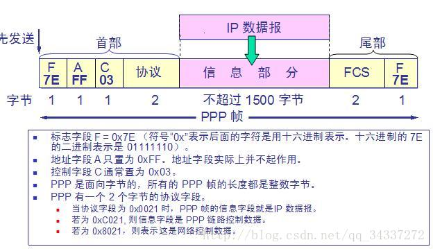
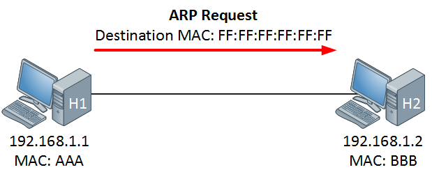

## 一、基本术语

1. **链路（link）** ：一个结点到相邻结点的一段物理链路。

1. **数据链路（data link）** ：把实现控制数据运输的协议的硬件和软件加到链路上就构成了数据链路。

1. **循环冗余检验 CRC（Cyclic Redundancy Check）** ：为了保证数据传输的可靠性，CRC 是数据链路层广泛使用的一种检错技术。

1. **帧（frame）** ：一个数据链路层的传输单元，由一个数据链路层首部和其携带的封包所组成协议数据单元。

1. **MTU（Maximum Transfer Uint ）** ：最大传送单元。帧的数据部分的的长度上限。

1. **误码率 BER（Bit Error Rate ）** ：在一段时间内，传输错误的比特占所传输比特总数的比率。

1. **PPP（Point-to-Point Protocol ）** ：点对点协议。即用户计算机和 ISP 进行通信时所使用的数据链路层协议。以下是 PPP 帧的示意图：

1. **MAC 地址（Media Access Control 或者 Medium Access Control）** ：意译为媒体访问控制，或称为物理地址、硬件地址，用来定义网络设备的位置。在 OSI 模型中，第三层网络层负责 IP 地址，第二层数据链路层则负责 MAC 地址。因此一个主机会有一个 MAC 地址，而每个网络位置会有一个专属于它的 IP 地址 。地址是识别某个系统的重要标识符，“名字指出我们所要寻找的资源，地址指出资源所在的地方，路由告诉我们如何到达该处。”

1. **网桥（bridge）** ：一种用于数据链路层实现中继，连接两个或多个局域网的网络互连设备。

1. **交换机（switch ）** ：广义的来说，交换机指的是一种通信系统中完成信息交换的设备。这里工作在数据链路层的交换机指的是交换式集线器，其实质是一个多接口的网桥

## 二、重要知识点总结

1. 链路是从一个结点到相邻结点的一段物理链路，数据链路则在链路的基础上增加了一些必要的硬件（如网络适配器）和软件（如协议的实现）

1. 数据链路层使用的主要是**点对点信道**和**广播信道**两种。

1. 数据链路层传输的协议数据单元是帧。数据链路层的三个基本问题是：**封装成帧**，**透明传输**和**差错检测**

1. **循环冗余检验 CRC** 是一种检错方法，而帧检验序列 FCS 是添加在数据后面的冗余码

1. **点对点协议 PPP** 是数据链路层使用最多的一种协议，它的特点是：简单，只检测差错而不去纠正差错，不使用序号，也不进行流量控制，可同时支持多种网络层协议

1. PPPoE 是为宽带上网的主机使用的链路层协议

1. **局域网的优点是：具有广播功能，从一个站点可方便地访问全网；便于系统的扩展和逐渐演变；提高了系统的可靠性，可用性和生存性。**

1. 计算机与外接局域网通信需要通过通信适配器（或网络适配器），它又称为网络接口卡或网卡。**计算器的硬件地址就在适配器的 ROM 中**。

1. 以太网采用的无连接的工作方式，对发送的数据帧不进行编号，也不要求对方发回确认。目的站收到有差错帧就把它丢掉，其他什么也不做

1. 以太网采用的协议是具有冲突检测的**载波监听多点接入 CSMA/CD**。协议的特点是：**发送前先监听，边发送边监听，一旦发现总线上出现了碰撞，就立即停止发送。然后按照退避算法等待一段随机时间后再次发送。** 因此，每一个站点在自己发送数据之后的一小段时间内，存在着遭遇碰撞的可能性。以太网上的各站点平等地争用以太网信道

1. 以太网的适配器具有过滤功能，它只接收单播帧，广播帧和多播帧。

1. 使用集线器可以在物理层扩展以太网（扩展后的以太网仍然是一个网络）

## 三、补充

### 1、随机接入

纯ALOHA协议：不检查直接发送，若无确认则等待重发。

- 时隙ALOHA协议：将时间划分为若干等长时隙，每个结点等待时隙发送数据。

- CSMA协议： 

- 1-坚持：闲则发送，忙则继续监听。

- 非坚持：闲则发送，忙则等待一个随机时间再重新监听。

- P-坚持：闲则以概率p发送，1-p等待下一个时隙。忙则延迟一段随机的时间再监听。

- CSMA/CD：先听后发，边听边发，冲突停发，随机重发

- CSMA/CA：发送站点在发送数据前，以控制短帧刺激站点发送应答短帧，使接收站点周围的站点监听到该帧，从而在一定时间内避免数据发送。

### 2、令牌传递协议

一个特殊的令牌帧在环中传递(circulate):
某一台主机获得令牌后，就允许传输数据。称为占有了令牌，当传输的帧回到了在环中绕了一圈回到了传输者这里，则这个帧将会被从环中删去(strip)，新的令牌将会从这个主机重新开始传递。

### 3、数据链路层的两个部分：

- MAC：向下到介质的过渡；定义了怎样在物理线缆上传输帧，处理物理寻址，定义网络拓扑，定义线缆规章。

- LLC：向上到网络层的过渡；标示不同的拓扑类型并封装他们。

### 4、WLAN（Wireless LAN：无线局域网

- BSS: Basic Service Set，基础服务集 ：包括基站(Base Station)和许多无线主机，在同一个BSS中的主机间直接通信。

- AP: Access Point，接入点 ：基础模式下，AP和BS作用一样，AP用有线方式连接到LAN以获得互联网接入。

### 5、链路层设备

- 网桥的作用：两个或多个以太网通过网桥桥接起来以后，成为一个范围更大的以太网，原来的每个以太网就可称为一个网段。网桥使各网段成为分隔开的冲突域。
  网桥又分为：

- Transparent Bridge（透明网桥）：
  “透明”是指局域网上的站点并不知道所发送的帧将经过哪几个网桥，因为网桥对各站来说是看不见的。透明网桥是一种即插即用设备，是目前以太网中使用得最多的网桥。

- Source routing Bridge（源路由网桥）：
  网桥发送帧时将详细的路由信息放在帧的首部中,从而使每个经过的网桥都了解帧的路径。在令牌环网络中被广泛使用。

- 交换机的作用：以太网交换机就是多端口的网桥，交换机分为直通式和存储转发式 

- 直通式：帧在接收后只检查目的地址，几乎能马上就传送出去，

- 存储转发：先将接收到的帧缓存到高速缓存器，检查数据正确性，如果正确再转发出去。

交换机和网桥的共同点：①按MAC地址转发②都能隔离冲突域，不能隔离广播域。

### 6、链路层协议：

- PPP（Point-to-Point Protocal，点对点协议）是一个面向字节的数据链路层协议：PPP为点对点连接上传输多协议数据包提供了一个标准的方法，PPP具有身份验证功能，提供成帧、链路控制和网络控制功能。

- HDLC：高级数据链路控制（High-Level Data Link Control），是一个面向比特的数据链路层协议，该协议不依赖任何一种字符编码。

- STP(Spanning Tree Protocal：生成树协议)：该协议可应用于在网络中建立树形拓扑，消除网络中的环路。减少冗余路径而不导致网络延时。

- ARQ：Automatic Repeat reQuest；自动重传请求，使用确认和超时重传两种机制实现可靠传输。

### 7、其他

1. 数据链路层的点对点信道和广播信道的特点，以及这两种信道所使用的协议（PPP 协议以及 CSMA/CD 协议）的特点

1. 数据链路层的三个基本问题：**封装成帧**，**透明传输**，**差错检测**

1. 以太网的 MAC 层硬件地址

1. 适配器，转发器，集线器，网桥，以太网交换机的作用以及适用场合