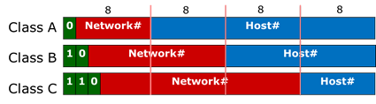

## 一、基本术语

1. **虚电路（Virtual Circuit）** : 在两个终端设备的逻辑或物理端口之间，通过建立的双向的透明传输通道。虚电路表示这只是一条逻辑上的连接，分组都沿着这条逻辑连接按照存储转发方式传送，而并不是真正建立了一条物理连接。

1. **IP（Internet Protocol ）** : 网际协议 IP 是 TCP/IP 体系中两个最主要的协议之一，是 TCP/IP 体系结构网际层的核心。配套的有 ARP，RARP，ICMP，IGMP。

1. **ARP（Address Resolution Protocol）** : 地址解析协议。地址解析协议 ARP 把 IP 地址解析为硬件地址。

ARP协议的（利用IP地址查询MAC地址）工作原理：先查本地的ARP表（每个主机都维护一个ARP表），如果不存在目的IP的MAC地址，则广播，目的主机收到广播报文之后，发现与自己的IP相匹配，就会发一个响应，其中包含自己的MAC地址，源主机收到响应报文之后，把目的主机MAC加入ARP表，然后再发送数据。

1. **ICMP（Internet Control Message Protocol ）** ：因特网控制报文协议，是为了提高IP数据报交付成功的机会，允许主机或路由器报告差错情况和提供有关异常情况报告的协议，运行在IP层。

1. **子网掩码（subnet mask ）** ：它是一种用来指明一个 IP 地址的哪些位标识的是主机所在的子网以及哪些位标识的是主机的位掩码。子网掩码不能单独存在，它必须结合 IP 地址一起使用。

1. **CIDR（ Classless Inter-Domain Routing ）**：无分类域间路由选择 （特点是消除了传统的 A 类、B 类和 C 类地址以及划分子网的概念，并使用各种长度的“网络前缀”(network-prefix)来代替分类地址中的网络号和子网号）。

1. **默认路由（default route）** ：当在路由表中查不到能到达目的地址的路由时，路由器选择的路由。默认路由还可以减小路由表所占用的空间和搜索路由表所用的时间。

1. **路由选择算法（Virtual Circuit）** ：路由选择协议的核心部分。因特网采用自适应的，分层次的路由选择协议。

1. RARP(Reverse Address Resolution Protocal)：反向地址转换协议，ARP为IP到MAC的转换，而RARP为MAC到IP的转换，向RARP服务器请求分配IP

1. DHCP(Dynamic Host Configuration Protocol)： 动态主机配置协议，使网络环境中的主机动态的获得IP地址、DNS服务器地址等信息，它提供即插即用联网的机制。

1. DVP(Distance-Vector Protocol)距离向量协议，通过计算目标路由器与源路由器之间的距离矢量和来选择最佳路径，有频繁和周期性的更新，每次更新都将整张路由表发给周围的路由器，如RIP等。

1. LSP(Link State Protocols)链路状态协议，每个路由器都了解整个网络的拓扑结构，利用算法计算两个路由之间的最短路径，更新由事件触发，每次更新使用泛洪法向周围的路由器传递路由器的链路状态，如OSPF等。

1. IGP：Interior Gateway Protocols，内部网关协议用于自治系统，包括RIP, OSPF等。

1. EGP：Exterior Gateway Protocols，外部网关协议用于自制系统之间，包括BGP等。

1. RIP：Route Information Protocol，路由信息协议：是一种内部网关协议。基于距离矢量算法，使用UDP，按照固定的时间间隔与相邻路由器交换整个路由表。使用跳数(metric)来衡量到达目标地址的路由距离，适用于小型网络。

1. OSPF：Open Shortest Path First，开放最短路径优先：是一种内部网关协议，基于链路状态协议。使用IP，与全部路由器交换相邻结点链路状态。每个路由器都了解整个网络的拓扑结构，更新由链路状态变化触发。

1. BGP：Border Gateway Protocol边界网关协议：基于路径向量算法，使用TCP，BGP是在不同自治系统的路由器之间交换信息的协议。寻找的不是最佳路由，适用于大型网络。

1. VLSM(Variable Length Subnet Masks)：可变长子网掩码，规定了一个网络在划分子网时的不同部分使用不同的子网掩码。有利于有效的使用无类别域间路由（CIDR）和路由汇聚(route summary)来控制路由表的大小

1. PING(Packet Internet Groper)： 因特网包探索器,用于测试网络连接量的程序。使用了ICMP回送请求和回送回答报文，是应用程序直接使用网络层ICMP的例子，没有通过TCP/UDP

1. 路由聚合（Route Summary）：将网络前缀都相同的连续的IP地址组成CIDR地址快。目的：使得一个地址块可以表示很多地址，减少路由表表项和路由器间的信息交换。方法：把一串IP地址都写为二进制表示，取最长的公共前缀作为网络号。

1. IP组播：在发送者和每一接受者之间实现点对点网络连接，应用UDP协议，使用D类地址。

1. 路由器：可以用来连接异构网络、完成路由转发、能隔离冲突域和广播域，依照IP地址转发。

1. NAT：Network Address Translation；网络地址转换；是一种把内部私有网络地址（IP地址）翻译成合法网络IP地址的技术。

## 二、重要知识点总结

1. **TCP/IP 协议中的网络层向上只提供简单灵活的，无连接的，尽最大努力交付的数据报服务。网络层不提供服务质量的承诺，不保证分组交付的时限所传送的分组可能出错，丢失，重复和失序。进程之间通信的可靠性由运输层负责**
1. 在互联网的交付有两种，一是在本网络直接交付不用经过路由器，另一种是和其他网络的间接交付，至少经过一个路由器，但最后一次一定是直接交付
1. 分类的 IP 地址由网络号字段（指明网络）和主机号字段（指明主机）组成。网络号字段最前面的类别指明 IP 地址的类别。IP 地址是一种分等级的地址结构。IP 地址管理机构分配 IP 地址时只分配网络号，主机号由得到该网络号的单位自行分配。路由器根据目的主机所连接的网络号来转发分组。一个路由器至少连接到两个网络，所以一个路由器至少应当有两个不同的 IP 地址
1. IP 数据报分为首部和数据两部分。首部的前一部分是固定长度，共 20 字节，是所有 IP 数据包必须具有的（源地址，目的地址，总长度等重要地段都固定在首部）。一些长度可变的可选字段固定在首部的后面。IP 首部中的生存时间给出了 IP 数据报在互联网中所能经过的最大路由器数。可防止 IP 数据报在互联网中无限制的兜圈子。
1. **地址解析协议 ARP 把 IP 地址解析为硬件地址。ARP 的高速缓存可以大大减少网络上的通信量。因为这样可以使主机下次再与同样地址的主机通信时，可以直接从高速缓存中找到所需要的硬件地址而不需要再去以广播方式发送 ARP 请求分组**
1. 无分类域间路由选择 CIDR 是解决目前 IP 地址紧缺的一个好办法。CIDR 记法在 IP 地址后面加上斜线“/”，然后写上前缀所占的位数。前缀（或网络前缀）用来指明网络，前缀后面的部分是后缀，用来指明主机。CIDR 把前缀都相同的连续的 IP 地址组成一个“CIDR 地址块”，IP 地址分配都以 CIDR 地址块为单位。
1. 网际控制报文协议是 IP 层的协议。ICMP 报文作为 IP 数据报的数据，加上首部后组成 IP 数据报发送出去。使用 ICMP 数据报并不是为了实现可靠传输。ICMP 允许主机或路由器报告差错情况和提供有关异常情况的报告。ICMP 报文的种类有两种，即 ICMP 差错报告报文和 ICMP 询问报文。
1. **要解决 IP 地址耗尽的问题，最根本的办法是采用具有更大地址空间的新版本 IP 协议-IPv6。** IPv6 所带来的变化有 ① 更大的地址空间（采用 128 位地址）② 灵活的首部格式 ③ 改进的选项 ④ 支持即插即用 ⑤ 支持资源的预分配 ⑥IPv6 的首部改为 8 字节对齐。
1. **虚拟专用网络 VPN 利用公用的互联网作为本机构专用网之间的通信载体。VPN 内使用互联网的专用地址。一个 VPN 至少要有一个路由器具有合法的全球 IP 地址，这样才能和本系统的另一个 VPN 通过互联网进行通信。所有通过互联网传送的数据都需要加密。**
1. MPLS 的特点是：① 支持面向连接的服务质量 ② 支持流量工程，平衡网络负载 ③ 有效的支持虚拟专用网 VPN。MPLS 在入口节点给每一个 IP 数据报打上固定长度的“标记”，然后根据标记在第二层（链路层）用硬件进行转发（在标记交换路由器中进行标记交换），因而转发速率大大加快。

## 三、路由协议

### 1、路由协议分类

概念：将互联网分成许多较小的自治系统，系统有权决定自己内部使用什么路由协议。
协议：①内部网关协议：自治系统内部使用的网关协议，如RIP、OSPF ②外部网关协议：自治系统之间使用的网关协议。

### 2、RIP

* IP 是一种**分布式的基于距离向量的路由选择协议**，最大优点是简单。

- RIP 协议要求每一个路由器都要维护从它自己到其他每一个目的网络的距离记录，距离的单位是跳数。**RIP 选择一条具有最少路由器的路径。**

- RIP 允许一条路径最多有 15 个路由器，因此 RIP 只适用于小型互联网。

- RIP 和 OSPF 同为分布式路由选择协议，特点是**每一个路由器都要不断地和其他路由器交换路由信息。**

- **RIP 的特点是：**

  - 仅和相邻路由器交换信息。

  - 交换的信息是当前本路由器知道的所有信息，即自己的路由表。

  - 按固定的时间间隔交换路由信息，比如 30s。

- 路由器刚开始的路由表是空的，通过不断地和与它直接相连的路由器交换并更新信息，经过多次更新后，所有的路由表就都会知道到达本自治系统中任何一个网络的最短距离和下一跳路由器的地址了。
- 路由表中最主要的信息就是**到某个网络的最短距离和下一跳地址**。

### 3、OSPF

* OSPF 是内部网关协议的一种，采用最短路径算法，使用分布 式链路状态协议。 
*  对于规模很大的网络，OSPF通过划分区域来提高路由更新收 敛速度。每个区域有一个32位的区域标识符，区域内路由 器不超过200个。  
* 一个OSPF区域内每个路由器的链路状态数据库包含着本区 域(不是全网)的拓扑结构信息，不知道其他区域的网络拓扑。  
* 链路状态“度量”主要指费用、距离、延时、带宽等，没有 路径。 
* 当链路状态发生变化时用洪泛法向所有(不是相邻)路由器发 送此信息。  
* 链路状态数据库中保存的是全网的拓扑结构图，而非一个完 整的路由表，也不是只保存下一跳路由器的数据。  
* 为确保链路状态数据库一致，OSPF每隔一段时间（不确定） 刷新一次数据库中的链路状态

### 4、BGP

* BGP 是边界网关协议，是外部而不是内部网关协议(是不同自 治系统(AS)的路由器之间使用的协议)。 
* 一个BGP发言人使用TCP（不是UDP）与其他自治系统的BGP 发言人交换路由信息。  
* BGP 协议交换路由信息的节点数是以自治系统数为单位的， BGP 交换路由信息的节点数不小于自治系统数。  
* BGP 采用路由向量协议，而RIP采用距离向量协议。  
* BGP 发言人通过update而不是noticfication分组通知相邻 系统，使用update分组更新路由时，一个报文只能增加一 条路由。  
* open 分组用来与相邻的另一个BGP发言人建立关系，两个 BGP 发言人需要周期性地（不是不定期）交换keepalive分 组来确认双方的相邻关系。  
* BGP 路由选择协议执行中使用的四个分组为打开(open)、更 新(update)、保活(keepalive)和通知(notification)分组。

## 四、其他

### 1、路由算法

- 静态路由：由网络管理员手工配置路由信息

- 动态路由：通过路由器交换的信息来构造路由表，分为距离-向量和链路状态算法。

### 2、IP地址分类：

IP地址中前8位的含义：

- 0–127 Class A 地址

- 128-191 Class B 地址

- 192–223 Class C 地址

- 224–239 Class D – 组播

- 240–255 Class E - 研究

保留地址：

- 网段地址：主机号全为0

- 广播地址：主机号全为1

私有地址空间：

- 10.0.0.0 - 10.255.255.255 (A类)

- 127.16.0.0 - 127.31.255.255 (B类)

- 192.168.0.0 - 192.168.255.255 (C类)

### 3、子网划分

计算子网地址的步骤：

- 将IP地址转化为二进制；

- 将子网掩码转化为二进制；

- 对两个数进行与操作；

- 将子网地址转化为带点的十进制。

每个路由接口都必须有一个单独的网段地址。

### 4、路由环路

路由环路、就是数据包不断在这个网络传输，始终到达不了目的地，导致掉线或者网络瘫痪。解决方法如下：

- Defining a Maximum：定义最大跳数，超过则丢弃报文。

- Route Poisoning：路由毒害，由信息在路由表中失效的时候，把该表项的的度量值（metric）设为无穷大16，而不是马上从路由表中删掉这条路由信息，再将其信息发布出去，这样相邻的路由器就得知这条路由已无效了。

- Split Horizon：水平分割，由一个接口发送出去的路由信息不能再朝这个接口往回发送。

- Hold-Down Timers：抑制计时器，当路由表中跳数更新时，启动计时器，在计时器计时内路由表此项不接受更新。

### 5．什么是子网掩码？255.255.255.0 代表什么意思。

子网掩码是一个网络或一个子网的重要属性。子网掩码长 32bit，由一串 1 和跟随的一串 0组成，其中的 1 对应于 IP 地址中的网络号和子网号，而 0 对应 IP 地址中的主机号。将子网掩码逐比特和 IP 地址进行“与”运算就可得出网络地址。可用于判断目的主机或源主机连接的网络是否进行子网的划分。
255.255.255.0 代表 C 类地址的默认子网掩码，如果一个网络不划分子网，则该网络的子网掩码就使用默认子网掩码。

### 6．试说明 IP 地址与物理地址的区别。为什么要使用这两种不同的地址。

- 在 IP 层抽象的互联网上只能看到 IP 数据报。

- 虽然在 IP 数据报首部有源站 IP 地址，但路由器只根据目的站的 IP 地址的网络
  号进行路由选择。

- 在具体的物理网络的链路层，只能看见 MAC 帧。 （4） 尽管互连在一起的网络的硬件地址体系各不相同，但 IP 层抽象的互联网却屏蔽了下层这些很复杂的细节。只要我们再网络层上讨论问题，就能够使用统一的、抽象的 IP地址研究主机和主机或路由器之间的通信。IP 地址不能直接用来进行通信。这是因为 IP 地址只是主机在抽象的网络层中的地址。若要将网络层中传送的数据报交给目的主机，还要传到链路层转变成 MAC 帧后才能发送到实际的网络上，因此，不管网络层使用的是什么协议，在实际网络的链路上传送数据帧时，最终还是必须使用硬件地址。