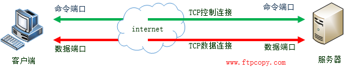
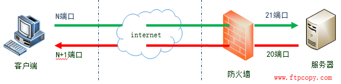
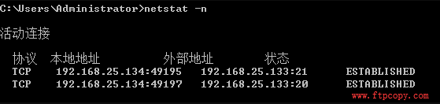
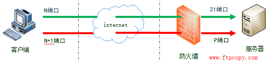
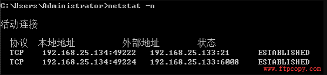
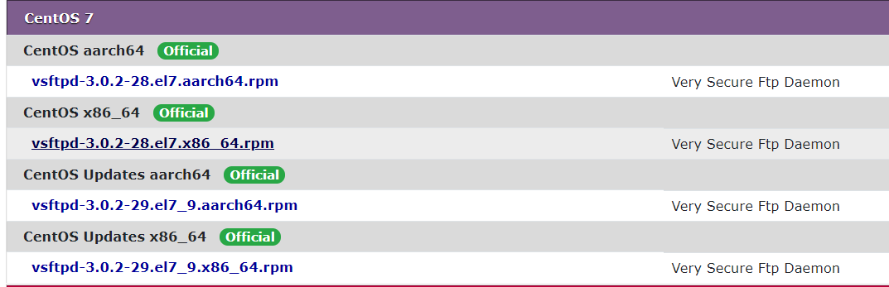
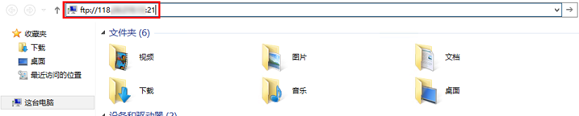

# FTP 协议简介

## 一、什么是 FTP 协议

<font style="color:rgb(51, 51, 51);">FTP的中文名称是“文件传输协议”，是 File Transfer Protocol 三个英文单词的缩写。FTP协议是TCP/IP协议组中的协议之一，其传输效率非常高，在网络上传输大的文件时，经常采用该协议。</font>

<font style="color:rgb(51, 51, 51);"></font>

<font style="color:rgb(51, 51, 51);">一个完整的FTP由 </font><font style="color:rgb(232, 62, 140);background-color:rgb(246, 246, 246);">FTP服务器 </font><font style="color:rgb(51, 51, 51);">和 </font><font style="color:rgb(232, 62, 140);background-color:rgb(246, 246, 246);">FTP客户端 </font><font style="color:rgb(51, 51, 51);">组成，客户端可以将服务器上的文件通过FTP协议下载到本地，也可以将本地数据通过FTP协议上传到服务器上。</font>

## 二、FTP 的两个 TCP 连接



<font style="color:rgb(51, 51, 51);">左侧为客户端，右侧为 FTP 服务器，无论是上传还是下载，客户端与服务器之间都会建立 2 个TCP连接会话，绿色是</font><font style="color:rgb(232, 62, 140);background-color:rgb(246, 246, 246);">控制连接</font><font style="color:rgb(51, 51, 51);">，红色的是</font><font style="color:rgb(232, 62, 140);background-color:rgb(246, 246, 246);">数据连接</font><font style="color:rgb(51, 51, 51);">。其中，</font><font style="color:rgb(232, 62, 140);background-color:rgb(246, 246, 246);">控制连接</font><font style="color:rgb(51, 51, 51);">用于传输FTP命令，如：删除文件、重命名文件、下载文件、列取目录、获取文件信息等。真正的数据传输时通过</font><font style="color:rgb(232, 62, 140);background-color:rgb(246, 246, 246);">数据连接</font><font style="color:rgb(51, 51, 51);">来完成的。</font>

<font style="color:rgb(51, 51, 51);"></font>

<font style="color:rgb(51, 51, 51);">默认情况下，服务器</font><code><font style="color:rgb(51, 51, 51);">21</font></code><font style="color:rgb(51, 51, 51);">端口作为命令端口，</font><code><font style="color:rgb(51, 51, 51);">20</font></code><font style="color:rgb(51, 51, 51);">端口为数据端口。但被动模式下就有所差别了。</font>

<font style="color:rgb(51, 51, 51);"></font>

<font style="color:rgb(51, 51, 51);">刚接触 FTP 的朋友，经常搞不清楚 FTP 的主动模式和被动模式，造成连接被防火墙拦截，下面我们就详细了解下 FTP 的这两种模式：</font>

<font style="color:rgb(51, 51, 51);"></font>

## <font style="color:rgb(51, 51, 51);">三、主动模式与被动模式</font>

<font style="color:rgb(51, 51, 51);"></font>

### 1、主动模式

<font style="color:rgb(51, 51, 51);">首先，来了解下FTP的主动模式，主动模式是 FTP 的默认模式，也称为 PORT 模式。</font>



1. <font style="color:rgb(0, 0, 0);">在主动模式下，客户端会开启 N 和 N+1 两个端口，N 为客户端的命令端口，N+1 为客户端的数据端口。</font>

* <font style="color:rgb(51, 51, 51);">第一步，客户端使用端口 N 连接 FTP 服务器的命令端口 21，建立</font><font style="color:rgb(232, 62, 140);background-color:rgb(246, 246, 246);">控制连接</font><font style="color:rgb(51, 51, 51);">并告诉服务器我这边开启了数据端口 N+1。</font>
* <font style="color:rgb(51, 51, 51);">第二步，在</font><font style="color:rgb(232, 62, 140);background-color:rgb(246, 246, 246);">控制连接</font><font style="color:rgb(51, 51, 51);">建立成功后，服务器会使用数据端口 20，主动连接客户端的 N+1 端口以建立</font><font style="color:rgb(232, 62, 140);background-color:rgb(246, 246, 246);">数据连接</font><font style="color:rgb(51, 51, 51);">。这就是FTP主动模式的连接过程。</font>

<font style="color:rgb(51, 51, 51);">我们可以看到，在这条红色的</font><font style="color:rgb(232, 62, 140);background-color:rgb(246, 246, 246);">数据连接</font><font style="color:rgb(51, 51, 51);">建立的过程中，服务器是主动的连接客户端的，所以称这种模式为主动模式。</font>



<font style="color:rgb(51, 51, 51);">上面这张图是通过</font><code><font style="color:rgb(51, 51, 51);">netstat</font></code><font style="color:rgb(51, 51, 51);">命令查看到的 ftp 主动模式下 TCP的连接信息，首先客户端使用</font><code><font style="color:rgb(51, 51, 51);">49195</font></code><font style="color:rgb(51, 51, 51);">端口连接服务器</font><code><font style="color:rgb(51, 51, 51);">21</font></code><font style="color:rgb(51, 51, 51);">端口建立</font><font style="color:rgb(232, 62, 140);background-color:rgb(246, 246, 246);">控制连接</font><font style="color:rgb(51, 51, 51);">，然后服务器使用20端口连接客户端</font><code><font style="color:rgb(51, 51, 51);">49197</font></code><font style="color:rgb(51, 51, 51);">端口建立</font><font style="color:rgb(232, 62, 140);background-color:rgb(246, 246, 246);">数据连接</font><font style="color:rgb(51, 51, 51);">。</font>

> <font style="color:rgb(51, 51, 51);">这里需要补充下，客户端的命令端口和数据端口实际中并不是有些文章写道的</font><code><font style="color:rgb(51, 51, 51);">N</font></code><font style="color:rgb(51, 51, 51);">和</font><code><font style="color:rgb(51, 51, 51);">N+1</font></code><font style="color:rgb(51, 51, 51);">的关系，两个端口比较接近而已。</font>

<font style="color:rgb(51, 51, 51);"></font>

2. <font style="color:rgb(51, 51, 51);">主动模式有什么利弊呢?</font>

<font style="color:rgb(51, 51, 51);"></font>

<font style="color:rgb(51, 51, 51);">主动模式对 FTP 服务器的管理有利，因为 FTP 服务器只需要开启</font><code><font style="color:rgb(51, 51, 51);">21</font></code><font style="color:rgb(51, 51, 51);">端口的“准入”和</font><code><font style="color:rgb(51, 51, 51);">20</font></code><font style="color:rgb(51, 51, 51);">端口的“准出”即可。</font>

<font style="color:rgb(51, 51, 51);">但这种模式对客户端的管理不利，因为FTP服务器</font><code><font style="color:rgb(51, 51, 51);">20</font></code><font style="color:rgb(51, 51, 51);">端口连接客户端的数据端口时，有可能被客户端的防火墙拦截掉。</font>

<font style="color:rgb(51, 51, 51);">大多数客户端机器在局域网中，IP 地址是经过转换的。如果您选择了 FTP 主动模式，请确保客户端机器已获取真实的 IP 地址，否则可能会导致客户端无法登录 FTP 服务器。</font>

<font style="color:rgb(51, 51, 51);"></font>

### <font style="color:rgb(51, 51, 51);">2、被动模式</font>

<font style="color:rgb(51, 51, 51);">上面所讲的是 FTP 主动模式，简单的理解就是服务器的数据端口</font><code><font style="color:rgb(51, 51, 51);">20</font></code><font style="color:rgb(51, 51, 51);">主动连接客户端的数据端口，来建立</font><font style="color:rgb(232, 62, 140);background-color:rgb(246, 246, 246);">数据连接</font><font style="color:rgb(51, 51, 51);">，用来传输数据，这个</font><font style="color:rgb(232, 62, 140);background-color:rgb(246, 246, 246);">数据连接</font><font style="color:rgb(51, 51, 51);">的建立有可能被客户端防火墙拦截掉。为了解决这个问题就衍生出另外一种连接模式---被动模式。被动模式也称为</font><code><font style="color:rgb(51, 51, 51);">passive</font></code><font style="color:rgb(51, 51, 51);">模式。</font>

<font style="color:rgb(51, 51, 51);"></font>

1. <font style="color:rgb(51, 51, 51);">被动模式是如何运作的呢？来看下这张图：</font>



* <font style="color:rgb(51, 51, 51);">第一步，客户端的命令端口N主动连接服务器命令端口</font><code><font style="color:rgb(51, 51, 51);">21</font></code><font style="color:rgb(51, 51, 51);">，并发送</font><code><font style="color:rgb(51, 51, 51);">PASV</font></code><font style="color:rgb(51, 51, 51);">命令，告诉服务器用“被动模式”，</font><font style="color:rgb(232, 62, 140);background-color:rgb(246, 246, 246);">控制连接</font><font style="color:rgb(51, 51, 51);">建立成功后，服务器开启一个数据端口</font><code><font style="color:rgb(51, 51, 51);">P</font></code><font style="color:rgb(51, 51, 51);">，通过</font><code><font style="color:rgb(51, 51, 51);">PORT</font></code><font style="color:rgb(51, 51, 51);">命令将P端口告诉客户端。</font>
* <font style="color:rgb(51, 51, 51);">第二步，客户端的数据端口</font><code><font style="color:rgb(51, 51, 51);">N+1</font></code><font style="color:rgb(51, 51, 51);">去连接服务器的数据端口</font><code><font style="color:rgb(51, 51, 51);">P</font></code><font style="color:rgb(51, 51, 51);">，建立</font><font style="color:rgb(232, 62, 140);background-color:rgb(246, 246, 246);">数据连接</font><font style="color:rgb(51, 51, 51);">。</font>

<font style="color:rgb(51, 51, 51);">我们可以看到，在这条红色的</font><font style="color:rgb(232, 62, 140);background-color:rgb(246, 246, 246);">数据连接</font><font style="color:rgb(51, 51, 51);">建立的过程中，服务器是被动的等待客户端来连接的，所以称这种模式为被动模式。</font>



<font style="color:rgb(51, 51, 51);">上面这张图是通过</font><code><font style="color:rgb(51, 51, 51);">netstat</font></code><font style="color:rgb(51, 51, 51);">命令查看到的“被动模式”下的TCP连接情况，首先客户端</font><code><font style="color:rgb(51, 51, 51);">49222</font></code><font style="color:rgb(51, 51, 51);">端口去连接服务器的</font><code><font style="color:rgb(51, 51, 51);">21</font></code><font style="color:rgb(51, 51, 51);">端口，建立</font><font style="color:rgb(232, 62, 140);background-color:rgb(246, 246, 246);">控制连接</font><font style="color:rgb(51, 51, 51);">。然后客户端的</font><code><font style="color:rgb(51, 51, 51);">49224</font></code><font style="color:rgb(51, 51, 51);">端口连接服务器的</font><code><font style="color:rgb(51, 51, 51);">6008</font></code><font style="color:rgb(51, 51, 51);">端口去建立</font><font style="color:rgb(232, 62, 140);background-color:rgb(246, 246, 246);">数据连接</font><font style="color:rgb(51, 51, 51);">。</font>

<font style="color:rgb(51, 51, 51);">这里有两点需要补充</font>

* <font style="color:rgb(51, 51, 51);">第一，客户端的命令端口和数据端口实际中并不是有些文章写道的</font><code><font style="color:rgb(51, 51, 51);">N</font></code><font style="color:rgb(51, 51, 51);">和</font><code><font style="color:rgb(51, 51, 51);">N+1</font></code><font style="color:rgb(51, 51, 51);">的关系，两个端口比较接近而已；</font>
* <font style="color:rgb(51, 51, 51);">第二，服务器的数据端口</font><code><font style="color:rgb(51, 51, 51);">P</font></code><font style="color:rgb(51, 51, 51);">是随机的，这个客户端连接过来用的是</font><code><font style="color:rgb(51, 51, 51);">6008</font></code><font style="color:rgb(51, 51, 51);">端口，另外一个连接过来可能用的就是</font><code><font style="color:rgb(51, 51, 51);">7009</font></code><font style="color:rgb(51, 51, 51);">，不过</font><code><font style="color:rgb(51, 51, 51);">P</font></code><font style="color:rgb(51, 51, 51);">端口的范围是可以设置的。</font>

<font style="color:rgb(51, 51, 51);"></font>

2. <font style="color:rgb(51, 51, 51);">被动模式有什么利弊呢？</font>

<font style="color:rgb(51, 51, 51);"></font>

<font style="color:rgb(51, 51, 51);">被动模式对 FTP 客户端的管理有利，因为客户端的命令端口和数据端口都是“准出”，windows 防火墙对于“准出”一般是不拦截的，所以客户端不需要任何多余的配置就可以连接FTP服务器了。</font>

<font style="color:rgb(51, 51, 51);"></font>

<font style="color:rgb(51, 51, 51);">但对服务器端的管理不利。因为客户端数据端口连到 FTP 服务器的数据端口</font><code><font style="color:rgb(51, 51, 51);">P</font></code><font style="color:rgb(51, 51, 51);">时，很有可能被服务器端的防火墙阻塞掉。</font>

<font style="color:rgb(51, 51, 51);"></font>

<font style="color:rgb(51, 51, 51);">为了解决</font><code><font style="color:rgb(51, 51, 51);">P</font></code><font style="color:rgb(51, 51, 51);">端口的“准入”不被服务器防火墙拦截，需要在服务器端设定</font><code><font style="color:rgb(51, 51, 51);">P</font></code><font style="color:rgb(51, 51, 51);">端口的范围，并在防火墙中开启这个范围端口的“准入”。</font>

<font style="color:rgb(51, 51, 51);"></font>

## 四、通过RPM包安装

### 1、安装FTP服务端

#### （1）查看是否安装 vsftp

```bash
rpm -qa | grep vsftpd
```

如果出现 vsftpd ，说明已经安装。

#### （2）下载 vsftpd

下载地址 <https://pkgs.org/download/vsftpd>



```bash
wget http://mirror.centos.org/centos/7/updates/x86_64/Packages/vsftpd-3.0.2-29.el7_9.x86_64.rpm
```

#### （3）安装 vsftpd

```bash
rpm -ivh vsftpd-3.0.2-29.el7_9.x86_64.rpm
```

#### （4）启动服务

```bash
[root@VM-8-7-centos opt]# systemctl start vsftpd

[root@VM-8-7-centos opt]# rpm -qa |grep vsftpd
vsftpd-3.0.2-29.el7_9.x86_64

[root@VM-8-7-centos opt]# systemctl status vsftpd
● vsftpd.service - Vsftpd ftp daemon
   Loaded: loaded (/usr/lib/systemd/system/vsftpd.service; disabled; vendor preset: disabled)
   Active: active (running) since Thu 2021-10-21 10:11:04 CST; 27s ago
  Process: 3390 ExecStart=/usr/sbin/vsftpd /etc/vsftpd/vsftpd.conf (code=exited, status=0/SUCCESS)
 Main PID: 3391 (vsftpd)
    Tasks: 1
   Memory: 576.0K
   CGroup: /system.slice/vsftpd.service
           └─3391 /usr/sbin/vsftpd /etc/vsftpd/vsftpd.conf

Oct 21 10:11:04 VM-8-7-centos systemd[1]: Starting Vsftpd ftp daemon...
Oct 21 10:11:04 VM-8-7-centos systemd[1]: Started Vsftpd ftp daemon.

```

#### （5）配置 vsftpd

```bash
[root@VM-8-7-centos opt]# whereis vsftpd
vsftpd: /usr/sbin/vsftpd /etc/vsftpd /usr/share/man/man8/vsftpd.8.gz
[root@VM-8-7-centos opt]# cd /etc/vsftpd/
[root@VM-8-7-centos vsftpd]# cp vsftpd.conf vsftpd.conf.bak
[root@VM-8-7-centos vsftpd]# vim vsftpd.conf
```

* 注意：vsftpd 配置文件如果修改，需要重新启动 vsftpd ：`systemctl restart vsftpd.service`

#### （6）添加 ftp 防火墙规则

* 针对 Centos7

```bash
# 查看防火墙状态：
[root@localhost ~]# systemctl status firewalld.service

# 一般情况下，如果外部无法链接 vsftp ，排除网络的问题，很有可能是防火墙在作祟。

# 开启防火墙：
[root@localhost ~]# systemctl start firewalld.service

# 关闭防火墙：
[root@localhost ~]# systemctl stop firewalld.service

# 重启防火墙：
[root@localhost ~]# systemctl restart firewalld.service

# 禁止开机启动：
[root@localhost ~]# systemctl disable firewalld.service

# 开启开机启动：
[root@localhost ~]# systemctl enable firewalld.service

说明：如果你不愿意关闭防火墙，需要防火墙添加FTP服务。
firewall-cmd --permanent --zone=public --add-service=ftp
firewall-cmd --reload

firewall-cmd --list-services
```

#### （7）添加用户

* 以匿名用户登录

<font style="color:rgb(61, 68, 80);"></font>

<font style="color:rgb(61, 68, 80);">编辑配置文件</font><code><font style="color:rgb(61, 68, 80);">vsftpd.conf</font></code><font style="color:rgb(61, 68, 80);">：</font>

```bash
# Allow anonymous FTP? (Beware - allowed by default if you comment this out).

anonymous_enable=YES
```

此时匿名用户既可以登录上传、下载文件。记得修改配置文件后需要重启服务。

* 非匿名用户登录

> <font style="color:rgb(61, 68, 80);">vsftpd服务与系统用户是相互关联的，例如我们创建一个名为</font><code><font style="color:rgb(61, 68, 80);">ling</font></code>

```bash
useradd ling
passwd ling
```

#### （8）创建 FTP 使用的目录

<font style="color:rgb(51, 51, 51);">执行以下命令，创建 FTP 服务使用的文件目录，本文以 </font><font style="color:rgb(152, 163, 183);background-color:rgb(243, 245, 249);">/var/ftp/test</font><font style="color:rgb(51, 51, 51);"> 为例</font>

```bash
sudo mkdir /var/ftp/test
```

<font style="color:rgb(51, 51, 51);">执行以下命令，修改目录权限。</font>

```bash
sudo chown -R ling:ling /var/ftp/test
```

#### （8）选择 FTP 模式

> <font style="color:rgb(21, 21, 21);">FTP 可通过主动模式和被动模式与客户端机器进行连接并传输数据。由于大多数客户端机器的防火墙设置及无法获取真实 IP 等原因，建议选择</font>**<font style="color:rgb(21, 21, 21);">被动模式</font>**<font style="color:rgb(21, 21, 21);">搭建 FTP 服务。</font>

* <font style="color:rgb(51, 51, 51);">修改以下配置参数，设置匿名用户和本地用户的登录权限，设置指定例外用户列表文件的路径，并开启监听 IPv4 sockets。</font>

```bash
anonymous_enable=NO      #禁止匿名用户登录
local_enable=YES         #支持本地用户登录
chroot_local_user=YES    #全部用户被限制在主目录
chroot_list_enable=YES   #启用例外用户名单
chroot_list_file=/etc/vsftpd/chroot_list  #指定用户列表文件，该列表中的用户不被锁定在主目录
listen=YES               #监听IPv4 sockets

#在行首添加#注释掉以下参数
#listen_ipv6=YES         #关闭监听IPv6 sockets

#添加以下配置参数，开启被动模式，设置本地用户登录后所在目录，
#以及云服务器建立数据传输可使用的端口范围值。
local_root=/var/ftp/test
allow_writeable_chroot=YES
pasv_enable=YES
pasv_address=xxx.xx.xxx.xx #请修改为您的轻量应用服务器公网 IP
pasv_min_port=40000
pasv_max_port=45000
```

<font style="color:rgb(51, 51, 51);">执行以下命令，重启 FTP 服务。</font>

```bash
sudo systemctl restart vsftpd
```

<font style="color:rgb(51, 51, 51);">搭建好 FTP 服务后，您需要根据实际使用的 FTP 模式给 Linux 轻量应用服务器放通对应端口。\ </font><font style="color:rgb(51, 51, 51);">大多数客户端机器在局域网中，IP 地址是经过转换的。如果您选择了 FTP 主动模式，请确保客户端机器已获取真实的 IP 地址，否则可能会导致客户端无法登录 FTP 服务器。</font>

* <font style="color:rgb(51, 51, 51);">主动模式：放通端口21。</font>
* <font style="color:rgb(51, 51, 51);">被动模式：放通端口21，及上面设置的 </font><font style="color:rgb(152, 163, 183);background-color:rgb(243, 245, 249);">pasv\_min\_port</font><font style="color:rgb(51, 51, 51);"> 到 </font><font style="color:rgb(152, 163, 183);background-color:rgb(243, 245, 249);">pasv\_max\_port</font><font style="color:rgb(51, 51, 51);"> 之间的所有端口，本文放通端口为40000-45000。</font>

#### （9）验证 FTP 服务

<font style="color:rgb(51, 51, 51);">您可通过 FTP 客户端软件、浏览器或文件资源管理器等工具验证 FTP 服务，本文以客户端的文件资源管理器为例。</font>

1. <font style="color:rgb(51, 51, 51);">打开客户端的 IE 浏览器，选择</font>**<font style="color:rgb(51, 51, 51);">工具</font>**<font style="color:rgb(51, 51, 51);"> </font><font style="color:rgb(51, 51, 51);">></font><font style="color:rgb(51, 51, 51);"> </font>**<font style="color:rgb(51, 51, 51);">Internet 选项</font>**<font style="color:rgb(51, 51, 51);"> </font><font style="color:rgb(51, 51, 51);">></font><font style="color:rgb(51, 51, 51);"> </font>**<font style="color:rgb(51, 51, 51);">高级</font>**<font style="color:rgb(51, 51, 51);">，根据您选择的 FTP 模式进行修改：</font>
   * <font style="color:rgb(51, 51, 51);">主动模式：取消勾选“使用被动 FTP”。</font>
   * <font style="color:rgb(51, 51, 51);">被动模式：勾选“使用被动 FTP”。</font>
2. <font style="color:rgb(51, 51, 51);">打开客户端的计算机，在路径栏中访问以下地址。如下图所示：</font><code><font style="color:rgb(51, 51, 51);">ftp:</font><font style="color:rgb(242, 119, 122);">//</font><font style="color:rgb(51, 51, 51);">IP:</font><font style="color:rgb(204, 153, 205);">21</font></code>
3. <font style="color:rgb(51, 51, 51);">在弹出的“登录身份”窗口中输入</font>\*\*<font style="color:rgb(51, 51, 51);"> </font>\*\***配置 vsftpd**<font style="color:rgb(51, 51, 51);"> 中已设置的用户名及密码。</font>
4. <font style="color:rgb(51, 51, 51);">成功登录后，即可上传及下载文件。</font>

<font style="color:rgb(51, 51, 51);"></font>

#### （9）<font style="color:rgb(0, 0, 0);">设置 FTP 主动模式</font>

<font style="color:rgb(51, 51, 51);">主动模式需修改的配置如下，其余配置保持默认设置：</font>

```bash
anonymous_enable=NO      #禁止匿名用户登录
local_enable=YES         #支持本地用户登录
chroot_local_user=YES    #全部用户被限制在主目录
chroot_list_enable=YES   #启用例外用户名单
chroot_list_file=/etc/vsftpd/chroot_list  #指定用户列表文件，该列表中的用户不被锁定在主目录
listen=YES               #监听IPv4 sockets
#在行首添加#注释掉以下参数
#listen_ipv6=YES         #关闭监听IPv6 sockets
#添加下列参数
allow_writeable_chroot=YES
local_root=/var/ftp/test #设置本地用户登录后所在的目录
```

<font style="color:rgb(51, 51, 51);">按 </font>**<font style="color:rgb(51, 51, 51);">Esc</font>**<font style="color:rgb(51, 51, 51);"> 后输入 </font>**<font style="color:rgb(51, 51, 51);">:wq</font>**<font style="color:rgb(51, 51, 51);"> 保存后退出，并完成后续配置。</font>

<font style="color:rgb(51, 51, 51);"></font>

<font style="color:rgb(51, 51, 51);"></font>

## <font style="color:rgb(51, 51, 51);">参考</font>

* <https://www.cnblogs.com/rainman/p/11647723.html>
* <https://cloud.tencent.com/document/product/1207/47638>


> 更新: 2024-08-27 20:01:33  
> 原文: <https://www.yuque.com/thinkspace/vxiyrq/pe8b8e>