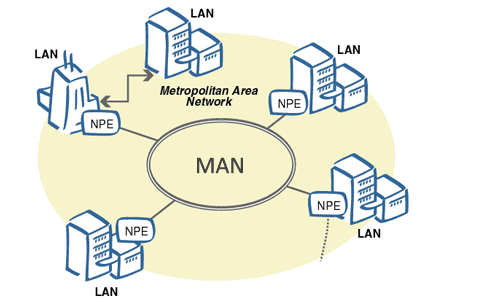
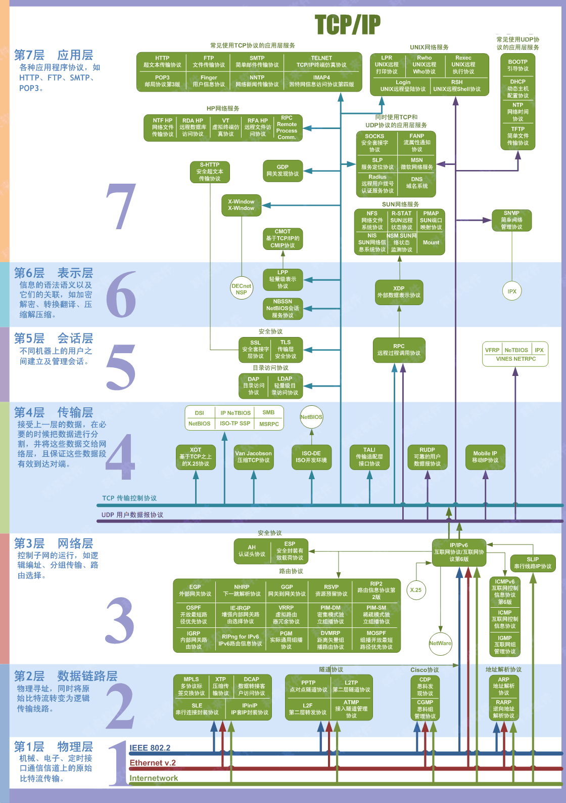

## 一、基本术语

1. **结点 （node）** ：网络中的结点可以是计算机，集线器，交换机或路由器等。

1. **链路（link ）** : 从一个结点到另一个结点的一段物理线路。中间没有任何其他交点。

1. **主机（host）** ：连接在因特网上的计算机。

1. **ISP（Internet Service Provider）** ：互联网服务提供者/互联网服务提供商；向广大用户综合提供互联网接入业务、信息业务、和增值业务的电信运营商。

1. **ICP(Internet Content Provider)**；互联网内容提供商；向广大用户综合提供互联网信息业务和增值业务的电信运营商。

1. **IXP（Internet eXchange Point）** ： 互联网交换点 IXP 的主要作用就是允许两个网络直接相连并交换分组，而不需要再通过第三个网络来转发分组。

1. **RFC(Request For Comments)** ：意思是“请求评议”，包含了关于 Internet 几乎所有的重要的文字资料。

1. **WAN(Wide Area Networks):** 广域网；是指一种跨地区的数据通讯网络,通常包含一个国家或地区。

1. **MAN（Metropolitan Area Network）城域网**：用来将多个局域网进行互连。
   

1. **LAN:Local AreaNetworks**: 局域网；是指在某一区域内由多台计算机互联成的计算机组。

1. **个人区域网 PAN（Personal Area Network）** ：在个人工作的地方把属于个人使用的电子设备用无线技术连接起来的网络 。

1. **分组（packet ）** ：因特网中传送的数据单元。由首部 header 和数据段组成。分组又称为包，首部可称为包头。

1. **存储转发（store and forward ）** ：路由器收到一个分组，先检查分组是否正确，并过滤掉冲突包错误。确定包正确后，取出目的地址，通过查找表找到想要发送的输出端口地址，然后将该包发送出去。

1. **带宽（bandwidth）** ：在计算机网络中，表示在单位时间内从网络中的某一点到另一点所能通过的“最高数据率”。常用来表示网络的通信线路所能传送数据的能力。单位是“比特每秒”，记为 b/s。

1. **吞吐量（throughput ）** ：表示在单位时间内通过某个网络（或信道、接口）的数据量。吞吐量更经常地用于对现实世界中的网络的一种测量，以便知道实际上到底有多少数据量能够通过网络。吞吐量受网络的带宽或网络的额定速率的限制。

## 二、重要知识点总结

1. 计算机网络（简称网络）把许多计算机连接在一起，而互联网把许多网络连接在一起，是网络的网络。

1. 小写字母 i 开头的 internet（互联网）是通用名词，它泛指由多个计算机网络相互连接而成的网络。在这些网络之间的通信协议（即通信规则）可以是任意的。大写字母 I 开头的 Internet（互联网）是专用名词，它指全球最大的，开放的，由众多网络相互连接而成的特定的互联网，并采用 TCP/IP 协议作为通信规则，其前身为 ARPANET。Internet 的推荐译名为因特网，现在一般流行称为互联网。

1. 路由器是实现分组交换的关键构件，其任务是转发收到的分组，这是网络核心部分最重要的功能。分组交换采用存储转发技术，表示把一个报文（要发送的整块数据）分为几个分组后再进行传送。在发送报文之前，先把较长的报文划分成为一个个更小的等长数据段。在每个数据端的前面加上一些由必要的控制信息组成的首部后，就构成了一个分组。分组又称为包。分组是在互联网中传送的数据单元，正是由于分组的头部包含了诸如目的地址和源地址等重要控制信息，每一个分组才能在互联网中独立的选择传输路径，并正确地交付到分组传输的终点。

1. 互联网按工作方式可划分为边缘部分和核心部分。主机在网络的边缘部分，其作用是进行信息处理。由大量网络和连接这些网络的路由器组成核心部分，其作用是提供连通性和交换。

1. 计算机通信是计算机中进程（即运行着的程序）之间的通信。计算机网络采用的通信方式是客户-服务器方式（C/S 方式）和对等连接方式（P2P 方式）。

1. 客户和服务器都是指通信中所涉及的应用进程。客户是服务请求方，服务器是服务提供方。

1. 按照作用范围的不同，计算机网络分为广域网 WAN，城域网 MAN，局域网 LAN，个人区域网 PAN。

1. 计算机网络最常用的性能指标是：速率，带宽，吞吐量，时延（发送时延，处理时延，排队时延），时延带宽积，往返时间和信道利用率。

1. 网络协议即协议，是为进行网络中的数据交换而建立的规则。计算机网络的各层以及其协议集合，称为网络的体系结构。

1. 五层体系结构由应用层，运输层，网络层（网际层），数据链路层，物理层组成。运输层最主要的协议是 TCP 和 UDP 协议，网络层最重要的协议是 IP 协议。

下面的内容会介绍计算机网络的五层体系结构：物理层+数据链路层+网络层（网际层）+运输层+应用层。

## 三、补充

### 1、拓扑层次图

总线拓扑，环形拓扑，星形拓扑，扩展星形拓扑，层次型(树形)拓扑，网络拓扑。

### 2、网络设备

- 物理层：集线器(Hub)，中继器(Repeater)

- 数据链路层：网卡(NIC)，交换机(Switch)，网桥(Bridge)

- 网络层：路由(Router)

交换机、网桥、路由器可以隔离冲突域。 只有路由器可以隔离广播域。

### 3、计算机网络采用层次结构模型有什么好处。

- 各层之间是独立的。某一层并不需要知道它的下一层是如何实现的，而仅仅需要知
  道该层通过层间的接口所提供的服务。由于每一层只实现一种相对独立的功能，因而可将一个难以处理的复杂问题分解为若干个较容易处理的更小一些的问题。这样，整个问题的复杂程度就下降了；

- 灵活性好。当任何一层发生变化时，只要层间接口关系保持不变，则在这层以上或
  以下各层均不受影响。此外，对某一层提供的服务还可进行修改。当某曾提供的服务不再需要时，甚至可以讲这层取消；

- 结构上可分割开。各层都可以采用最合适的技术来实现；

- 易于实现和维护。这种结构使得实现和调试一个庞大而复杂的系统变得易于处理，因为整个的系统已被分解为若干个相对独立的子系统；

- 能促进标准化工作。因为每一层的功能及其所提供的服务都已有了精确的说明。

### 4、试阐述服务和协议的概念，及其相互之间的关系。

协议时控制两个对等实体进行通信的规则的集合。在协议的控制下，两个对等实体间的通信使得本层能够向上一层提供服务。要实现本层协议，还需要使用下面一层所提供的服务。协议的实现保证了能够向上一层提供服务。本层的服务用户只能看见服务而无法看见下面的协议。下面的协议对上面的服务用户是透明的。协议是“水平的”，即协议是控制对等实体之间通信的规则。但服务是“垂直的”，即服务是由下层向上层通过层间接口提供的。另外，并非在一个层内完成的全部功能都称为服务，只有那些能够被高一层看得见的功能才能称之为“服务”。