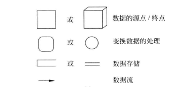
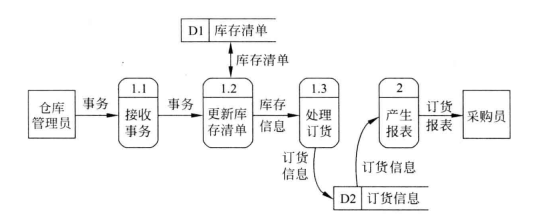
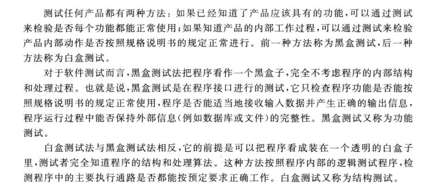

# 软件工程

### 1、软件生命周期
+ 软件策划：软件策划是指完成软件问题定义、可行性研究、制订开发计划和项目申报工作，编写可行性分析报告。
+ 需求分析：需求分析是指分析待开发软件的需求，给出详细定义，编写需求规格说明书。
+ 总体设计：总体设计是指设计软件的结构，划分模块，给出模块的层次结构、调用关系及功能，设计总体数据结构，编写总体设计说明书。
+ 详细设计：详细设计是指对软件中各模块的功能及算法的设计，给出适当的算法描述，并且对性能、可靠性等进行具体的技术描述，编写详细设计说明书。
+ 编写程序：编写程序也称编码，是指将软件的控制结构转换为计算机能够接收的程序代码的过程。
+ 测试：测试是指针对软件功能和性能等需求，在设计测试用例的基础上对软件进行检验，编写软件测试文档。
+ 运行与维护：运行与维护是指将已交付的软件产品投入运行，并且在运行过程中不断进行维护。

### 2、软件开发模型
+ 瀑布模型：按照软件生命周期模型将软件开发活动组织为需求开发、软件设计、软件实现、软件测试、软件交付、软件维护等基本活动，并规定了他们自下而上，相互衔接的开发活动次序。瀑布模型适用于应用软件需求明确、开发技术成熟、工程管理较严格的场合。利用瀑布模型进行开发，具有如下三个特点：
    - 文档驱动，开发过程具有顺序性，只有当前阶段的工作完成后，才能开始下一阶段的工作。
    - 推迟实现，统筹兼顾不过早编程。
    - 坚持文档复审，严格要求保证质量。
+ 原型模型：快速原型模型需要先构建一个快速模型，通过用户对该原型的评价和改进意见，进一步细化待开发软件的需求，逐步调整原型以达到用户要求，从而确定用户的具体需求，然后按照需求开发软件。快速原型模型适用于可快速构建原型的应用软件的开发。
+ 螺旋模型：螺旋模型是将快速原型模型和瀑布模型相结合，强调风险分析。它将开发过程划分为指定计划、风险分析、实施工程和客户评估四类活动。螺旋模型沿着螺旋线进行多次迭代，每转一圈就完成这四类活动，表示开发出一个更加完善的新软件版本。螺旋模型适用于大型复杂系统的开发。
+ 增量模型：增量模型将软件作为一系列具有一定功能的增量构件来进行设计、实现、集成和测试，每个构件都由多个相互作用的模块构成，并且能够完成特定的功能。增量模型适用于软件需求不明确、设计方案有风险的软件开发项目。

### 3、数据流图

### 4、需求分析的任务
+ 功能需求
+ 性能需求
+ 可靠性需求和可用性需求
+ 出错处理需求。这类需求说明系统

### 5、软件测试的方法

### 6、测试步骤
+ 单元测试：单元测试把每个模块作为一个单独的实体来测试，检验其正确性，保证每个模块作为一个单元能正确运行。在这个测试步骤中所发现的往往是编码和详细设计的错误。
+ 子系统测试：子系统测试是把单元测试的模块放在一起作为一个子系统来测试。模块相互间的协调和通信是这个测试过程中的主要问题，因此，这个步骤着重测试模块的接口。
+ 系统测试：系统测试是把经过测试的子系统装配成一个完整的系统来测试。在这个过程中不仅发现设计和编码的错误，还可以验证系统确实能够提供需求说明书中指定的内容。不论是子系统测试还是系统测试，都兼有检测和组装两重含义，通常称为集成测试。
+ 验收测试：验收测试把系统作为单一的实体进行测试，测试内容与系统测试基本类似，但是它是在用户积极参与下进行的，而且可能主要使用实际数据进行测试。验收测试的目的是验证系统能够满足用户的需要，在这个测试步骤中发现的往往是需求说明书中的错误。验收测试也称为确认测试。

> 更新: 2024-10-03 22:42:14  
> 原文: <https://www.yuque.com/thinkspace/vxiyrq/opyndqczhz3vstmi>